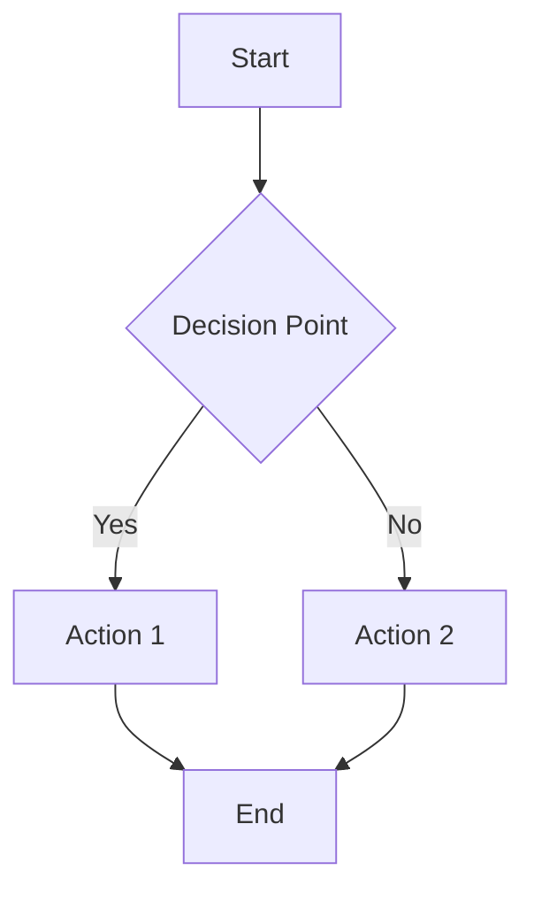
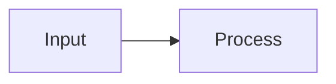
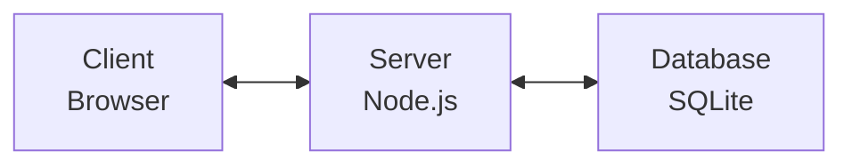
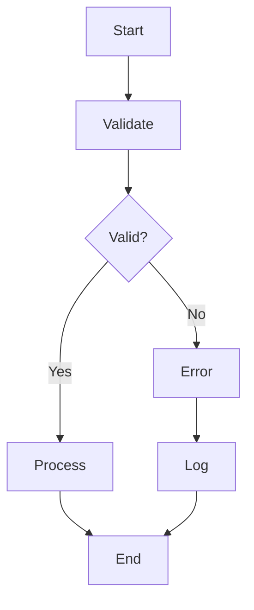

# 04: Documentation Standards and Diagram Guidelines

**Version:** 1.0
**Date:** 2025-09-03
**Status:** ACTIVE

## 1. Objective

This document establishes mandatory documentation standards for the Qualia-NSS project, with special emphasis on visual explanations through diagrams and flowcharts. These standards ensure clear, accessible, and consistently formatted documentation across all project files.

---

## 2. Core Documentation Principles

### 2.1. Dual-Format Requirement
**All technical documentation MUST include both ASCII and Mermaid diagram formats when visual explanations are needed.**

- **ASCII Diagrams**: For direct reading in text editors, terminals, and plain markdown viewers
- **Mermaid Diagrams**: For enhanced web rendering in GitHub wiki and web applications

### 2.2. Visual-First Documentation
Complex processes, architectures, or relationships MUST be explained with diagrams first, followed by textual descriptions.

---

## 3. ASCII Diagram Standards

### 3.1. Mandatory ASCII Diagrams
All .md files intended for direct reading MUST include simplified ASCII diagrams for:
- System architecture overviews
- Data flow processes  
- Component relationships
- User workflows
- File structure hierarchies

### 3.2. ASCII Diagram Format Requirements
```
┌─────────────────┐
│  ASCII Format   │
│  Guidelines:    │
├─────────────────┤
│ • Use box chars │ 
│ • Max 80 chars  │
│ • Clear labels  │
│ • Logical flow  │
└─────────────────┘
```

**Character Set for ASCII Diagrams:**
- Boxes: `┌─┐ │ └─┘ ├─┤ ┬─┴`
- Arrows: `→ ← ↑ ↓ ↔ ↕`
- Connectors: `─ │ ┼ ├ ┤ ┬ ┴`

### 3.3. ASCII Flowchart Standards
```
[Start] → [Process] → {Decision?} → [End]
                           │
                           ↓
                      [Alternative]
```

---

## 4. Mermaid Diagram Standards

### 4.1. Mandatory Mermaid Diagrams
All .md files that will be processed through GitHub wiki MUST include Mermaid versions of diagrams for:
- System architecture
- Sequence diagrams
- State machines  
- Gantt charts
- Flowcharts
- Entity relationships

### 4.2. Mermaid Format Requirements


### 4.3. Supported Mermaid Types
- `graph` - Flowcharts and directed graphs
- `sequenceDiagram` - Interaction flows
- `classDiagram` - Object relationships  
- `stateDiagram` - State transitions
- `gantt` - Project timelines
- `gitgraph` - Branch visualizations

---

## 5. Implementation Guidelines

### 5.1. Dual-Format Template
Every technical document MUST follow this structure:

```markdown
# Title

## Overview
Brief description of the topic.

## ASCII Diagram
```
┌─────────┐    ┌─────────┐
│ Input   │───▶│ Process │
└─────────┘    └─────────┘
```

## Mermaid Diagram


## Detailed Explanation
...
```

### 5.2. File Naming Conventions
- **Direct Reading**: `filename.md` (includes ASCII diagrams)
- **Wiki Processing**: Same file with Mermaid diagrams for GitHub wiki rendering

### 5.3. Location-Specific Requirements

**Wiki Files (`src/wiki/`):**
- MUST include both ASCII and Mermaid formats
- Mermaid diagrams will render in web application
- ASCII diagrams ensure terminal/editor accessibility

**Documentation (`docs/`):**
- MUST include ASCII diagrams for direct reading
- MAY include Mermaid for enhanced presentations

**Module READMEs:**
- MUST include ASCII architecture diagrams
- SHOULD include Mermaid for GitHub web viewing

---

## 6. Diagram Content Requirements

### 6.1. Architecture Diagrams Must Show:
- Component boundaries
- Data flow directions  
- Integration points
- External dependencies
- User interaction points

### 6.2. Process Diagrams Must Show:
- Clear start/end points
- Decision branches
- Error handling paths
- Parallel processes
- Timing considerations

### 6.3. Flowchart Requirements:
- Single entry/exit points
- Clear decision logic
- Exception handling
- Progress indicators
- User feedback points

---

## 7. Quality Standards

### 7.1. ASCII Diagram Quality:
- Maximum 80 characters wide
- Clear visual hierarchy
- Consistent spacing
- Readable in monospace fonts
- Logical top-to-bottom or left-to-right flow

### 7.2. Mermaid Diagram Quality:
- Semantic node naming
- Consistent styling
- Appropriate diagram type selection
- Clear relationship indicators
- Color coding for different types

### 7.3. Documentation Integration:
- Diagrams MUST precede detailed explanations
- Text MUST reference diagram elements
- Consistency between ASCII and Mermaid versions
- Version synchronization across formats

---

## 8. Maintenance Requirements

### 8.1. Update Protocol:
1. Update ASCII version first (for immediate accessibility)
2. Update corresponding Mermaid version
3. Verify both versions convey same information
4. Test rendering in multiple environments

### 8.2. Review Checklist:
- [ ] ASCII diagram renders correctly in terminal
- [ ] Mermaid diagram renders in GitHub wiki
- [ ] Both versions show same logical flow
- [ ] Diagrams match current implementation
- [ ] All text references are accurate

---

## 9. Examples and Templates

### 9.1. System Architecture Template:
```
ASCII Version:
┌─────────────┐    ┌─────────────┐    ┌─────────────┐
│   Client    │────│   Server    │────│  Database   │
│  (Browser)  │    │  (Node.js)  │    │ (SQLite)    │
└─────────────┘    └─────────────┘    └─────────────┘

Mermaid Version:

```

### 9.2. Process Flow Template:
```
ASCII Version:
[Start] → [Validate] → {Valid?} → [Process] → [End]
                           │
                           ↓
                       [Error] → [Log] → [End]

Mermaid Version:

```

---

**Compliance**: All documentation MUST follow these standards. Non-compliance will result in documentation rejection during review processes.