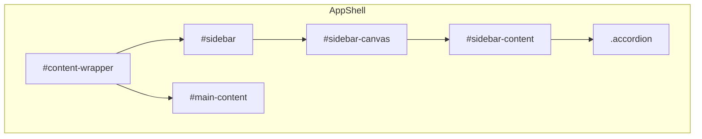
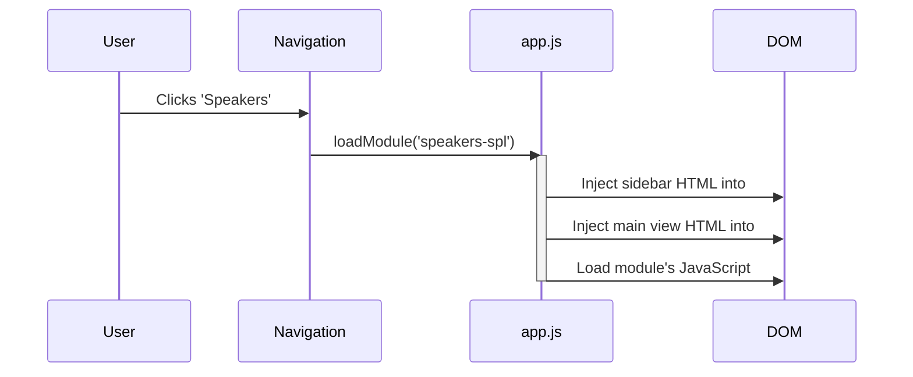

# App Shell Wireframe & Logic

This document outlines the visual layout and functional logic of the main application shell for Qualia-NSS.

---

## 1. Visual Layouts & Module Patterns

The application shell adapts its layout based on the complexity of the loaded module. Three primary patterns are defined.

### 1.1. Landing Page Layout (No Sidebar)

This layout is used for the home/landing page or for simple, full-width content views that do not require dedicated controls. The sidebar is hidden, allowing the main content area to span the full width of the viewport.

```
+------------------------------------------------------------------------------+
| [QUALIA🍀NSS]      | [Speakers] [Filters] [Cabinets] [Tests] |    [💡]        |
+==============================================================================+
|                                                                              |
|                      <--- MAIN CONTENT AREA --->                             |
|                       (Full-width Module View)                               |
|                                                                              |
+------------------------------------------------------------------------------+
| (c) 2025 Qualia-NSS                                                          |
+------------------------------------------------------------------------------+
```

### 1.2. Standard Module Layout (Simple Sidebar)

This is the default layout for modules that require a small to moderate number of controls. It features a fixed-width sidebar alongside the main content area.

**Example Use Case:** Speaker SPL viewer (`src/speakers-spl/`), which might only need a file loader and a few toggles.

```
+------------------------------------------------------------------------------+
| [QUALIA🍀NSS]      | [Speakers] [Filters] [Cabinets] [Tests] |    [💡]        |
+==============================================================================+
| +-------------------+ +----------------------------------------------------+ |
| | SIDEBAR           | |                                                    | |
| |-------------------| |            <--- MAIN CONTENT AREA --->             | |
| | [Load SPL File]   | |                                                    | |
| |                   | |               (e.g., SPL Chart)                    | |
| | ( ) Normalize     | |                                                    | |
| | (x) Show Phase    | |                                                    | |
| +-------------------+ +----------------------------------------------------+ |
+------------------------------------------------------------------------------+
| (c) 2025 Qualia-NSS                                                          |
+------------------------------------------------------------------------------+
```

### 1.3. Advanced Module Layout (Complex Sidebar) - ✅ IMPLEMENTED

This layout is designed for sophisticated modules like the Spectrogram and Comb-Filtering Analyzer, which require a large and organized set of controls.

**✅ IMPLEMENTATION STATUS: COMPLETED**
- **Module**: Spectrogram with advanced 3D visualization controls
- **Location**: `src/js/sidebar-manager.js` (spectrogram section)
- **Integration**: Automatic loading via `module-loader.js`
- **Features**: Bootstrap 5 accordion, scroll-fade effects, no browser scrollbars

**Key Feature:** The sidebar's internal structure uses collapsible sections (accordions) to manage complexity and group related controls. This approach keeps the UI clean and prevents the sidebar from becoming an overwhelmingly long list. A UI framework like Bootstrap can provide ready-to-use accordion components for this purpose. **✅ Implemented with Bootstrap 5 accordion**

**Example Use Case:** ~~Comb-Filtering Experiments module~~ **✅ Spectrogram Module** - combining controls for audio source selection, 3D camera controls, and visualization parameters.

```
+------------------------------------------------------------------------------+
| [QUALIA🍀NSS]      | [Speakers] [Filters] [Cabinets] [Tests] |    [💡]        |
+==============================================================================+
| +-------------------+ +----------------------------------------------------+ |
| | SIDEBAR (Complex) | |                                                    | |
| |-------------------| |                                                    | |
| | ▼ Experiment Setup| |            <--- MAIN CONTENT AREA --->             | |
| |  (o) Controlled   | |                                                    | |
| |  ( ) Acoustic     | |            (e.g., 3D Spectrogram)                  | |
| |  ( ) Analysis     | |                                                    | |
| |-------------------| |                                                    | |
| | ► Signal Generator| |                                                    | |
| |-------------------| |                                                    | |
| | ▼ Analysis Source | |                                                    | |
| |  ( ) Digital Out  | |                                                    | |
| |  (o) Mic In       | |                                                    | |
| |  [ ] Echo Cancel  | |                                                    | |
| |-------------------| |                                                    | |
| | ▼ 3D Viewport     | |                                                    | |
| |  Rotate X: [---]  | |                                                    | |
| |  Zoom:     [---]  | |                                                    | |
| +-------------------+ +----------------------------------------------------+ |
+------------------------------------------------------------------------------+
| (c) 2025 Qualia-NSS                                                          |
+------------------------------------------------------------------------------+
```

**✅ IMPLEMENTATION DETAILS:**

**Scroll-Fade Integration:**
- **CSS**: `scroll-fade.css` → Implemented in `src/styles/utilities.css` with theme-adaptive gradients and subtle shadows
- **JS**: `scroll-fade.js` → Implemented in `src/js/ui-utils.js` with fixed positioning system
- **HTML**: `advanced_sidebar_structure.html` → Implemented in `src/js/sidebar-manager.js` with clean structure

**Current Implementation Enhancements:**
1. **Fixed Fade System**: Monitors `#sidebar-canvas` scroll, applies effects to `#sidebar` for window-edge positioning
2. **Theme Integration**: Complete accordion and form control theming with CSS variables
3. **Immediate Detection**: Multiple timeout checks and MutationObserver for instant overflow detection
4. **Browser Scrollbar Prevention**: Hidden scrollbars with proper accessibility
5. **Professional Styling**: Enhanced visual hierarchy and responsive behavior

**Testing Status:**
- ✅ Fixed fade effects at sidebar window edges
- ✅ Theme-consistent accordion and form controls
- ✅ Immediate overflow detection on page load
- ✅ Bootstrap accordion expand/collapse working
- ✅ No browser scrollbars (internal scrolling only)
- ✅ All form controls functional and updating spectrogram in real-time
- ✅ Responsive behavior across different screen sizes

**Reference Files:**
- Implementation: `src/js/sidebar-manager.js`, `src/styles/utilities.css`, `src/js/ui-utils.js`
- Wireframe specs: `scroll-fade.css`, `scroll-fade.js`, `advanced_sidebar_structure.html`

### Component Breakdown:

*   **Header:** A sticky top navbar containing the logo, main navigation links (Speakers, Filters, etc.), and a theme toggle.
*   **Content Wrapper (`#content-wrapper`):** A flexbox container that fills the space between the header and footer. It is dynamically populated with:
    *   **Sidebar (`#sidebar`):** A left-hand panel (280px width) that holds the primary controls for the currently active module. Its content is injected dynamically. For advanced modules, it should be structured with collapsible sections.
        *   **Sidebar Canvas (`#sidebar-canvas`):** The scrollable viewport container (with scroll-fade effects)
        *   **Sidebar Content (`#sidebar-content`):** The actual content container (accordion, controls, etc.)
    *   **Main Content (`#main-content`):** The primary view area where the module's main interface (e.g., charts, visualizations) is rendered.
*   **Footer:** A minimal, single-line footer for copyright information.

### Container Hierarchy for Complex Sidebar:

#### ASCII Diagram: Container Hierarchy
```
#content-wrapper
  #sidebar
    #sidebar-canvas
      #sidebar-content
        .accordion
  #main-content
```

#### Mermaid Diagram: DOM Hierarchy


**Container Hierarchy Created:**
```
#content-wrapper (flexbox container)
├── #sidebar (280px fixed, scroll-fade-container, overflow: hidden)
│   └── #sidebar-canvas (scrollable viewport)
│       └── #sidebar-content (actual content)
│           └── .accordion#sidebarAccordion (Bootstrap accordion)
└── #main-content (flexible content area)
```

**Fade System Architecture:**
- **Monitor**: `#sidebar-canvas` scroll position
- **Apply**: Fade effects to `#sidebar` container
- **Result**: Fixed fade overlays at sidebar window edges
- **Behavior**: Independent of scrolling content, theme-adaptive

---

## 2. Core Architectural Patterns

### 2.1. Module Loading & Layout Logic

#### Mermaid Diagram: `loadModule()` Sequence



The application functions as an SPA, loading modules into the main content area without page reloads.

*   **Module Selection:** When a user clicks a navigation link (e.g., "Speakers"), the `loadModule()` function in `app.js` is triggered.
*   **Dynamic Injection:**
    1.  The `loadModule()` function injects the appropriate sidebar HTML into the `#sidebar` div.
    2.  It injects the module's main view HTML into the `#main-content` div.
    3.  A corresponding JavaScript file for the module is loaded to handle its specific logic.
*   **Layout Management:**
    *   The main container, `#content-wrapper`, uses `display: flex` to position the sidebar and main content area side-by-side.
    *   The `#main-content` area is also a flex container, allowing the content within it to be structured flexibly.

### 2.2. Chart.js Resizing Pattern (Simplified Approach)

**Problem:** Chart.js components fail to resize correctly when browser viewport changes from narrow to wider layouts. From wider to narrow works acceptably, but narrow to wider requires page refresh to display correctly.

**Analysis:** Chart.js responsive behavior has timing issues with CSS flexbox recalculation. Complex timing solutions (ResizeObserver, nested requestAnimationFrame) add unnecessary complexity without fully solving the issue.

**Adopted Solution (Simplified Pattern):** Use the simplest approach that works for most use cases:

**CSS Requirements:**
```css
.chart-container {
  position: relative;
  flex: 1 1 auto;
  height: 100%;  /* Key: Use 100% not 'auto' for proper flexbox inheritance */
  min-height: 360px;
}
.chart-container canvas { 
  width: 100% !important; 
  height: 100% !important; 
  display: block; 
}
```

**JavaScript Implementation:**
```javascript
// Simple Chart.js setup - let it handle its own responsive behavior
this.chart = new Chart(ctx, {
  type: 'line',
  data: { datasets: [] },
  options: {
    responsive: true,
    maintainAspectRatio: false,
    resizeDelay: 100,  // Built-in debouncing for smoother resizing
    // ... other options
  }
});
```

**Known Limitation:** Narrow-to-wider viewport changes may still require manual page refresh. This limitation is accepted in favor of code simplicity and maintainability.

**Implementation Status:** Applied in `src/speakers-spl/` module as the standard pattern for Chart.js components.

---

## 3. Responsive Behavior

*   **Layout:** The primary layout is a two-column design with a fixed-width sidebar and a flexible main content area.
*   **Navbar:** The main navigation bar is designed to be responsive. On narrower screens (<768px), the text labels for the navigation links are hidden, showing only the icons to save space while maintaining functionality. The navbar itself never stacks vertically.