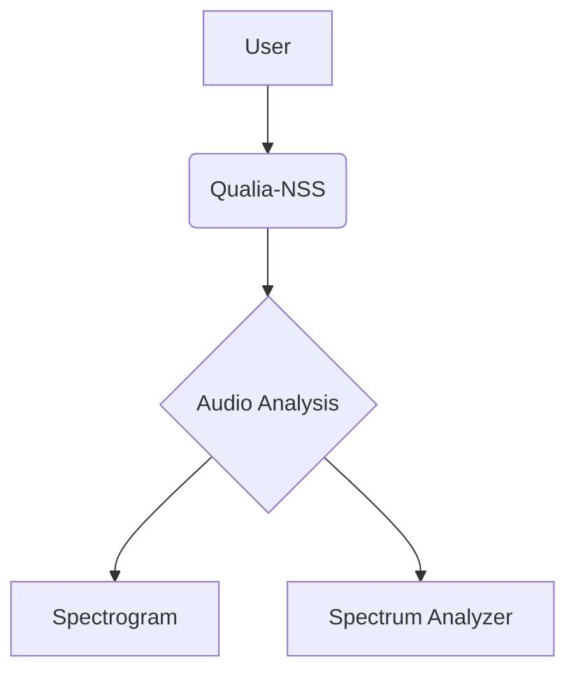
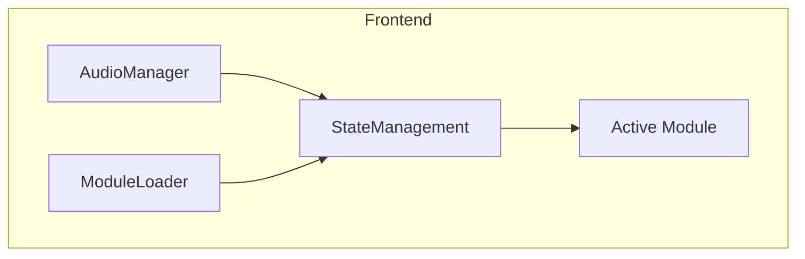
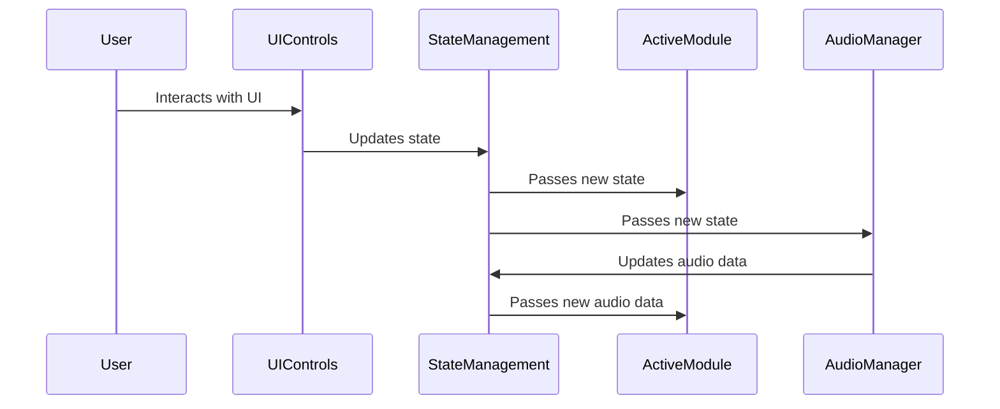

# Qualia-NSS System Architecture

This document describes the technical architecture of the Qualia-NSS project.

## 0. System Context Diagram

## 1. Frontend Architecture

### 1.1. Container Diagram

The application will be a single-page application (SPA) built with modern web technologies.

*   **Framework**: (To be decided - e.g., React, Vue, Svelte, or vanilla JS with Web Components)
*   **Core Components**:
    *   **`AudioManager`**: A global service to handle audio context, playback, and source management (live input, file playback).
    *   **`ModuleLoader`**: Responsible for dynamically loading and rendering the selected analysis module.
    *   **`StateManagement`**: A central store to manage application state, such as selected parameters, loaded data, and UI settings.
*   **Modules**: Each analysis tool (`spectrogram`, `spectrum-analyzer`, etc.) will be developed as a self-contained component with a clearly defined API for receiving data and emitting events.

## 2. Backend Architecture

A backend is not required for the initial phase (client-side analysis). Future development may include a backend for:

*   User accounts and saved sessions.
*   Server-side data processing for large files.
*   A shared library of reference SPL curves.

## 3. Module Interaction

### 3.1. Data and Control Flow

Modules will not communicate directly with each other. They will interact with the central `AudioManager` and `StateManagement` services.

*   **Data Flow**: `AudioManager` -> `StateManagement` -> `Active Module`.
*   **Control Flow**: `User Interaction` -> `UI Controls` -> `StateManagement` -> `Active Module` / `AudioManager`.
