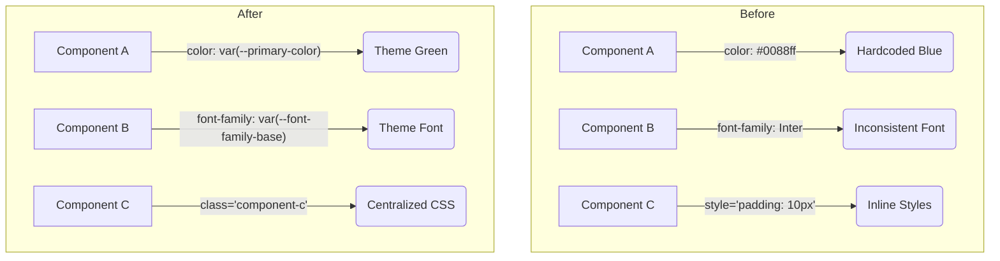
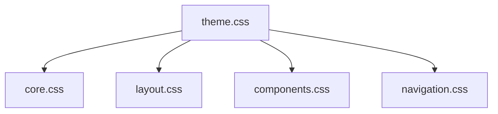

# UI/UX Refactoring Summary

**Date:** 2025-08-30
**Status:** ✅ Completed

## 1. Introduction

This document summarizes the successful UI/UX refactoring effort for the Qualia-NSS application. An initial audit revealed significant inconsistencies in color, typography, and styling practices. A systematic plan was executed to implement a new, unified, and minimalist style guide, resulting in a more professional, consistent, and maintainable user interface. This document details the initial findings and the implementation steps that were completed.

## 2. Initial Audit Findings

### Mermaid Diagram: Before & After UI State



The initial audit of the `src` directory revealed several key areas for improvement:

-   **Inconsistent Color Palette:** The primary accent color was blue (`#0088ff`), which conflicted with the green of the brand logo. Numerous components used hardcoded colors, ignoring the central theme variables.
-   **Inconsistent Typography:** Multiple, conflicting font families (`-apple-system` and `Inter`) and sizing units (`rem`, `em`, `px`) were in use, preventing a cohesive typographic scale.
-   **Prevalence of Inline Styles:** Many HTML elements contained inline `style` attributes for layout and styling, which is detrimental to maintainability.

## 3. Implemented Solution

The inconsistencies were resolved by creating and implementing a centralized design system.

### 3.1. Centralized Theme: `theme.css`

#### Mermaid Diagram: CSS Architecture



A new file was created at `src/styles/theme.css` to act as the single source of truth for all visual styling. This file defines a comprehensive set of CSS variables for the entire application.

**Final `theme.css` Snippet:**
```css
:root {
  /* Color Palette */
  --primary-color: #28a745; /* Green, aligned with clover logo */
  --primary-color-hover: #218838;
  --primary-color-translucent: rgba(40, 167, 69, 0.1);
  --text-color: #e0e0e0;
  --panel-background: #1e1e1e;
  --border-color: #333;
  --slider-track-color: #555; /* Constant neutral gray for slider tracks */

  /* Typography */
  --font-family-base: -apple-system, BlinkMacSystemFont, ...;
  --font-size-base: 1rem;

  /* Spacing & Layout */
  --spacing-unit: 8px;
}
```

### 3.2. Mobile Viewport Enhancement

The main `index.html` file was updated with a viewport meta tag to ensure the application renders correctly and uses the full screen on modern mobile devices:

```html
<meta name="viewport" content="width=device-width, initial-scale=1.0, viewport-fit=cover">
```

### 3.3. Semantic & Visual Hierarchy

A clear, semantic hierarchy was implemented to improve accessibility and SEO, and to create a more professional and intuitive layout. The application now follows these structural rules:

-   **H1:** The largest size, for the primary page title (e.g., "Welcome", or the loaded module's name like "Spectrogram").
-   **H2:** A secondary heading size, applied to sidebar titles (e.g., accordion headers).
-   **H3:** A tertiary heading size, for sidebar subtitles and corresponding section titles within the main content.
-   **H4, H5, H6:** Available for deeper nesting within main content areas.
-   **Navbar Links:** Retain their visual weight but remain as `<a>` tags for semantic correctness.

## 4. Implementation Log

The following steps were successfully executed to refactor the application's UI/UX:

1.  **✅ Created `src/styles/theme.css`:** The central style guide was created and populated with the new design system variables.
2.  **✅ Loaded Theme:** The new `theme.css` file was linked in `index.html` to make the variables globally accessible.
3.  **✅ Refactored Core & Component CSS:** All stylesheets (`core.css`, `layout.css`, `components.css`, `navigation.css`) were updated to use the new CSS variables. Hardcoded colors and fonts were eliminated.
4.  **✅ Refactored HTML & JS:** Inline styles were removed from HTML files (e.g., `spectrogram/index.html`) and replaced with CSS classes. A dedicated stylesheet was created for the spectrogram module.
5.  **✅ Added Viewport Meta Tag:** The `viewport-fit=cover` meta tag was added to `index.html`.
6.  **✅ Fixed UI Inconsistencies:** Several specific UI bugs and inconsistencies were resolved:
    -   Themed all `input[type=range]` slider controls to use the primary green color and a new neutral gray track.
    -   Refined the sidebar accordion and header styles to be more compact and visually consistent.
    -   Corrected the `tone-control-container` background to respect the application theme.
7.  **✅ Fixed Navigation Bugs:** The JavaScript logic in `navigation.js` was corrected to ensure the home page state is properly saved and restored on page reload.

## 5. Final Status

The UI/UX refactoring is complete. The application now benefits from a consistent, minimalist, and maintainable design system that reinforces the brand identity.