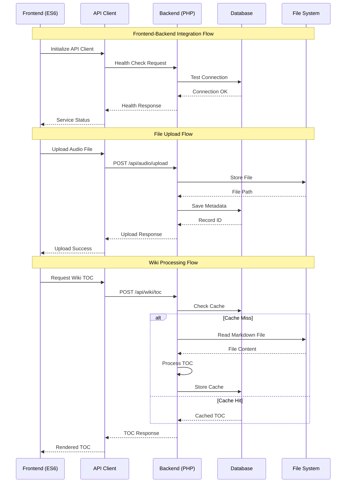

# Backend API Integration Guide

**Stage:** st01-backend-server  
**Version:** 1.0  
**Date:** 2025-09-03  
**Focus:** Frontend-Backend API integration patterns

## 1. Integration Architecture Overview

### 1.1. ASCII Communication Flow
```
┌─────────────────────────────────────────────────────────────────┐
│                 FRONTEND-BACKEND INTEGRATION                   │
├─────────────────────────────────────────────────────────────────┤
│                                                                 │
│  FRONTEND (file://)           BACKEND (http://localhost:8080)   │
│                                                                 │
│  ┌─────────────────┐          ┌─────────────────────────────┐   │
│  │  ES6 MODULES    │──────────│      REST API LAYER        │   │
│  │                 │   HTTP   │                             │   │
│  │ • App Core      │  Request │ • /api/health              │   │
│  │ • Module Loader │    ─────▶│ • /api/wiki/toc            │   │  
│  │ • UI Utils      │          │ • /api/audio/upload        │   │
│  │ • Navigation    │          │ • /api/auth/login          │   │
│  └─────────────────┘          └─────────────────────────────┘   │
│          │                              │                       │
│          ▼                              ▼                       │
│  ┌─────────────────┐          ┌─────────────────────────────┐   │
│  │  API CLIENT     │          │     SERVICE LAYER           │   │
│  │                 │          │                             │   │
│  │ • BackendAPI    │          │ • WikiProcessor             │   │
│  │ • ErrorHandler  │◄─────────│ • AudioProcessor            │   │
│  │ • ResponseCache │   JSON   │ • AuthenticationService     │   │
│  │ • RetryLogic    │ Response │ • DatabaseConnection        │   │
│  └─────────────────┘          └─────────────────────────────┘   │
│          │                              │                       │
│          ▼                              ▼                       │
│  ┌─────────────────┐          ┌─────────────────────────────┐   │
│  │  UI COMPONENTS  │          │      PERSISTENCE            │   │
│  │                 │          │                             │   │
│  │ • StatusDisplay │          │ • MariaDB Database          │   │
│  │ • ProgressBar   │          │ • File System Storage       │   │
│  │ • ErrorMessages │          │ • Response Cache            │   │
│  │ • DataDisplay   │          │ • Session Management        │   │
│  └─────────────────┘          └─────────────────────────────┘   │
└─────────────────────────────────────────────────────────────────┘
```

### 1.2. Mermaid Integration Sequence


## 2. API Client Architecture

### 2.1. KISS API Client Pattern
```javascript
// src/js/backend-api.js
// KISS Backend API Client for Qualia-NSS

class QualiaBackendAPI {
    constructor(baseURL = 'http://localhost:8080/api') {
        this.baseURL = baseURL;
        this.timeout = 10000; // 10 second timeout
        this.retries = 3;
    }
    
    // Health check endpoint
    async healthCheck() {
        return this._request('GET', '/health');
    }
    
    // Wiki TOC generation
    async generateWikiTOC(markdownContent) {
        return this._request('POST', '/wiki/toc', {
            content: markdownContent
        });
    }
    
    // Audio file upload
    async uploadAudio(file) {
        const formData = new FormData();
        formData.append('audio', file);
        
        return this._requestFormData('POST', '/audio/upload', formData);
    }
    
    // User authentication
    async login(username, password) {
        return this._request('POST', '/auth/login', {
            username,
            password
        });
    }
    
    // Core request method with KISS error handling
    async _request(method, endpoint, data = null) {
        const url = `${this.baseURL}${endpoint}`;
        const options = {
            method,
            headers: {
                'Content-Type': 'application/json',
            },
            signal: AbortSignal.timeout(this.timeout)
        };
        
        if (data && (method === 'POST' || method === 'PUT')) {
            options.body = JSON.stringify(data);
        }
        
        let lastError;
        
        for (let attempt = 1; attempt <= this.retries; attempt++) {
            try {
                const response = await fetch(url, options);
                
                if (!response.ok) {
                    throw new Error(`HTTP ${response.status}: ${response.statusText}`);
                }
                
                const responseData = await response.json();
                return { success: true, data: responseData };
                
            } catch (error) {
                lastError = error;
                
                if (attempt === this.retries) {
                    return {
                        success: false,
                        error: error.message,
                        attempt: attempt
                    };
                }
                
                // Exponential backoff: 1s, 2s, 4s
                await this._sleep(1000 * Math.pow(2, attempt - 1));
            }
        }
    }
    
    // Form data upload method
    async _requestFormData(method, endpoint, formData) {
        const url = `${this.baseURL}${endpoint}`;
        const options = {
            method,
            body: formData,
            signal: AbortSignal.timeout(this.timeout * 2) // Longer timeout for uploads
        };
        
        try {
            const response = await fetch(url, options);
            
            if (!response.ok) {
                throw new Error(`HTTP ${response.status}: ${response.statusText}`);
            }
            
            const responseData = await response.json();
            return { success: true, data: responseData };
            
        } catch (error) {
            return {
                success: false,
                error: error.message
            };
        }
    }
    
    // Utility method for delays
    _sleep(ms) {
        return new Promise(resolve => setTimeout(resolve, ms));
    }
}

// Export for ES6 module system
export { QualiaBackendAPI };
```

### 2.2. Frontend Integration Pattern
```javascript
// src/js/app-core.js - Integration with existing app core

import { QualiaBackendAPI } from './backend-api.js';

class AppCore {
    constructor() {
        this.backendAPI = new QualiaBackendAPI();
        this.backendStatus = { connected: false, lastCheck: null };
    }
    
    async initialize() {
        // Existing initialization code...
        
        // Add backend health check
        await this.checkBackendConnection();
        
        // Continue with existing initialization...
        this.setupTheme();
        this.setupEventListeners();
    }
    
    async checkBackendConnection() {
        try {
            const result = await this.backendAPI.healthCheck();
            
            if (result.success) {
                this.backendStatus = {
                    connected: true,
                    lastCheck: new Date(),
                    info: result.data
                };
                
                console.log('Backend connected:', result.data);
                this.showBackendStatus('connected');
                
            } else {
                this.handleBackendError(result.error);
            }
            
        } catch (error) {
            this.handleBackendError(error.message);
        }
    }
    
    handleBackendError(errorMessage) {
        this.backendStatus = {
            connected: false,
            lastCheck: new Date(),
            error: errorMessage
        };
        
        console.warn('Backend not available:', errorMessage);
        this.showBackendStatus('disconnected');
    }
    
    showBackendStatus(status) {
        const statusIndicator = document.getElementById('backend-status');
        if (statusIndicator) {
            statusIndicator.className = `backend-status ${status}`;
            statusIndicator.title = status === 'connected' 
                ? 'Backend services available'
                : 'Backend services unavailable - running in offline mode';
        }
    }
}
```

## 3. Backend API Endpoints

### 3.1. Health Check Endpoint
```php
<?php
// api/health.php - KISS Health Check Implementation

header('Content-Type: application/json');
header('Access-Control-Allow-Origin: *');
header('Access-Control-Allow-Methods: GET');

try {
    // Test database connection
    require_once '../config/database.php';
    $db = DatabaseConnection::getInstance();
    $pdo = $db->getConnection();
    
    // Simple connectivity test
    $stmt = $pdo->query('SELECT 1 as test');
    $result = $stmt->fetch();
    
    $response = [
        'status' => 'ok',
        'timestamp' => date('c'),
        'version' => '1.0.0',
        'services' => [
            'apache' => 'running',
            'php' => PHP_VERSION,
            'database' => 'connected',
            'database_test' => $result['test'] == 1 ? 'pass' : 'fail'
        ],
        'resources' => [
            'memory_usage' => memory_get_usage(true),
            'memory_limit' => ini_get('memory_limit'),
            'disk_free' => disk_free_space('/')
        ]
    ];
    
    http_response_code(200);
    echo json_encode($response, JSON_PRETTY_PRINT);
    
} catch (Exception $e) {
    $response = [
        'status' => 'error',
        'timestamp' => date('c'),
        'message' => $e->getMessage(),
        'services' => [
            'apache' => 'running',
            'php' => PHP_VERSION,
            'database' => 'error'
        ]
    ];
    
    http_response_code(500);
    echo json_encode($response, JSON_PRETTY_PRINT);
}
?>
```

### 3.2. Wiki TOC Generation Endpoint
```php
<?php
// api/wiki/toc.php - Wiki Table of Contents Generation

header('Content-Type: application/json');
header('Access-Control-Allow-Origin: *');
header('Access-Control-Allow-Methods: POST');
header('Access-Control-Allow-Headers: Content-Type');

if ($_SERVER['REQUEST_METHOD'] !== 'POST') {
    http_response_code(405);
    echo json_encode(['error' => 'Method not allowed']);
    exit;
}

try {
    $input = json_decode(file_get_contents('php://input'), true);
    
    if (!isset($input['content'])) {
        throw new Exception('No content provided');
    }
    
    require_once '../../config/wiki-processor.php';
    $processor = new WikiProcessor();
    
    $toc = $processor->generateTOC($input['content']);
    
    $response = [
        'status' => 'success',
        'toc' => $toc,
        'timestamp' => date('c')
    ];
    
    http_response_code(200);
    echo json_encode($response, JSON_PRETTY_PRINT);
    
} catch (Exception $e) {
    $response = [
        'status' => 'error',
        'message' => $e->getMessage(),
        'timestamp' => date('c')
    ];
    
    http_response_code(400);
    echo json_encode($response, JSON_PRETTY_PRINT);
}
?>
```

### 3.3. Audio Upload Endpoint
```php
<?php
// api/audio/upload.php - Audio File Upload Handler

header('Content-Type: application/json');
header('Access-Control-Allow-Origin: *');
header('Access-Control-Allow-Methods: POST');

if ($_SERVER['REQUEST_METHOD'] !== 'POST') {
    http_response_code(405);
    echo json_encode(['error' => 'Method not allowed']);
    exit;
}

try {
    if (!isset($_FILES['audio'])) {
        throw new Exception('No audio file provided');
    }
    
    $uploadedFile = $_FILES['audio'];
    
    // KISS validation
    $allowedMimeTypes = ['audio/wav', 'audio/mpeg', 'audio/mp4', 'audio/ogg'];
    if (!in_array($uploadedFile['type'], $allowedMimeTypes)) {
        throw new Exception('Unsupported audio format');
    }
    
    $maxFileSize = 50 * 1024 * 1024; // 50MB
    if ($uploadedFile['size'] > $maxFileSize) {
        throw new Exception('File too large. Maximum 50MB allowed.');
    }
    
    // Generate safe filename
    $fileExtension = pathinfo($uploadedFile['name'], PATHINFO_EXTENSION);
    $safeFilename = uniqid('audio_') . '.' . $fileExtension;
    $uploadPath = '../../uploads/audio/' . $safeFilename;
    
    // Ensure upload directory exists
    if (!is_dir('../../uploads/audio/')) {
        mkdir('../../uploads/audio/', 0775, true);
    }
    
    if (move_uploaded_file($uploadedFile['tmp_name'], $uploadPath)) {
        // Store metadata in database
        require_once '../../config/database.php';
        $db = DatabaseConnection::getInstance();
        $pdo = $db->getConnection();
        
        $stmt = $pdo->prepare('
            INSERT INTO audio_files 
            (filename, original_name, file_path, file_size, mime_type, created_at) 
            VALUES (?, ?, ?, ?, ?, NOW())
        ');
        
        $stmt->execute([
            $safeFilename,
            $uploadedFile['name'],
            $uploadPath,
            $uploadedFile['size'],
            $uploadedFile['type']
        ]);
        
        $fileId = $pdo->lastInsertId();
        
        $response = [
            'status' => 'success',
            'file_id' => $fileId,
            'filename' => $safeFilename,
            'size' => $uploadedFile['size'],
            'type' => $uploadedFile['type'],
            'timestamp' => date('c')
        ];
        
        http_response_code(200);
        echo json_encode($response, JSON_PRETTY_PRINT);
        
    } else {
        throw new Exception('Failed to save uploaded file');
    }
    
} catch (Exception $e) {
    $response = [
        'status' => 'error',
        'message' => $e->getMessage(),
        'timestamp' => date('c')
    ];
    
    http_response_code(400);
    echo json_encode($response, JSON_PRETTY_PRINT);
}
?>
```

## 4. Integration Testing Patterns

### 4.1. Frontend Integration Test
```javascript
// tests/integration/backend-api-test.js
// KISS Integration Testing

class BackendIntegrationTest {
    constructor() {
        this.api = new QualiaBackendAPI();
        this.results = [];
    }
    
    async runAllTests() {
        console.log('Starting backend integration tests...');
        
        await this.testHealthCheck();
        await this.testWikiTOC();
        await this.testFileUpload();
        
        this.reportResults();
    }
    
    async testHealthCheck() {
        try {
            const result = await this.api.healthCheck();
            
            if (result.success && result.data.status === 'ok') {
                this.results.push({ test: 'Health Check', status: 'PASS' });
            } else {
                this.results.push({ test: 'Health Check', status: 'FAIL', error: result.error });
            }
        } catch (error) {
            this.results.push({ test: 'Health Check', status: 'ERROR', error: error.message });
        }
    }
    
    async testWikiTOC() {
        const testMarkdown = '# Test Header\n## Subheader\n### Sub-subheader';
        
        try {
            const result = await this.api.generateWikiTOC(testMarkdown);
            
            if (result.success && result.data.toc) {
                this.results.push({ test: 'Wiki TOC', status: 'PASS' });
            } else {
                this.results.push({ test: 'Wiki TOC', status: 'FAIL', error: result.error });
            }
        } catch (error) {
            this.results.push({ test: 'Wiki TOC', status: 'ERROR', error: error.message });
        }
    }
    
    async testFileUpload() {
        // Create a small test audio file blob
        const audioBlob = new Blob(['test audio data'], { type: 'audio/wav' });
        const testFile = new File([audioBlob], 'test.wav', { type: 'audio/wav' });
        
        try {
            const result = await this.api.uploadAudio(testFile);
            
            if (result.success && result.data.file_id) {
                this.results.push({ test: 'Audio Upload', status: 'PASS' });
            } else {
                this.results.push({ test: 'Audio Upload', status: 'FAIL', error: result.error });
            }
        } catch (error) {
            this.results.push({ test: 'Audio Upload', status: 'ERROR', error: error.message });
        }
    }
    
    reportResults() {
        console.log('Backend Integration Test Results:');
        this.results.forEach(result => {
            const status = result.status === 'PASS' ? '✅' : '❌';
            console.log(`${status} ${result.test}: ${result.status}`);
            if (result.error) {
                console.log(`   Error: ${result.error}`);
            }
        });
        
        const passed = this.results.filter(r => r.status === 'PASS').length;
        const total = this.results.length;
        console.log(`\nTests passed: ${passed}/${total}`);
    }
}

// Run tests when page loads (development only)
if (window.location.hostname === 'localhost') {
    document.addEventListener('DOMContentLoaded', () => {
        const tester = new BackendIntegrationTest();
        tester.runAllTests();
    });
}
```

### 4.2. Backend Endpoint Testing
```bash
#!/bin/bash
# tests/backend/api-tests.sh - KISS Backend API Testing

echo "Testing Qualia-NSS Backend APIs..."

BASE_URL="http://localhost:8080/api"

# Test health endpoint
echo "Testing health endpoint..."
HEALTH_RESPONSE=$(curl -s -w "\n%{http_code}" "${BASE_URL}/health")
HEALTH_CODE=$(echo "$HEALTH_RESPONSE" | tail -n 1)
HEALTH_BODY=$(echo "$HEALTH_RESPONSE" | head -n -1)

if [ "$HEALTH_CODE" -eq 200 ]; then
    echo "✅ Health check: PASS"
    echo "   Status: $(echo "$HEALTH_BODY" | jq -r '.status')"
else
    echo "❌ Health check: FAIL (HTTP $HEALTH_CODE)"
fi

# Test wiki TOC endpoint
echo "Testing wiki TOC endpoint..."
TOC_RESPONSE=$(curl -s -w "\n%{http_code}" -X POST "${BASE_URL}/wiki/toc" \
    -H "Content-Type: application/json" \
    -d '{"content": "# Test\n## Subheader\n### Sub-sub"}')

TOC_CODE=$(echo "$TOC_RESPONSE" | tail -n 1)
TOC_BODY=$(echo "$TOC_RESPONSE" | head -n -1)

if [ "$TOC_CODE" -eq 200 ]; then
    echo "✅ Wiki TOC: PASS"
    echo "   TOC items: $(echo "$TOC_BODY" | jq '.toc | length')"
else
    echo "❌ Wiki TOC: FAIL (HTTP $TOC_CODE)"
fi

# Test audio upload (with dummy file)
echo "Testing audio upload endpoint..."
echo "test audio content" > /tmp/test.wav

UPLOAD_RESPONSE=$(curl -s -w "\n%{http_code}" -X POST "${BASE_URL}/audio/upload" \
    -F "audio=@/tmp/test.wav;type=audio/wav")

UPLOAD_CODE=$(echo "$UPLOAD_RESPONSE" | tail -n 1)
UPLOAD_BODY=$(echo "$UPLOAD_RESPONSE" | head -n -1)

if [ "$UPLOAD_CODE" -eq 200 ]; then
    echo "✅ Audio upload: PASS"
    echo "   File ID: $(echo "$UPLOAD_BODY" | jq -r '.file_id')"
else
    echo "❌ Audio upload: FAIL (HTTP $UPLOAD_CODE)"
fi

# Cleanup
rm -f /tmp/test.wav

echo "Backend API testing complete."
```

## 5. Error Handling Patterns

### 5.1. Frontend Error Handling
```javascript
// src/js/error-handler.js - KISS Error Handling

class BackendErrorHandler {
    static handle(error, context = 'Unknown') {
        const errorInfo = {
            timestamp: new Date().toISOString(),
            context: context,
            message: error.message || error,
            type: this.categorizeError(error)
        };
        
        console.error(`Backend Error [${context}]:`, errorInfo);
        
        this.showUserNotification(errorInfo);
        this.logError(errorInfo);
        
        return errorInfo;
    }
    
    static categorizeError(error) {
        const message = error.message || error;
        
        if (message.includes('fetch')) return 'NETWORK';
        if (message.includes('timeout')) return 'TIMEOUT';
        if (message.includes('HTTP 4')) return 'CLIENT_ERROR';
        if (message.includes('HTTP 5')) return 'SERVER_ERROR';
        
        return 'UNKNOWN';
    }
    
    static showUserNotification(errorInfo) {
        const notification = document.createElement('div');
        notification.className = 'error-notification';
        notification.innerHTML = `
            <div class="error-header">Backend Service Issue</div>
            <div class="error-message">${this.getUserFriendlyMessage(errorInfo)}</div>
            <button onclick="this.parentElement.remove()">Dismiss</button>
        `;
        
        document.body.appendChild(notification);
        
        // Auto-dismiss after 10 seconds
        setTimeout(() => {
            if (notification.parentElement) {
                notification.remove();
            }
        }, 10000);
    }
    
    static getUserFriendlyMessage(errorInfo) {
        switch (errorInfo.type) {
            case 'NETWORK':
                return 'Unable to connect to backend services. Please check your connection.';
            case 'TIMEOUT':
                return 'Request timed out. The server may be busy.';
            case 'CLIENT_ERROR':
                return 'Invalid request sent to server.';
            case 'SERVER_ERROR':
                return 'Server encountered an error processing your request.';
            default:
                return 'An unexpected error occurred. Please try again.';
        }
    }
    
    static logError(errorInfo) {
        // Store in localStorage for debugging
        const errors = JSON.parse(localStorage.getItem('backend_errors') || '[]');
        errors.push(errorInfo);
        
        // Keep only last 50 errors
        if (errors.length > 50) {
            errors.splice(0, errors.length - 50);
        }
        
        localStorage.setItem('backend_errors', JSON.stringify(errors));
    }
}
```

### 5.2. Backend Error Response Pattern
```php
<?php
// config/error-handler.php - KISS Backend Error Handling

class APIErrorHandler {
    
    public static function handleException($exception) {
        $errorInfo = [
            'status' => 'error',
            'message' => $exception->getMessage(),
            'code' => $exception->getCode(),
            'timestamp' => date('c'),
            'type' => get_class($exception)
        ];
        
        // Log error for debugging
        error_log(json_encode($errorInfo), 3, '/var/log/qualia-api-errors.log');
        
        // Determine HTTP status code
        $httpCode = self::getHTTPStatusFromException($exception);
        
        // Return JSON error response
        http_response_code($httpCode);
        header('Content-Type: application/json');
        echo json_encode($errorInfo, JSON_PRETTY_PRINT);
    }
    
    private static function getHTTPStatusFromException($exception) {
        if ($exception instanceof InvalidArgumentException) {
            return 400; // Bad Request
        }
        
        if ($exception instanceof UnauthorizedException) {
            return 401; // Unauthorized
        }
        
        if ($exception instanceof NotFoundException) {
            return 404; // Not Found
        }
        
        if ($exception instanceof PDOException) {
            return 500; // Database Error
        }
        
        return 500; // Generic Server Error
    }
    
    public static function validateRequest($requiredFields, $data) {
        foreach ($requiredFields as $field) {
            if (!isset($data[$field]) || empty($data[$field])) {
                throw new InvalidArgumentException("Required field missing: $field");
            }
        }
    }
}
?>
```

---

**KISS Integration Principles:**
- ✅ Simple request/response patterns
- ✅ Clear error handling and recovery
- ✅ Testable integration points  
- ✅ Progressive enhancement (works offline)
- ✅ Minimal configuration complexity
- ✅ Consistent API patterns across endpoints