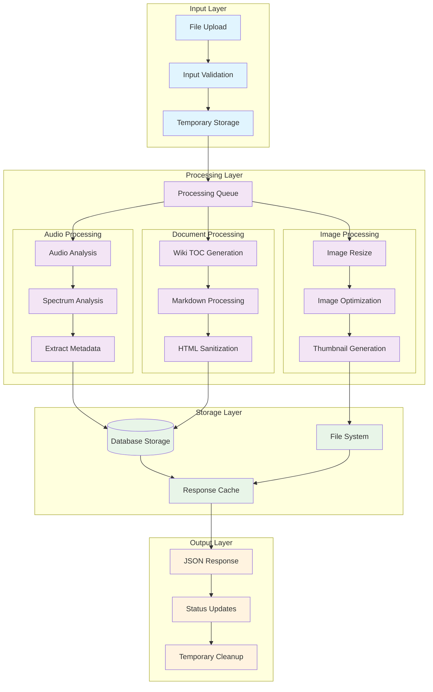
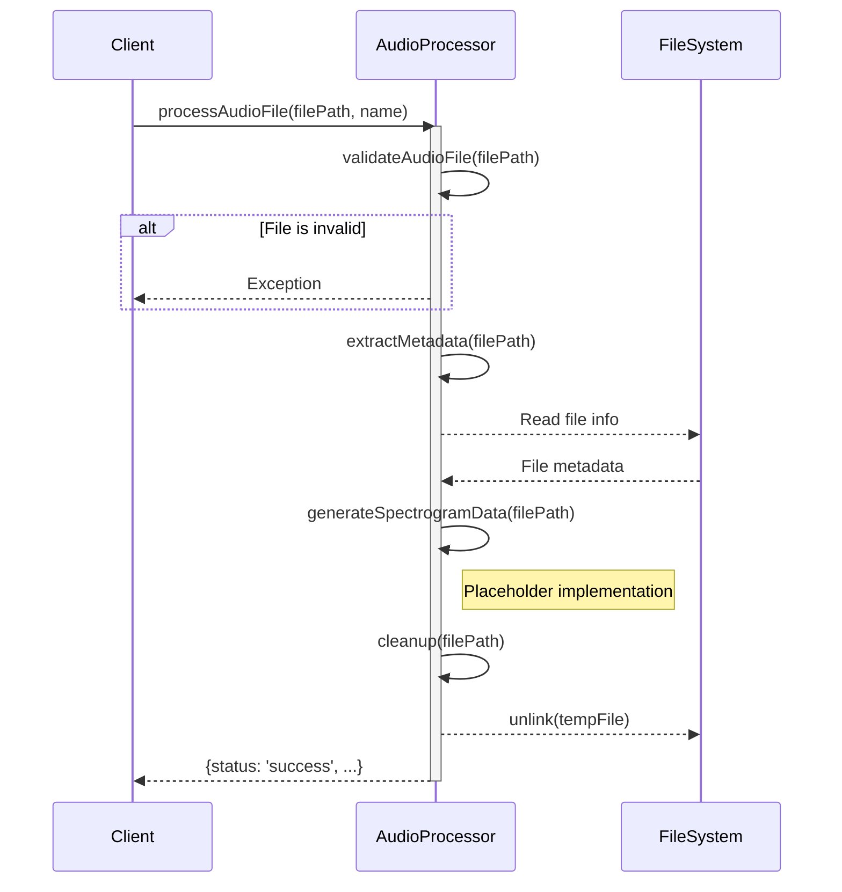
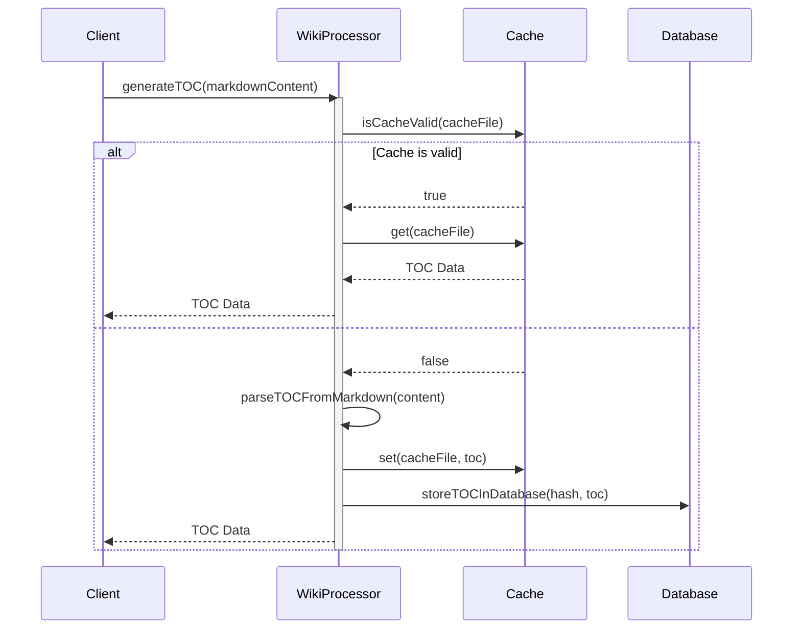
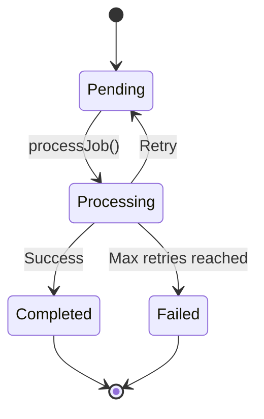
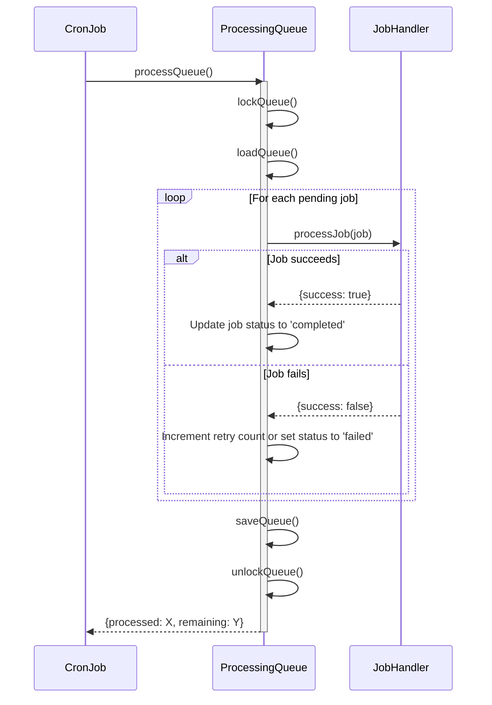
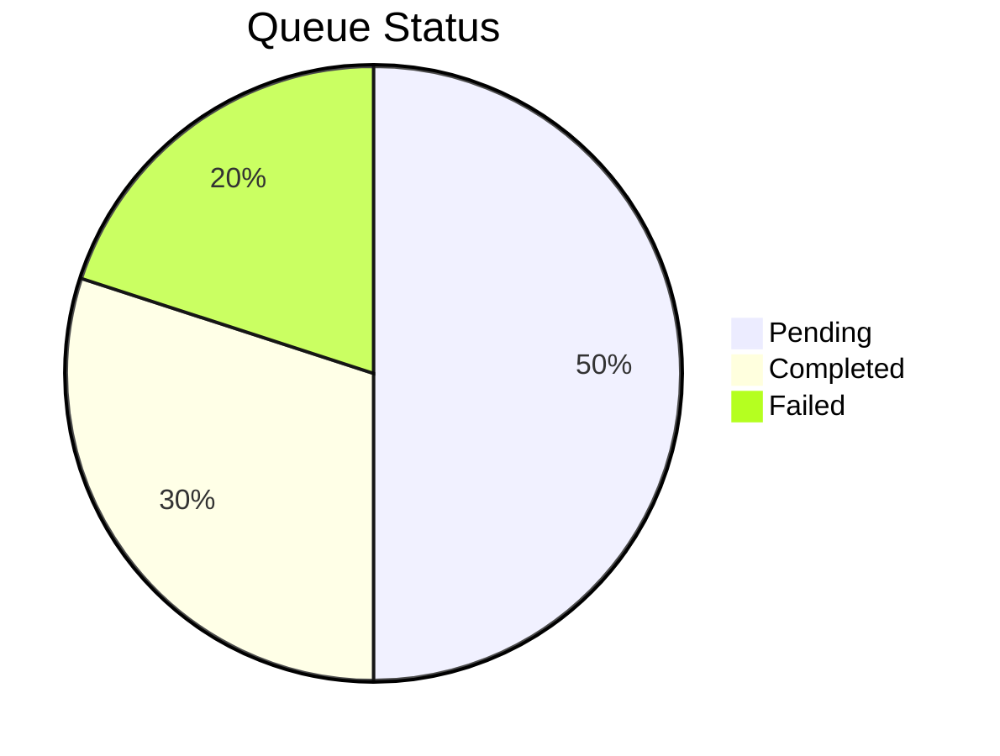
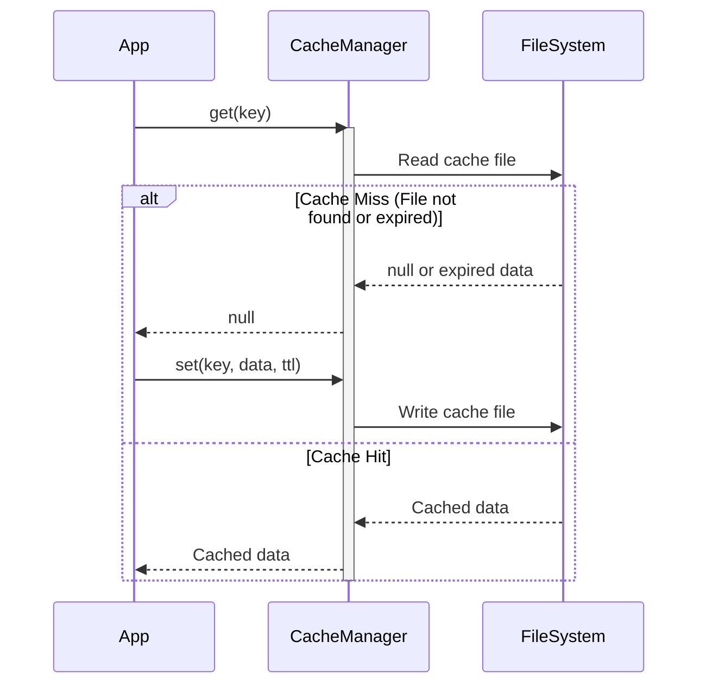
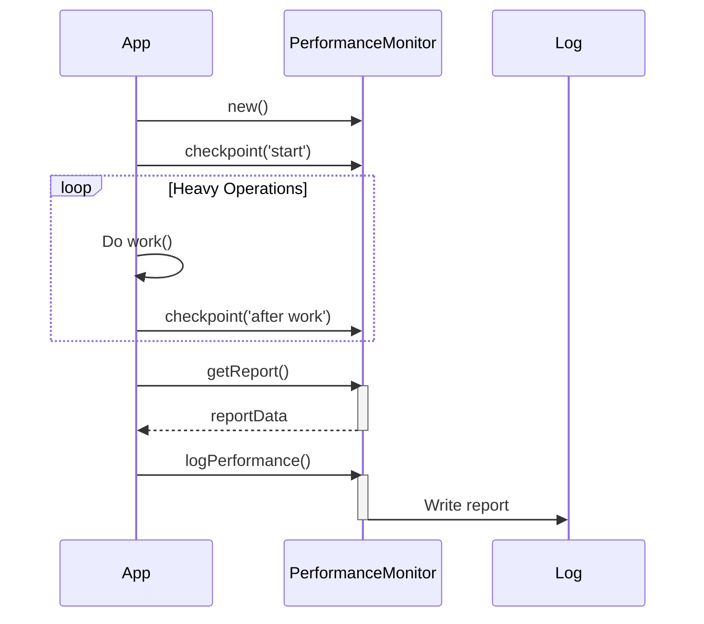

# Server-Side Processing Patterns

**Stage:** st01-backend-server  
**Version:** 1.0  
**Date:** 2025-09-03  
**Focus:** Server-side data processing and file handling patterns

## 1. Processing Architecture Overview

### 1.1. ASCII Processing Pipeline
```
┌─────────────────────────────────────────────────────────────────┐
│                 SERVER-SIDE PROCESSING PIPELINE                 │
├─────────────────────────────────────────────────────────────────┤
│                                                                 │
│  INPUT STAGE              PROCESSING STAGE           OUTPUT     │
│                                                                 │
│  ┌─────────────┐         ┌─────────────────────┐   ┌──────────┐ │
│  │ File Upload │────────▶│   File Validation   │──▶│   Queue  │ │
│  │             │         │                     │   │          │ │
│  │ • Audio     │         │ • Type Check        │   │ • Redis  │ │
│  │ • Markdown  │         │ • Size Limit        │   │ • MySQL  │ │
│  │ • Config    │         │ • Security Scan     │   │ • Memory │ │
│  └─────────────┘         └─────────────────────┘   └──────────┘ │
│        │                           │                      │      │
│        ▼                           ▼                      ▼      │
│  ┌─────────────┐         ┌─────────────────────┐   ┌──────────┐ │
│  │ Temp Storage│         │    Core Processing  │   │  Cache   │ │
│  │             │         │                     │   │          │ │
│  │ • /tmp/     │         │ • Audio Analysis    │   │ • Results│ │
│  │ • Buffer    │         │ • Wiki TOC Gen      │   │ • Metadata│ │
│  │ • Cleanup   │         │ • Image Resize      │   │ • Stats  │ │
│  └─────────────┘         └─────────────────────┘   └──────────┘ │
│        │                           │                      │      │
│        ▼                           ▼                      ▼      │
│  ┌─────────────┐         ┌─────────────────────┐   ┌──────────┐ │
│  │Error Handler│         │   Result Storage    │   │ Response │ │
│  │             │         │                     │   │          │ │
│  │ • Retry     │         │ • File System       │   │ • JSON   │ │
│  │ • Rollback  │         │ • Database          │   │ • Status │ │
│  │ • Notify    │         │ • Backup            │   │ • Links  │ │
│  └─────────────┘         └─────────────────────┘   └──────────┘ │
└─────────────────────────────────────────────────────────────────┘
```

### 1.2. Mermaid Processing Flow


## 2. Audio File Processing Patterns

### 2.1. Audio Analysis Service

#### 2.1.1. ASCII Diagram: `processAudioFile` Workflow

```
┌──────────────────┐      ┌───────────────────┐      ┌───────────────────┐      ┌───────────────────┐
│  processAudio()  │─────▶│ validateAudio()   │─────▶│  extractMetadata()│─────▶│  genSpectrogram() │
└──────────────────┘      └───────────────────┘      └───────────────────┘      └───────────────────┘
         │                      │                      │                      │
         │                      │                      │                      │
         ▼                      ▼                      ▼                      ▼
┌──────────────────┐      ┌───────────────────┐      ┌───────────────────┐      ┌───────────────────┐
│   (Exception?)   │◀─────│   (Exception?)    │◀─────│      (null)       │◀─────│   (placeholder)   │
└──────────────────┘      └───────────────────┘      └───────────────────┘      └───────────────────┘
         │
         │
         ▼
┌──────────────────┐
│     cleanup()    │
└──────────────────┘
```

#### 2.1.2. Mermaid Diagram: `processAudioFile` Sequence



```php
<?php
// config/audio-processor.php
// KISS Audio Processing Service

class AudioProcessor {
    private $uploadDir;
    private $tempDir;
    private $maxFileSize;
    
    public function __construct() {
        $this->uploadDir = '/var/www/html/uploads/audio/';
        $this->tempDir = '/tmp/audio_processing/';
        $this->maxFileSize = 50 * 1024 * 1024; // 50MB
        
        // Ensure directories exist
        if (!is_dir($this->uploadDir)) {
            mkdir($this->uploadDir, 0775, true);
        }
        if (!is_dir($this->tempDir)) {
            mkdir($this->tempDir, 0775, true);
        }
    }
    
    public function processAudioFile($filePath, $originalName) {
        try {
            // Basic validation
            $this->validateAudioFile($filePath);
            
            // Extract basic metadata
            $metadata = $this->extractMetadata($filePath);
            
            // Generate spectrogram data (simplified)
            $spectrogram = $this->generateSpectrogramData($filePath);
            
            // Store results
            $result = [
                'status' => 'success',
                'metadata' => $metadata,
                'spectrogram' => $spectrogram,
                'processed_at' => date('c')
            ];
            
            // Clean up temporary files
            $this->cleanup($filePath);
            
            return $result;
            
        } catch (Exception $e) {
            $this->cleanup($filePath);
            throw $e;
        }
    }
    
    private function validateAudioFile($filePath) {
        if (!file_exists($filePath)) {
            throw new Exception('Audio file not found');
        }
        
        $fileSize = filesize($filePath);
        if ($fileSize > $this->maxFileSize) {
            throw new Exception('Audio file too large');
        }
        
        // Use PHP's built-in file info
        $finfo = finfo_open(FILEINFO_MIME_TYPE);
        $mimeType = finfo_file($finfo, $filePath);
        finfo_close($finfo);
        
        $allowedTypes = ['audio/wav', 'audio/mpeg', 'audio/mp4', 'audio/ogg'];
        if (!in_array($mimeType, $allowedTypes)) {
            throw new Exception('Unsupported audio format: ' . $mimeType);
        }
    }
    
    private function extractMetadata($filePath) {
        // KISS metadata extraction using getID3 or similar
        $metadata = [
            'file_size' => filesize($filePath),
            'file_type' => mime_content_type($filePath),
            'duration' => $this->getAudioDuration($filePath),
            'sample_rate' => null, // Would need audio library
            'channels' => null,    // Would need audio library
            'bitrate' => null      // Would need audio library
        ];
        
        return $metadata;
    }
    
    private function getAudioDuration($filePath) {
        // KISS duration extraction - would use FFmpeg in production
        // For now, return null and implement later
        return null;
    }
    
    private function generateSpectrogramData($filePath) {
        // KISS spectrogram generation - placeholder for now
        // In production, would use FFmpeg or similar tool
        return [
            'status' => 'placeholder',
            'message' => 'Spectrogram generation not implemented',
            'data_points' => 0
        ];
    }
    
    private function cleanup($filePath) {
        if (file_exists($filePath) && strpos($filePath, $this->tempDir) === 0) {
            unlink($filePath);
        }
    }
}
?>
```

### 2.2. Audio Processing API Endpoint
```php
<?php
// api/audio/process.php - Audio Processing API

header('Content-Type: application/json');
header('Access-Control-Allow-Origin: *');
header('Access-Control-Allow-Methods: POST');

if ($_SERVER['REQUEST_METHOD'] !== 'POST') {
    http_response_code(405);
    echo json_encode(['error' => 'Method not allowed']);
    exit;
}

try {
    require_once '../../config/audio-processor.php';
    require_once '../../config/database.php';
    
    $input = json_decode(file_get_contents('php://input'), true);
    
    if (!isset($input['file_id'])) {
        throw new Exception('No file ID provided');
    }
    
    // Get file info from database
    $db = DatabaseConnection::getInstance();
    $pdo = $db->getConnection();
    
    $stmt = $pdo->prepare('SELECT * FROM audio_files WHERE id = ?');
    $stmt->execute([$input['file_id']]);
    $fileRecord = $stmt->fetch(PDO::FETCH_ASSOC);
    
    if (!$fileRecord) {
        throw new Exception('Audio file not found');
    }
    
    // Process the audio file
    $processor = new AudioProcessor();
    $result = $processor->processAudioFile($fileRecord['file_path'], $fileRecord['original_name']);
    
    // Update database with processing results
    $stmt = $pdo->prepare('
        UPDATE audio_files 
        SET metadata = ?, processed = 1, processed_at = NOW() 
        WHERE id = ?
    ');
    
    $stmt->execute([
        json_encode($result['metadata']),
        $input['file_id']
    ]);
    
    $response = [
        'status' => 'success',
        'file_id' => $input['file_id'],
        'processing_result' => $result,
        'timestamp' => date('c')
    ];
    
    http_response_code(200);
    echo json_encode($response, JSON_PRETTY_PRINT);
    
} catch (Exception $e) {
    $response = [
        'status' => 'error',
        'message' => $e->getMessage(),
        'timestamp' => date('c')
    ];
    
    http_response_code(400);
    echo json_encode($response, JSON_PRETTY_PRINT);
}
?>
```

## 3. Wiki Processing Patterns

### 3.1. Wiki TOC Processor

#### 3.1.1. ASCII Diagram: `generateTOC` Workflow

```
                                 ┌───────────────────┐
                                 │   Cache Check     │
                                 └───────────────────┘
                                         │
                                         ▼
                                 ┌───────────────────┐
                                 │ {Is Cache Valid?} │
                                 └───────────────────┘
                                  │               │
                        [Yes]     │               │     [No]
                                  ▼               ▼
┌───────────────────┐      ┌───────────────────┐      ┌───────────────────┐
│  Return from Cache│◀─────│  Return TOC       │      │  Generate TOC     │
└───────────────────┘      └───────────────────┘      └───────────────────┘
                                                          │
                                                          ▼
                                                 ┌───────────────────┐
                                                 │   Store in Cache  │
                                                 └───────────────────┘
                                                          │
                                                          ▼
                                                 ┌───────────────────┐
                                                 │   Return TOC      │
                                                 └───────────────────┘
```

#### 3.1.2. Mermaid Diagram: `generateTOC` Sequence



```php
<?php
// config/wiki-processor.php
// KISS Wiki Table of Contents Processor

class WikiProcessor {
    private $cacheDir;
    private $cacheExpiry;
    
    public function __construct() {
        $this->cacheDir = '/var/www/html/cache/wiki/';
        $this->cacheExpiry = 3600; // 1 hour cache
        
        if (!is_dir($this->cacheDir)) {
            mkdir($this->cacheDir, 0775, true);
        }
    }
    
    public function generateTOC($markdownContent) {
        // Generate cache key from content hash
        $contentHash = md5($markdownContent);
        $cacheFile = $this->cacheDir . 'toc_' . $contentHash . '.json';
        
        // Check cache first
        if ($this->isCacheValid($cacheFile)) {
            return json_decode(file_get_contents($cacheFile), true);
        }
        
        // Generate TOC from markdown
        $toc = $this->parseTOCFromMarkdown($markdownContent);
        
        // Store in cache
        file_put_contents($cacheFile, json_encode($toc, JSON_PRETTY_PRINT));
        
        // Store in database cache
        $this->storeTOCInDatabase($contentHash, $toc);
        
        return $toc;
    }
    
    private function isCacheValid($cacheFile) {
        if (!file_exists($cacheFile)) {
            return false;
        }
        
        $fileTime = filemtime($cacheFile);
        $expiryTime = time() - $this->cacheExpiry;
        
        return $fileTime > $expiryTime;
    }
    
    private function parseTOCFromMarkdown($content) {
        $lines = explode("\n", $content);
        $toc = [];
        $currentLevel = 0;
        
        foreach ($lines as $lineNumber => $line) {
            $line = trim($line);
            
            // Match headers (# ## ### etc.)
            if (preg_match('/^(#{1,6})\s+(.+)$/', $line, $matches)) {
                $level = strlen($matches[1]);
                $title = trim($matches[2]);
                $anchor = $this->generateAnchor($title);
                
                $tocItem = [
                    'level' => $level,
                    'title' => $title,
                    'anchor' => $anchor,
                    'line_number' => $lineNumber + 1
                ];
                
                $toc[] = $tocItem;
            }
        }
        
        return [
            'items' => $toc,
            'total_headers' => count($toc),
            'generated_at' => date('c')
        ];
    }
    
    private function generateAnchor($title) {
        // KISS anchor generation - convert to lowercase, replace spaces with dashes
        $anchor = strtolower($title);
        $anchor = preg_replace('/[^a-z0-9\s-]/', '', $anchor);
        $anchor = preg_replace('/\s+/', '-', $anchor);
        $anchor = trim($anchor, '-');
        
        return $anchor;
    }
    
    private function storeTOCInDatabase($contentHash, $toc) {
        try {
            require_once 'database.php';
            $db = DatabaseConnection::getInstance();
            $pdo = $db->getConnection();
            
            $stmt = $pdo->prepare('
                INSERT INTO wiki_cache (content_hash, toc_json, generated_at, expires_at)
                VALUES (?, ?, NOW(), DATE_ADD(NOW(), INTERVAL 1 HOUR))
                ON DUPLICATE KEY UPDATE
                toc_json = VALUES(toc_json),
                generated_at = VALUES(generated_at),
                expires_at = VALUES(expires_at)
            ');
            
            $stmt->execute([$contentHash, json_encode($toc)]);
            
        } catch (Exception $e) {
            // Non-critical error - log but don't throw
            error_log('Failed to store TOC in database: ' . $e->getMessage());
        }
    }
}
?>
```

### 3.2. Markdown Processing Service
```php
<?php
// config/markdown-processor.php
// KISS Markdown Processing Service

class MarkdownProcessor {
    private $allowedTags;
    private $allowedAttributes;
    
    public function __construct() {
        // Define allowed HTML tags for security
        $this->allowedTags = [
            'h1', 'h2', 'h3', 'h4', 'h5', 'h6',
            'p', 'br', 'strong', 'em', 'u', 'code',
            'pre', 'blockquote', 'ul', 'ol', 'li',
            'a', 'img', 'table', 'thead', 'tbody', 'tr', 'th', 'td'
        ];
        
        $this->allowedAttributes = [
            'href' => ['a'],
            'src' => ['img'],
            'alt' => ['img'],
            'title' => ['a', 'img'],
            'class' => ['*'],
            'id' => ['*']
        ];
    }
    
    public function processMarkdown($content) {
        try {
            // Basic markdown to HTML conversion (KISS approach)
            $html = $this->convertMarkdownToHTML($content);
            
            // Sanitize HTML for security
            $sanitizedHTML = $this->sanitizeHTML($html);
            
            // Extract metadata
            $metadata = $this->extractMetadata($content);
            
            return [
                'html' => $sanitizedHTML,
                'metadata' => $metadata,
                'word_count' => str_word_count(strip_tags($html)),
                'processed_at' => date('c')
            ];
            
        } catch (Exception $e) {
            throw new Exception('Markdown processing failed: ' . $e->getMessage());
        }
    }
    
    private function convertMarkdownToHTML($content) {
        // KISS markdown conversion - basic patterns only
        $html = $content;
        
        // Headers
        $html = preg_replace('/^### (.+)$/m', '<h3>$1</h3>', $html);
        $html = preg_replace('/^## (.+)$/m', '<h2>$1</h2>', $html);
        $html = preg_replace('/^# (.+)$/m', '<h1>$1</h1>', $html);
        
        // Bold and italic
        $html = preg_replace('/\*\*(.*?)\*\*/', '<strong>$1</strong>', $html);
        $html = preg_replace('/\*(.*?)\*/', '<em>$1</em>', $html);
        
        // Code blocks
        $html = preg_replace('/```(.*?)```/s', '<pre><code>$1</code></pre>', $html);
        $html = preg_replace('/`(.*?)`/', '<code>$1</code>', $html);
        
        // Links
        $html = preg_replace('/\[([^\]]+)\]\(([^\)]+)\)/', '<a href="$2">$1</a>', $html);
        
        // Line breaks
        $html = preg_replace('/\n\n/', '</p><p>', $html);
        $html = '<p>' . $html . '</p>';
        
        // Clean up empty paragraphs
        $html = preg_replace('/<p><\/p>/', '', $html);
        
        return $html;
    }
    
    private function sanitizeHTML($html) {
        // KISS HTML sanitization - strip unwanted tags
        $html = strip_tags($html, '<' . implode('><', $this->allowedTags) . '>');
        
        // Remove dangerous attributes (basic approach)
        $html = preg_replace('/on\w+="[^"]*"/', '', $html);
        $html = preg_replace('/javascript:[^"\']*/', '', $html);
        
        return $html;
    }
    
    private function extractMetadata($content) {
        $lines = explode("\n", $content);
        
        return [
            'line_count' => count($lines),
            'character_count' => strlen($content),
            'header_count' => preg_match_all('/^#{1,6}\s+/m', $content),
            'code_block_count' => preg_match_all('/```/', $content) / 2,
            'link_count' => preg_match_all('/\[([^\]]+)\]\(([^\)]+)\)/', $content)
        ];
    }
}
?>
```

## 4. File Processing Queue System

### 4.1. Simple Processing Queue

#### 4.1.1. ASCII Diagram: Job State Lifecycle

```
┌─────────┐       ┌───────────┐       ┌───────────┐
│ Pending │──────▶│ Processing│──────▶│ Completed │
└─────────┘       └───────────┘       └───────────┘
     │                 │
     │                 ▼
     │            ┌────────┐
     └────────────▶│ Failed │
                  └────────┘
```

#### 4.1.2. Mermaid Diagram: Job State Lifecycle



#### 4.1.3. Mermaid Diagram: `processQueue` Sequence



```php
<?php
// config/processing-queue.php
// KISS File Processing Queue

class ProcessingQueue {
    private $queueFile;
    private $lockFile;
    private $maxRetries;
    
    public function __construct() {
        $this->queueFile = '/var/www/html/cache/processing_queue.json';
        $this->lockFile = '/var/www/html/cache/queue.lock';
        $this->maxRetries = 3;
    }
    
    public function addJob($type, $data) {
        $job = [
            'id' => uniqid('job_'),
            'type' => $type,
            'data' => $data,
            'status' => 'pending',
            'created_at' => date('c'),
            'attempts' => 0,
            'max_attempts' => $this->maxRetries
        ];
        
        $this->lockQueue();
        
        try {
            $queue = $this->loadQueue();
            $queue[] = $job;
            $this->saveQueue($queue);
            
        } finally {
            $this->unlockQueue();
        }
        
        return $job['id'];
    }
    
    public function processQueue() {
        if ($this->isLocked()) {
            return ['message' => 'Queue is already being processed'];
        }
        
        $this->lockQueue();
        
        try {
            $queue = $this->loadQueue();
            $processed = 0;
            
            foreach ($queue as $index => $job) {
                if ($job['status'] === 'pending' && $job['attempts'] < $job['max_attempts']) {
                    $result = $this->processJob($job);
                    
                    if ($result['success']) {
                        $queue[$index]['status'] = 'completed';
                        $queue[$index]['completed_at'] = date('c');
                        $processed++;
                    } else {
                        $queue[$index]['attempts']++;
                        $queue[$index]['last_error'] = $result['error'];
                        
                        if ($queue[$index]['attempts'] >= $queue[$index]['max_attempts']) {
                            $queue[$index]['status'] = 'failed';
                        }
                    }
                }
            }
            
            // Remove completed jobs older than 1 hour
            $queue = array_filter($queue, function($job) {
                if ($job['status'] === 'completed') {
                    $completedTime = strtotime($job['completed_at']);
                    return (time() - $completedTime) < 3600;
                }
                return true;
            });
            
            $this->saveQueue(array_values($queue));
            
            return [
                'processed' => $processed,
                'remaining' => count(array_filter($queue, function($job) {
                    return $job['status'] === 'pending';
                }))
            ];
            
        } finally {
            $this->unlockQueue();
        }
    }
    
    private function processJob($job) {
        try {
            switch ($job['type']) {
                case 'audio_analysis':
                    return $this->processAudioJob($job['data']);
                    
                case 'wiki_toc':
                    return $this->processWikiJob($job['data']);
                    
                case 'image_resize':
                    return $this->processImageJob($job['data']);
                    
                default:
                    return ['success' => false, 'error' => 'Unknown job type'];
            }
            
        } catch (Exception $e) {
            return ['success' => false, 'error' => $e->getMessage()];
        }
    }
    
    private function processAudioJob($data) {
        require_once 'audio-processor.php';
        $processor = new AudioProcessor();
        
        $result = $processor->processAudioFile($data['file_path'], $data['original_name']);
        return ['success' => true, 'result' => $result];
    }
    
    private function processWikiJob($data) {
        require_once 'wiki-processor.php';
        $processor = new WikiProcessor();
        
        $toc = $processor->generateTOC($data['content']);
        return ['success' => true, 'result' => $toc];
    }
    
    private function processImageJob($data) {
        // Placeholder for image processing
        return ['success' => false, 'error' => 'Image processing not implemented'];
    }
    
    private function lockQueue() {
        $timeout = 30; // 30 second timeout
        $start = time();
        
        while (file_exists($this->lockFile)) {
            if (time() - $start > $timeout) {
                throw new Exception('Queue lock timeout');
            }
            usleep(100000); // 100ms sleep
        }
        
        touch($this->lockFile);
    }
    
    private function unlockQueue() {
        if (file_exists($this->lockFile)) {
            unlink($this->lockFile);
        }
    }
    
    private function isLocked() {
        return file_exists($this->lockFile);
    }
    
    private function loadQueue() {
        if (!file_exists($this->queueFile)) {
            return [];
        }
        
        $content = file_get_contents($this->queueFile);
        return json_decode($content, true) ?: [];
    }
    
    private function saveQueue($queue) {
        file_put_contents($this->queueFile, json_encode($queue, JSON_PRETTY_PRINT));
    }
}
?>
```

### 4.2. Queue Management API

#### 4.2.1. ASCII Diagram: Queue Status

```
Queue Status:
  - Pending:   [|||||     ] 50%
  - Completed: [|||       ] 30%
  - Failed:    [||        ] 20%
```

#### 4.2.2. Mermaid Diagram: Queue Status Pie Chart



```php
<?php
// api/queue/status.php - Processing Queue Status

header('Content-Type: application/json');
header('Access-Control-Allow-Origin: *');

try {
    require_once '../../config/processing-queue.php';
    
    $queue = new ProcessingQueue();
    
    if ($_SERVER['REQUEST_METHOD'] === 'POST') {
        // Process the queue
        $result = $queue->processQueue();
        
        $response = [
            'status' => 'success',
            'processed' => $result['processed'],
            'remaining' => $result['remaining'],
            'timestamp' => date('c')
        ];
        
    } else {
        // Get queue status
        $queueFile = '/var/www/html/cache/processing_queue.json';
        
        if (file_exists($queueFile)) {
            $queueData = json_decode(file_get_contents($queueFile), true);
            
            $stats = [
                'total' => count($queueData),
                'pending' => count(array_filter($queueData, function($job) {
                    return $job['status'] === 'pending';
                })),
                'completed' => count(array_filter($queueData, function($job) {
                    return $job['status'] === 'completed';
                })),
                'failed' => count(array_filter($queueData, function($job) {
                    return $job['status'] === 'failed';
                }))
            ];
            
        } else {
            $stats = ['total' => 0, 'pending' => 0, 'completed' => 0, 'failed' => 0];
        }
        
        $response = [
            'status' => 'success',
            'queue_stats' => $stats,
            'timestamp' => date('c')
        ];
    }
    
    http_response_code(200);
    echo json_encode($response, JSON_PRETTY_PRINT);
    
} catch (Exception $e) {
    $response = [
        'status' => 'error',
        'message' => $e->getMessage(),
        'timestamp' => date('c')
    ];
    
    http_response_code(500);
    echo json_encode($response, JSON_PRETTY_PRINT);
}
?>
```

## 5. Caching and Performance Patterns

### 5.1. Response Caching Service

#### 5.1.1. ASCII Diagram: Cache `get` Logic

```
┌───────────┐      ┌──────────────┐      ┌──────────────┐      ┌───────────┐
│ App Logic │─────▶│ CacheManager │─────▶│  FileSystem  │─────▶│ App Logic │
└───────────┘      └──────────────┘      └──────────────┘      └───────────┘
      │                  │                     │                     │
      │ Get(key)         │                     │                     │
      │─────────────────▶│                     │                     │
      │                  │ Read(file)          │                     │
      │                  │────────────────────▶│                     │
      │                  │                     │ {File Exists?}      │
      │                  │                     │        │            │
      │                  │◀────────────────────│       [No]          │
      │                  │                     │        │            │
      │◀─────────────────│ null                │        ▼            │
      │                  │                     │  ┌───────────┐      │
      │                  │                     │  │ Return null │      │
      │                  │                     │  └───────────┘      │
      │                  │                     │                     │
      │                  │◀────────────────────│       [Yes]         │
      │                  │ {Is Expired?}       │                     │
      │                  │        │            │                     │
      │                  │       [No]          │                     │
      │◀─────────────────│ Data                │                     │
      │                  │                     │                     │
      │                  │       [Yes]         │                     │
      │◀─────────────────│ null                │                     │
```

#### 5.1.2. Mermaid Diagram: Cache `get`/`set` Sequence



```php
<?php
// config/cache-manager.php
// KISS Response Caching Manager

class CacheManager {
    private $cacheDir;
    private $defaultTTL;
    
    public function __construct() {
        $this->cacheDir = '/var/www/html/cache/responses/';
        $this->defaultTTL = 3600; // 1 hour default
        
        if (!is_dir($this->cacheDir)) {
            mkdir($this->cacheDir, 0775, true);
        }
    }
    
    public function get($key) {
        $cacheFile = $this->getCacheFile($key);
        
        if (!file_exists($cacheFile)) {
            return null;
        }
        
        $cacheData = json_decode(file_get_contents($cacheFile), true);
        
        if ($cacheData['expires_at'] < time()) {
            unlink($cacheFile);
            return null;
        }
        
        return $cacheData['data'];
    }
    
    public function set($key, $data, $ttl = null) {
        $ttl = $ttl ?: $this->defaultTTL;
        
        $cacheData = [
            'data' => $data,
            'created_at' => time(),
            'expires_at' => time() + $ttl
        ];
        
        $cacheFile = $this->getCacheFile($key);
        file_put_contents($cacheFile, json_encode($cacheData));
    }
    
    public function delete($key) {
        $cacheFile = $this->getCacheFile($key);
        if (file_exists($cacheFile)) {
            unlink($cacheFile);
        }
    }
    
    public function clear() {
        $files = glob($this->cacheDir . '*');
        foreach ($files as $file) {
            if (is_file($file)) {
                unlink($file);
            }
        }
    }
    
    public function getStats() {
        $files = glob($this->cacheDir . '*');
        $totalSize = 0;
        $activeCount = 0;
        $expiredCount = 0;
        
        foreach ($files as $file) {
            if (is_file($file)) {
                $totalSize += filesize($file);
                
                $cacheData = json_decode(file_get_contents($file), true);
                if ($cacheData['expires_at'] > time()) {
                    $activeCount++;
                } else {
                    $expiredCount++;
                }
            }
        }
        
        return [
            'total_files' => count($files),
            'active_cache_entries' => $activeCount,
            'expired_entries' => $expiredCount,
            'total_size_bytes' => $totalSize,
            'total_size_mb' => round($totalSize / 1024 / 1024, 2)
        ];
    }
    
    private function getCacheFile($key) {
        $safeKey = preg_replace('/[^a-zA-Z0-9_-]/', '_', $key);
        return $this->cacheDir . $safeKey . '.cache';
    }
}
?>
```

### 5.2. Performance Monitoring

#### 5.2.1. ASCII Diagram: Performance Monitoring Workflow

```
┌───────────────┐      ┌────────────────────┐      ┌────────────────┐
│   App Code    │─────▶│ PerformanceMonitor │─────▶│    Log File    │
└───────────────┘      └────────────────────┘      └────────────────┘
        │                      │                           │
        │ checkpoint("A")      │                           │
        │─────────────────────▶│                           │
        │                      │                           │
        │ ... some work ...    │                           │
        │                      │                           │
        │ checkpoint("B")      │                           │
        │─────────────────────▶│                           │
        │                      │                           │
        │ getReport()          │                           │
        │─────────────────────▶│                           │
        │◀─────────────────────│ Report Data               │
        │                      │                           │
        │ logPerformance()     │                           │
        │─────────────────────▶│                           │
        │                      │ write(report)             │
        │                      │──────────────────────────▶│
```

#### 5.2.2. Mermaid Diagram: PerformanceMonitor Sequence



```php
<?php
// config/performance-monitor.php
// KISS Performance Monitoring

class PerformanceMonitor {
    private $startTime;
    private $startMemory;
    private $checkpoints;
    
    public function __construct() {
        $this->startTime = microtime(true);
        $this->startMemory = memory_get_usage(true);
        $this->checkpoints = [];
    }
    
    public function checkpoint($name) {
        $this->checkpoints[] = [
            'name' => $name,
            'time' => microtime(true),
            'memory' => memory_get_usage(true),
            'elapsed_since_start' => microtime(true) - $this->startTime
        ];
    }
    
    public function getReport() {
        $endTime = microtime(true);
        $endMemory = memory_get_usage(true);
        
        return [
            'execution_time_ms' => round(($endTime - $this->startTime) * 1000, 2),
            'memory_usage_mb' => round($endMemory / 1024 / 1024, 2),
            'memory_peak_mb' => round(memory_get_peak_usage(true) / 1024 / 1024, 2),
            'checkpoints' => $this->checkpoints
        ];
    }
    
    public function logPerformance($context = 'Unknown') {
        $report = $this->getReport();
        $logEntry = [
            'timestamp' => date('c'),
            'context' => $context,
            'performance' => $report
        ];
        
        error_log(json_encode($logEntry), 3, '/var/log/qualia-performance.log');
    }
}
?>
```

---

**KISS Processing Principles:**
- ✅ Simple, focused processing functions
- ✅ Clear error handling and recovery
- ✅ File-based caching for simplicity
- ✅ Queue system without external dependencies
- ✅ Basic performance monitoring
- ✅ Minimal configuration complexity
- ✅ Progressive enhancement from basic to advanced features