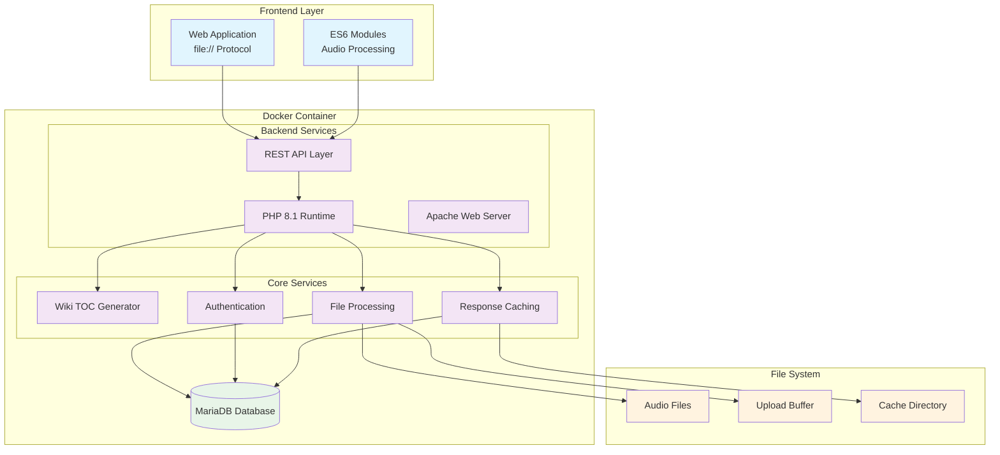

# Stage 01: Backend Server Architecture

**Version:** 1.0  
**Date:** 2025-09-03  
**Status:** ACTIVE  
**Development Method:** KISS (Keep It Simple Stable)

## 1. Stage Objective

Establish Docker-based backend server architecture for Qualia-NSS, enabling server-side processing, database integration, and API services while maintaining the KISS methodology through incremental, testable implementation.

## 2. ASCII Architecture Overview

```
┌─────────────────────────────────────────────────────────────────┐
│                    QUALIA-NSS BACKEND ARCHITECTURE              │
├─────────────────────────────────────────────────────────────────┤
│                                                                 │
│  ┌─────────────┐    ┌─────────────┐    ┌─────────────────────┐  │
│  │   FRONTEND  │───▶│   BACKEND   │───▶│      DATABASE      │  │
│  │   (Client)  │    │  (Docker)   │    │     (MariaDB)      │  │
│  │             │    │             │    │                     │  │
│  │ • Web App   │    │ • PHP 8.1   │    │ • User Sessions    │  │
│  │ • File://   │    │ • Apache    │    │ • Audio Metadata   │  │
│  │ • ES6 Mods  │    │ • REST API  │    │ • Processing Cache │  │
│  └─────────────┘    └─────────────┘    └─────────────────────┘  │
│        │                   │                       │            │
│        ▼                   ▼                       ▼            │
│  ┌─────────────┐    ┌─────────────┐    ┌─────────────────────┐  │
│  │  PROTOCOLS  │    │  SERVICES   │    │    FILE SYSTEM     │  │
│  │             │    │             │    │                     │  │
│  │ • HTTP/8080 │    │ • Wiki TOC  │    │ • Audio Storage    │  │
│  │ • REST API  │    │ • File Proc │    │ • Cache Directory  │  │
│  │ • WebSockets│    │ • Auth      │    │ • Upload Buffer    │  │
│  └─────────────┘    └─────────────┘    └─────────────────────┘  │
└─────────────────────────────────────────────────────────────────┘
```

## 3. Mermaid Architecture Diagram



## 4. KISS Implementation Strategy

### 4.1. Small Functionality Focus
**Stage Breakdown:**
- **st01a**: Docker environment setup and basic PHP endpoint
- **st01b**: MariaDB integration and connection testing  
- **st01c**: Wiki TOC generation API implementation
- **st01d**: File upload and processing pipeline
- **st01e**: Authentication and session management
- **st01f**: Production deployment patterns

### 4.2. Iterative Development Approach
Each sub-stage builds incrementally:
1. **Minimal Working Implementation** first
2. **Testing and Validation** before progression  
3. **Documentation Updates** after successful testing
4. **Fallback Capability** maintained at each checkpoint

## 5. Stage Dependencies

### 5.1. Prerequisites
- **st00-wireframe**: App shell architecture understanding
- **st02-modularization**: Frontend-backend integration patterns
- **st03-wiki-system**: Wiki submodule processing requirements
- **Existing Dockerfile**: Docker container configuration

### 5.2. Integration Points
- **Frontend**: ES6 modules must communicate with backend APIs
- **Database**: MariaDB schema design for audio metadata
- **File System**: Volume mounting for audio file processing
- **Deployment**: FTPS integration for production deployment

## 6. Technical Specifications

### 6.1. Docker Configuration
```
Container: PHP 8.1 + Apache + MariaDB
Ports: 80 (Apache), 3306 (MariaDB), 8080 (Development)
Volumes: Project root mounted to /var/www/html
Environment: Development-focused with debugging enabled
```

### 6.2. API Endpoints (Planned)
```
POST /api/wiki/toc          - Generate table of contents
POST /api/audio/upload      - Upload audio files  
GET  /api/audio/metadata    - Retrieve audio file info
POST /api/auth/login        - User authentication
GET  /api/health            - Service health check
```

### 6.3. Database Schema (Initial)
```sql
-- User sessions and authentication
users (id, username, password_hash, created_at)
sessions (id, user_id, token, expires_at)

-- Audio processing and metadata  
audio_files (id, filename, path, metadata, processed_at)
processing_queue (id, file_id, status, priority, created_at)

-- Wiki and documentation
wiki_cache (id, file_path, toc_json, generated_at)
```

## 7. Development Workflow

### 7.1. Local Development Setup
```bash
# Build Docker image
docker build -t qualia-nss-backend .

# Run development container
docker run -d -p 8080:80 -p 3306:3306 \
  -v "$(pwd)":/var/www/html \
  --name qualia-dev \
  qualia-nss-backend

# Verify services
curl http://localhost:8080/api/health
```

### 7.2. Testing Protocol
1. **Unit Testing**: Individual API endpoints
2. **Integration Testing**: Frontend-backend communication
3. **Container Testing**: Docker build and run verification
4. **Database Testing**: MariaDB connection and queries
5. **Volume Testing**: File system mounting and permissions

## 8. Security Considerations

### 8.1. Development Security
- **No Production Secrets** in development environment
- **Local Network Only** - no external exposure
- **File System Isolation** through Docker volumes
- **Database Access Control** within container network

### 8.2. API Security Patterns
- **Input Validation** for all API endpoints
- **SQL Injection Prevention** using prepared statements
- **File Upload Sanitization** with type and size limits
- **Authentication Tokens** with expiration management

## 9. Monitoring and Debugging

### 9.1. Development Tools
- **Apache Error Logs**: `/var/log/apache2/error.log`
- **PHP Error Reporting**: Enabled in development mode
- **MariaDB Query Logs**: For database debugging
- **Docker Logs**: `docker logs qualia-dev`

### 9.2. Health Check Endpoints
```php
// Basic health check
GET /api/health
Response: {"status": "ok", "timestamp": "2025-09-03T12:00:00Z"}

// Detailed service status
GET /api/status  
Response: {
  "database": "connected",
  "apache": "running", 
  "php": "8.1.0",
  "disk_space": "available"
}
```

## 10. Next Steps

### 10.1. Immediate Actions (st01a)
1. **Verify Docker Setup**: Test existing Dockerfile functionality
2. **Create Basic API**: Implement /api/health endpoint
3. **Test Container Communication**: Verify port mapping and access
4. **Document Results**: Update stage documentation with findings

### 10.2. Future Iterations
- **st01b**: Database integration and connection testing
- **st01c**: Wiki TOC API implementation based on st03 requirements
- **st01d**: File processing pipeline for audio uploads
- **st01e**: Authentication system integration
- **st01f**: Production deployment and security hardening

---

**Adherence to KISS Principles:**
- ✅ Small, focused functionality per iteration
- ✅ Testable checkpoints at each sub-stage
- ✅ Clear rollback capability maintained
- ✅ Documentation updated after successful implementation
- ✅ Integration with existing frontend architecture preserved