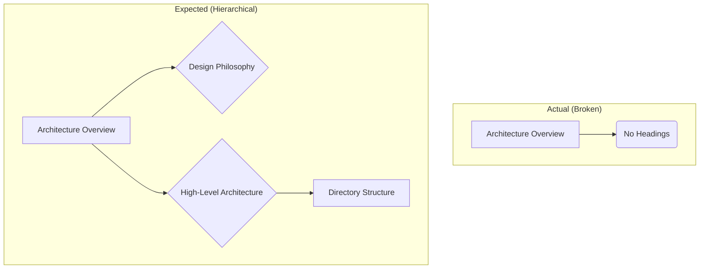
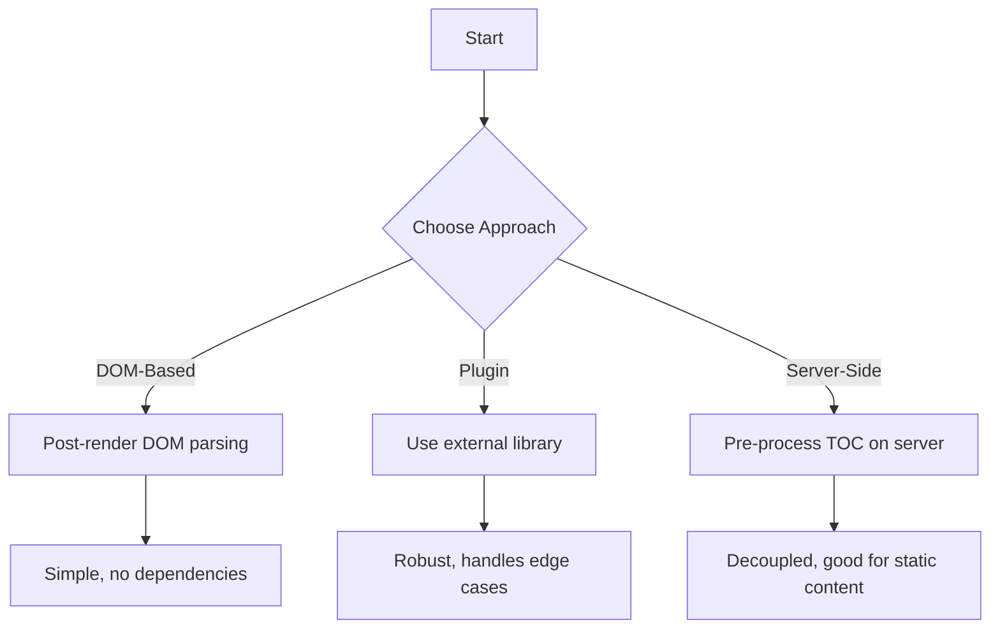
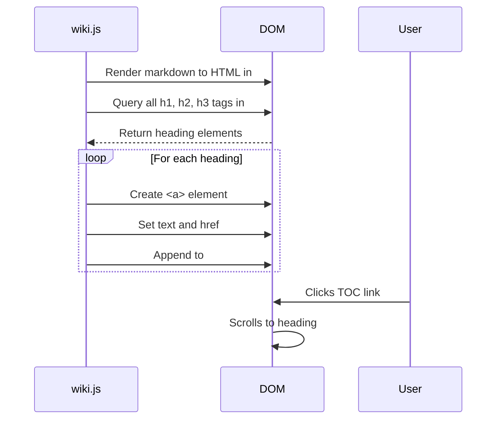

# CRITICAL ISSUE REPORT: Wiki TOC System Not Functional

**Date**: 2025-08-31  
**Severity**: HIGH  
**Module**: Wiki System (`src/wiki/`)  
**Status**: NEEDS ALTERNATIVE APPROACH  

## 🚨 Issue Summary

The wiki Table of Contents (TOC) system is not functioning as intended. Multiple attempts to fix have failed, requiring community input for alternative implementation approaches.

## 📋 Expected Behavior vs. Actual Behavior

### Expected Behavior (GitHub Wiki Style)
1. **Hierarchical TOC**: Sidebar should display a complete table of contents with all headings (H1, H2, H3, etc.) from the markdown file
2. **Interactive Navigation**: Clicking on TOC items should scroll to the corresponding section in the main content area
3. **Visual Hierarchy**: Indented structure showing heading levels with proper styling
4. **Active States**: Current section should be highlighted in TOC as user scrolls

### Actual Behavior (Broken)
1. **Simple Document Links**: Only shows document names (e.g., "Architecture Overview") without internal headings
2. **No Section Navigation**: Cannot jump to specific sections within documents
3. **Missing Content Structure**: Rich documents with many headings show no internal navigation
4. **Content Truncation**: Some content appears cut off or incomplete in main area

## 🖼️ Visual Evidence

### Mermaid Diagram: Expected vs. Actual TOC



From user screenshot showing Architecture Overview document:

**Sidebar TOC (Actual - WRONG)**:
```
🏠 General
👤 User Guide  
🛠️ Developer Documentation
  📄 Architecture Overview  <-- Only shows document name
```

**Expected TOC Should Show**:
```
🛠️ Developer Documentation
  📄 Architecture Overview
    🏗️ Design Philosophy
    🏛️ High-Level Architecture  
    📁 Directory Structure
    ⚙️ Core Module System
      Loading Order (Critical)
      Module Lifecycle
      Module Registration
    🎨 CSS Architecture
    🔊 Audio Processing Pipeline
    🧩 Component System (Phase 2)
    📊 Data Flow Patterns
    🔧 Extension Points
    🚀 Performance Considerations
    🔍 Debugging and Development
```

**Content Issues Observed**:
- Directory structure text cuts off mid-sentence
- "Loading Order (Critical)" section appears truncated
- No way to jump to specific sections from sidebar

## 🔧 Technical Analysis

### Root Cause: Template Literal Parsing Failures

Multiple attempts to implement hierarchical TOC have failed due to:

1. **Template Literal Syntax Errors**: When trying to interpolate markdown heading content containing special characters (`$`, `` ` ``, `\`) into template literals
2. **Async Content Loading Issues**: Race conditions between content fetching and DOM manipulation
3. **Complex String Escaping**: Markdown content with code blocks and special formatting breaking JavaScript string interpolation

### Previous Failed Approaches

#### Attempt 1: Direct Template Literal Interpolation
```javascript
// FAILED - Caused raw JavaScript to display in sidebar
const tocHTML = headings.map(h => `
    <a href="#" data-heading="${h.id}">${h.text}</a>
`).join('');
```
**Issue**: Special characters in heading text broke template literal parsing

#### Attempt 2: String Escaping
```javascript
// FAILED - Over-complicated, still had parsing issues
const safeText = heading.text.replace(/[`$\\]/g, '\\$&');
```
**Issue**: Escaping didn't handle all edge cases, markdown content too complex

#### Attempt 3: Error Handling Wrapper
```javascript
// FAILED - Debugging broke basic functionality
try {
    // Complex TOC generation
} catch (error) {
    // Fallback content
}
```
**Issue**: Error handling masked root cause, basic TOC disappeared

## 📁 Affected Files

### Primary Files
- `src/wiki/index.js` (Lines 106-205) - TOC generation logic
- `src/styles/modules/wiki.css` (Lines 34-78) - Hierarchical TOC styling

### Integration Points
- `src/js/sidebar-manager.js` - Wiki sidebar template
- `src/js/module-loader.js` - Wiki content container

### Content Files Affected
- `src/wiki/content/Developer-Docs/01-Architecture-Overview.md` - Complex document with many headings
- `src/wiki/content/User-Guide/02-Understanding-Filters.md` - Rich content structure
- All markdown files with internal heading structure

## 💡 Potential Alternative Approaches

### Mermaid Diagram: Alternative Solutions Flowchart




### Approach 1: DOM-Based TOC Generation

#### Mermaid Diagram: DOM-Based TOC Generation Sequence



**Instead of**: Template literal string interpolation  
**Use**: Direct DOM manipulation after content is loaded

```javascript
// After markdown is rendered to HTML
const contentHeadings = document.querySelectorAll('h1, h2, h3, h4, h5, h6');
const tocContainer = document.getElementById('toc');

contentHeadings.forEach(heading => {
    const link = document.createElement('a');
    link.textContent = heading.textContent;
    link.href = '#' + heading.id;
    tocContainer.appendChild(link);
});
```

### Approach 2: Markdown TOC Plugin
**Use**: External library like `markdown-it-toc-done-right` or similar  
**Benefit**: Handles edge cases automatically

### Approach 3: Server-Side TOC Generation
**Pre-process**: Generate TOC metadata when content is published  
**Store**: TOC structure in separate JSON files

### Approach 4: Intersection Observer Navigation
**Real-time**: Track which section is visible and update TOC accordingly  
**Smooth**: Handle scrolling and active states properly

## 🛠️ Current Workaround

Currently implemented simple document-based navigation:
- Shows only top-level document names
- Basic functionality works but lacks internal navigation
- Not suitable for complex documents with many sections

## 🆘 Request for Community Input

**Need help with**:
1. **Best practice** for generating TOC from markdown content in vanilla JavaScript
2. **Safe string handling** for content with special characters
3. **Template alternatives** that avoid template literal parsing issues
4. **Smooth scrolling implementation** for section navigation
5. **Performance optimization** for large documents

## 🎯 Acceptance Criteria for Fix

1. **Complete TOC Display**: All headings (H1-H6) from markdown files visible in sidebar
2. **Hierarchical Structure**: Proper indentation showing heading levels
3. **Section Navigation**: Clicking TOC items scrolls to corresponding content section
4. **Active State Management**: Current section highlighted in TOC
5. **No Content Truncation**: Full document content displays properly
6. **Cross-browser Compatibility**: Works in Chrome, Firefox, Safari, Edge
7. **Performance**: Fast loading even for large documents with many headings

## 🔗 Related Issues

- Template literal syntax errors in JavaScript console
- Content area showing truncated/incomplete text
- Missing scroll-to-section functionality
- Inconsistent TOC styling compared to other modules

## 📞 Contact for Discussion

- **GitHub Issues**: Report technical approaches and solutions
- **Development Team**: Discuss architectural alternatives
- **Community**: Share similar implementation experiences

---

**Priority**: HIGH - Wiki system is core documentation feature  
**Impact**: Blocks effective use of comprehensive documentation  
**Urgency**: Need alternative approach before next deployment  

*This report details a complex issue that has resisted multiple fix attempts and requires community expertise to resolve properly.*