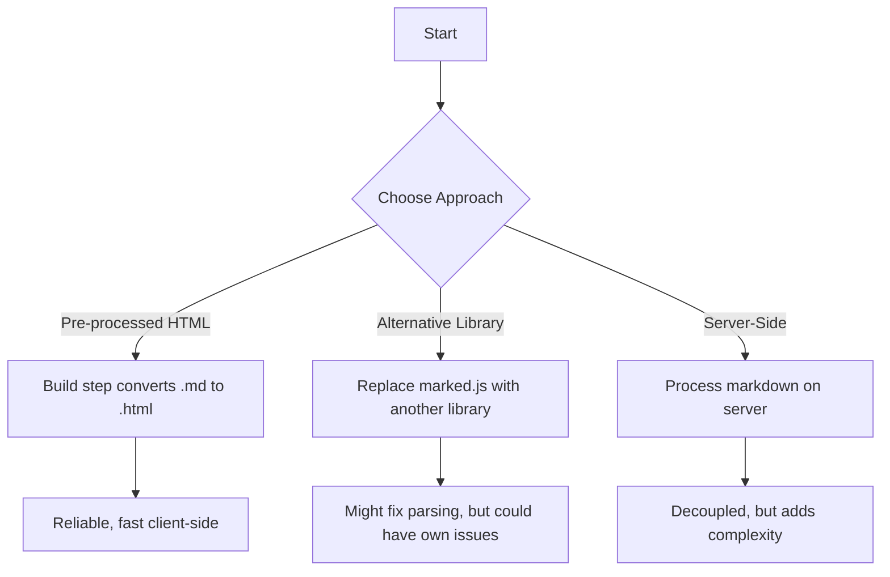
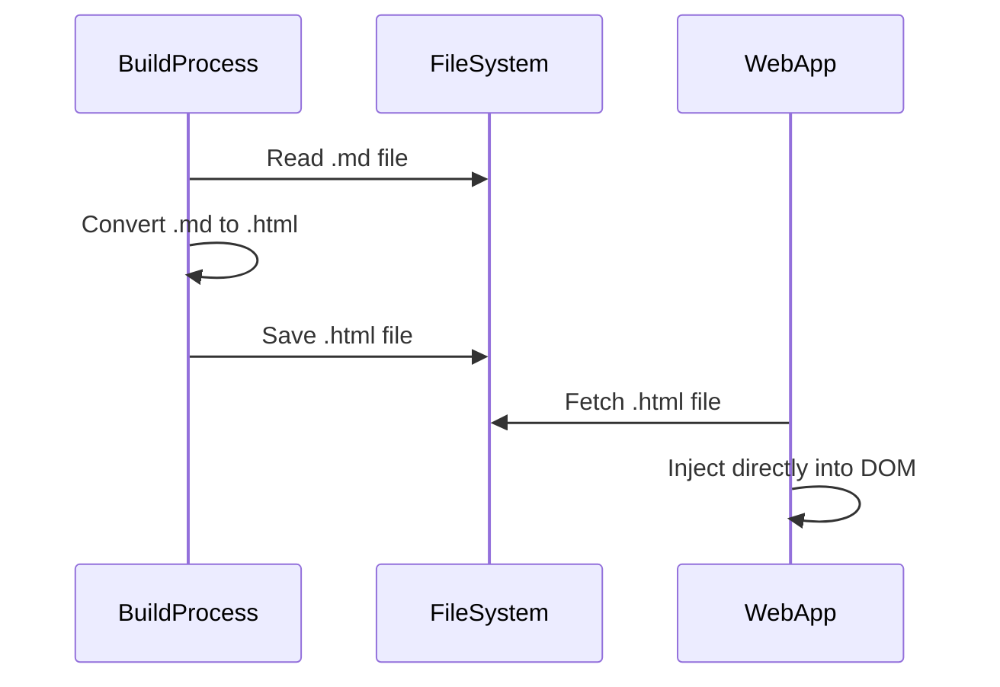

# CRITICAL ISSUE REPORT: Persistent Line Break Rendering Problem

**Date:** 2025-08-31  
**Status:** CRITICAL - Blocking wiki functionality  
**Reporter:** Development Team  
**Priority:** HIGH

## 1. Problem Description

The Wiki Module continues to render literal `\n` characters in the displayed content instead of proper line breaks, despite implementing the DOM-based TOC fix. The issue persists at the same line locations consistently, indicating a systematic problem with markdown parsing or content processing.

### Visual Evidence

#### Mermaid Diagram: Line Break Rendering Issue

```mermaid
graph TD
    A[Markdown Source\n"Hello\nWorld"] --> B{marked.js parsing};
    B --> C["HTML Output<p>Hello\\nWorld</p>"];
```

- Literal `\n\n` characters appear in the rendered text

- Affects the "### Loading Order (Critical)" section specifically
- Text displays as: "### Loading Order (Critical)\n\nThe core JavaScript modules must load in this exact or"
- Should display as proper formatted markdown with line breaks

## 2. Current Implementation Analysis

### What We've Tried
1. **DOM-based TOC Generation**: Successfully implemented per FIX_PLAN.md
2. **marked.js Configuration**: Changed `breaks: true` to `breaks: false`
3. **Template Literal Elimination**: Removed problematic string concatenation

### What Still Fails
- Raw markdown content contains proper line breaks
- marked.js parsing still produces literal `\n` characters in HTML output
- Issue appears to be in the markdown-to-HTML conversion process

## 3. Root Cause Hypothesis

The problem likely stems from one of these areas:
1. **marked.js Version Incompatibility**: The library version may have parsing bugs
2. **Content Encoding Issues**: File encoding problems causing newline character corruption
3. **marked.js Options**: Configuration options not properly handling line breaks
4. **Template Processing**: Content still being processed through template systems before markdown parsing

## 4. Proposed Alternative Approaches

### Mermaid Diagram: Alternative Solutions Flowchart




### Option A: Pre-processed HTML Documents

#### Mermaid Diagram: Pre-processed HTML Workflow



- **Concept**: Generate wiki content as HTML files instead of markdown
- **Process**: 
  1. Use a build step to convert .md → .html using a reliable markdown processor
  2. Store HTML files in the wiki content directory
  3. Load HTML directly without client-side markdown processing
- **Advantages**: 
  - Eliminates client-side parsing issues
  - Ensures consistent rendering
  - Better performance (no client-side processing)
- **Implementation**: Maintain .md files for GitHub wiki, generate .html for web app

### Option B: Alternative Markdown Library
- **Concept**: Replace marked.js with a more reliable markdown parser
- **Options**: 
  - markdown-it (more robust, widely used)
  - micromark (modern, standards-compliant)
  - showdown (simpler, fewer features)
- **Testing Required**: Each library has different configuration options

### Option C: Server-Side Processing
- **Concept**: Process markdown on server/build time rather than client-side
- **Implementation**: 
  - Use Node.js build script to pre-process all .md files
  - Generate JSON with processed HTML content
  - Client loads pre-processed content
- **Advantages**: More control over processing environment

### Option D: Raw HTML Injection with Safety
- **Concept**: Use innerHTML with careful sanitization
- **Process**:
  1. Process markdown server-side or in build step
  2. Sanitize HTML output
  3. Inject directly without additional parsing
- **Requirements**: Robust HTML sanitization library

## 5. Immediate Investigation Required

### Debug Steps Needed
1. **Content Inspection**: Log the exact string content at each processing step
2. **marked.js Testing**: Test with minimal example to isolate the issue
3. **Encoding Verification**: Check file encoding and character set handling
4. **Browser Compatibility**: Test across different browsers for consistency

### Code Locations to Examine
- `src/wiki/index.js:166` - marked.parse() call
- File fetch process at `src/wiki/index.js:155`
- Content injection at `src/wiki/index.js:181-186`

## 6. Recommended Next Steps

1. **IMMEDIATE**: Implement comprehensive logging to trace content transformation
2. **SHORT TERM**: Test Option A (pre-processed HTML) as fastest solution
3. **MEDIUM TERM**: Evaluate Option B (alternative library) for long-term stability
4. **LONG TERM**: Consider Option C (server-side) for production deployment

## 7. Success Criteria

- [ ] Markdown content renders with proper line breaks and formatting
- [ ] No literal `\n` characters visible in rendered output
- [ ] Hierarchical TOC continues to function correctly
- [ ] Solution is maintainable and doesn't introduce new complexity
- [ ] Performance remains acceptable (< 500ms load time for typical documents)

## 8. Technical Constraints

- Must maintain compatibility with existing GitHub wiki workflow
- Should not require major architectural changes
- Must work in browser environment (no server dependencies for core functionality)
- Should preserve current TOC generation functionality

---

**URGENT**: This issue is blocking the wiki module's core functionality. Immediate investigation and alternative implementation approaches are required.

**Agent Assignment**: Request specialized agent assistance for:
- Markdown parsing expertise
- Alternative technical approaches evaluation
- Build system integration for pre-processing solutions