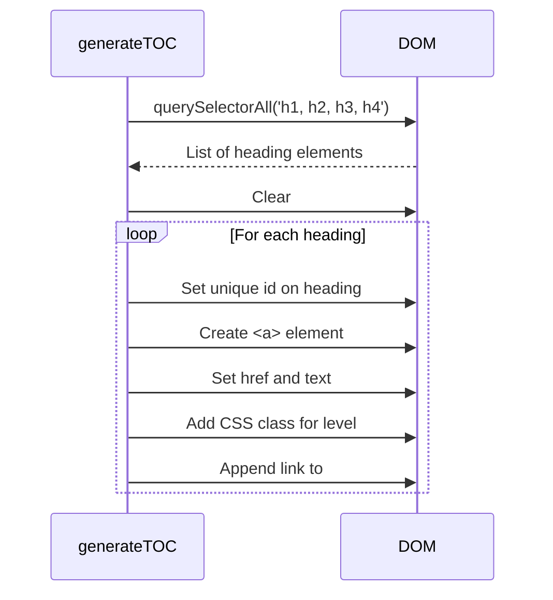
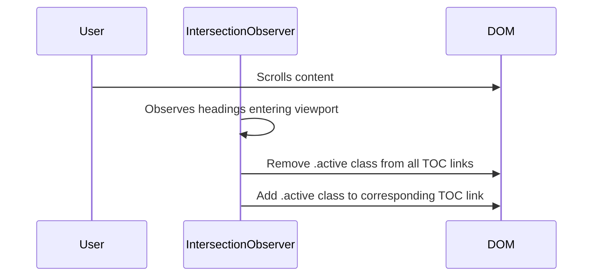

# Wiki TOC System: Fix Plan

**Date**: 2025-08-31  
**Status**: Proposed  
**Responding to**: `CRITICAL_ISSUE_REPORT.md`

## 1. Objective

To implement a robust, hierarchical, and interactive Table of Contents (TOC) for the Wiki module. This plan directly resolves the parsing failures outlined in the critical issue report by adopting a new technical approach that avoids the problematic string manipulation.

## 2. Chosen Approach: DOM-Based TOC Generation

After reviewing the suggested alternatives, the **DOM-Based TOC Generation** approach has been selected. 

**Rationale:**
-   **Robustness:** This method completely bypasses the original problem of parsing raw Markdown with special characters in JavaScript. We will instead parse the clean, structured HTML *after* it has been rendered by the `marked.js` library.
-   **No New Dependencies:** This solution can be implemented with vanilla JavaScript and the already-included `marked.js` library, adhering to the project's architectural principles.
-   **Reliability:** It guarantees that the TOC accurately reflects the final rendered content.

## 3. Implementation Plan

### Mermaid Diagram: Implementation Flowchart

```mermaid
graph TD
    A[Start] --> B{Phase 1: Core Functionality};
    B --> C[Rewrite loadContent()];
    C --> D[Create generateTOCFromContent()];
    D --> E[Create wiki/styles.css];
    E --> F{Phase 2: UX Enhancements};
    F --> G[Implement Smooth Scrolling];
    G --> H[Implement Active State Highlighting];
    H --> I[Done];
```

The implementation will be a two-phase process: first, build the core functionality, then add enhancements for a polished user experience.

### Phase 1: Core TOC Functionality

**1. Rewrite `wiki/index.js` - `loadContent()` Function:**
   - The function will still `fetch` the requested Markdown file.
   - It will use `window.marked.parse()` to convert the Markdown string into an HTML string.
   - It will inject the generated HTML into the main content container (`#wiki-content-container`).
   - **New Step:** Immediately after injecting the HTML, it will call a new function: `this.generateTOCFromContent()`.

**2. Create `wiki/index.js` - `generateTOCFromContent()` Function:**

#### Mermaid Diagram: `generateTOCFromContent()` Sequence



   - This new function will be the core of the fix.
   - It will query the content container for all heading elements: `this.contentContainer.querySelectorAll('h1, h2, h3, h4')`.
   - It will clear the existing sidebar TOC container (`#wiki-toc-container`).
   - It will then loop through the resulting list of heading elements.
   - For each heading, it will:
     a. Generate and set a unique `id` on the heading element itself (e.g., `id="section-1"`).
     b. Create a corresponding `<a>` link element.
     c. Set the link's `href` to match the heading's ID (e.g., `href="#section-1"`).
     d. Set the link's text to match the heading's `textContent`.
     e. Add a class based on the heading level (e.g., `class="toc-level-1"`, `class="toc-level-2"`) for styling.
   - It will assemble these links into a nested `<ul>` list to represent the hierarchy and inject it into the sidebar TOC container.

**3. Create `wiki/styles.css` for TOC Styling:**
   - A new stylesheet will be created at `src/wiki/styles.css` and linked in `index.html`.
   - It will contain rules to style the TOC list, using left-padding on the `toc-level-*` classes to create the visual indentation and hierarchy.

### Phase 2: UX Enhancements

**4. Implement Smooth Scrolling:**
   - The event listener on the TOC links will be enhanced.
   - It will use `event.preventDefault()` to stop the default hash jump.
   - It will then find the target heading element by its ID and use `element.scrollIntoView({ behavior: 'smooth' })` to create a pleasant scrolling animation.

**5. Implement Active State Highlighting (Scroll-Spying):**

#### Mermaid Diagram: `IntersectionObserver` Sequence



   - An `IntersectionObserver` will be implemented to monitor when heading elements in the main content area scroll into the viewport.
   - When a new heading becomes the topmost visible section, the observer's callback will fire.
   - This callback will find the corresponding link in the TOC and apply an `.active` class to it, while removing the class from all others. This provides clear, real-time feedback to the user about their position in the document.

## 4. Expected Outcome

This plan will deliver all features listed in the `CRITICAL_ISSUE_REPORT.md` Acceptance Criteria, resulting in a fully functional, professional, and elegant documentation-viewing experience within the application.
