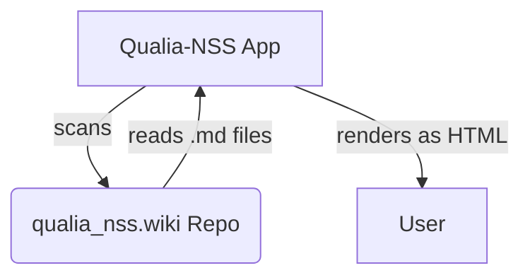
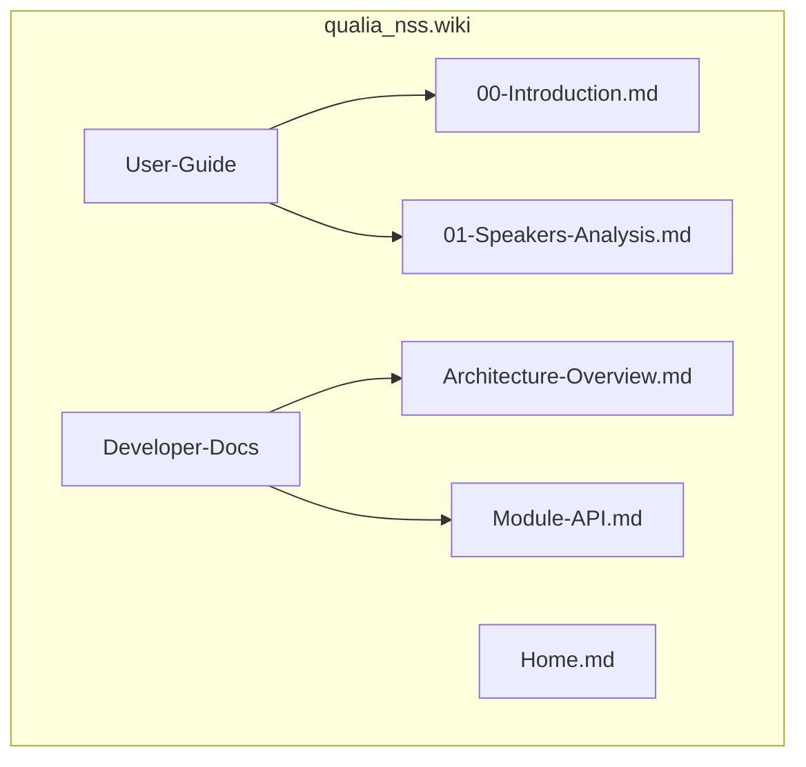
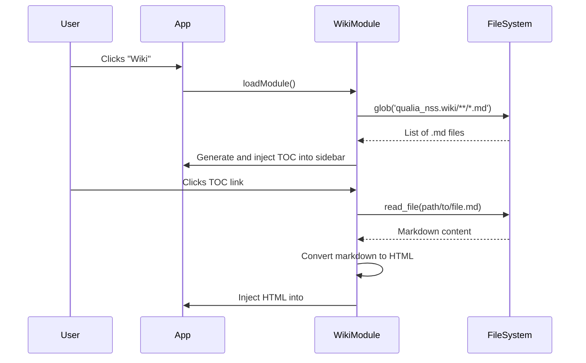

# Wiki Module Implementation Plan

**Version:** 1.0
**Date:** 2025-08-30

## 1. Objective

To integrate the project's GitHub Wiki directly into the Qualia-NSS web application as a new, dynamic "Wiki" module. This module will serve a dual purpose:

1.  **Primary (User Guide):** To guide users through the workflow of designing a Qualia NSS natural surround sound loudspeaker setup, following the logical progression of the tools in the main navbar.
2.  **Secondary (Developer Docs):** To provide a comprehensive technical reference for developers and contributors, accessible directly within the app.

## 2. Technical Approach: "Live Fetch" Module

### Mermaid Diagram: Live Fetch Architecture



This project will use a "Live Fetch" approach, where the application dynamically reads the content of the separate `qualia_nss.wiki` repository at runtime. This ensures the documentation is always synchronized without requiring complex symlinks, submodules, or build steps.

## 3. Wiki Repository Structure

### Mermaid Diagram: Wiki Directory Structure



To facilitate the dual-purpose documentation, the `qualia_nss.wiki` repository will be organized with the following directory structure:

```
qualia_nss.wiki/
├── User-Guide/
│   ├── 00-Introduction.md
│   ├── 01-Speakers-Analysis.md
│   └── ... (files for each step in the workflow)
├── Developer-Docs/
│   ├── Architecture-Overview.md
│   └── Module-API.md
└── Home.md
```

## 4. Application Implementation Steps

### Step 1: Create the "Wiki" Module

-   **Navigation:** Add a "Wiki" link to the main navbar in `index.html`.
-   **Module Templates:** Add new entries for the `wiki` module in `sidebar-manager.js` and `module-loader.js`.
-   **Routing:** Add a `loadWiki()` function in `navigation.js`.

### Step 2: Implement Dynamic Table of Contents

#### Mermaid Diagram: Wiki Module Loading Sequence



-   When the `wiki` module is loaded, its JavaScript will perform the following:
    1.  Use the `glob` tool to scan the `qualia_nss.wiki/` directory.
    2.  Dynamically generate the HTML for the sidebar.
    3.  The sidebar will feature two collapsible accordion sections: "User Guide" and "Developer Documentation".
    4.  Each section will be populated with an ordered list of links corresponding to the `.md` files found in the `User-Guide/` and `Developer-Docs/` subdirectories.

### Step 3: Implement Markdown Content Renderer

-   **Event Handling:** An event listener will be attached to the sidebar links.
-   **File Fetching:** On click, the module will use the `read_file` tool to get the raw Markdown content of the selected file from the `qualia_nss.wiki` repository.
-   **Markdown-to-HTML:** A lightweight, client-side library (e.g., `marked.js`) will be added to the project to parse the Markdown string into HTML.
-   **Rendering:** The generated HTML will be safely injected into the `#main-content` div of the application.

## 5. Advantages of this Plan

-   **Always Synchronized:** The documentation displayed in the app is a live view of the wiki repository.
-   **Clean Architecture:** The app and wiki codebases remain completely separate and decoupled.
-   **No Build Step:** The integration works seamlessly with the project's existing static-serving model.
-   **Excellent UX:** Users and developers can access all necessary documentation without ever leaving the application interface.
