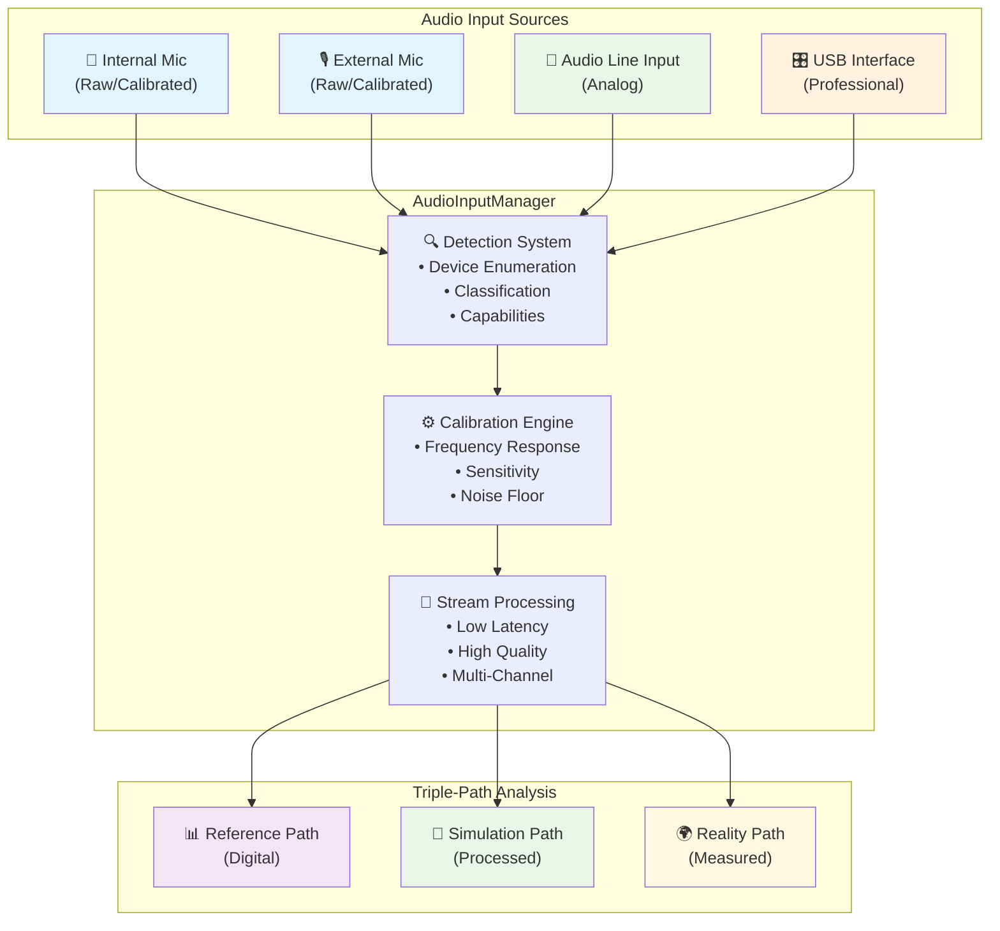
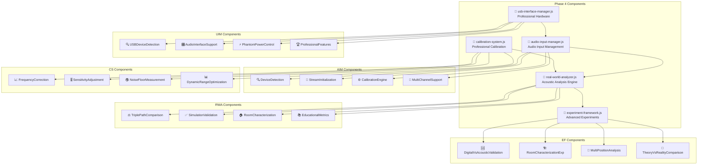
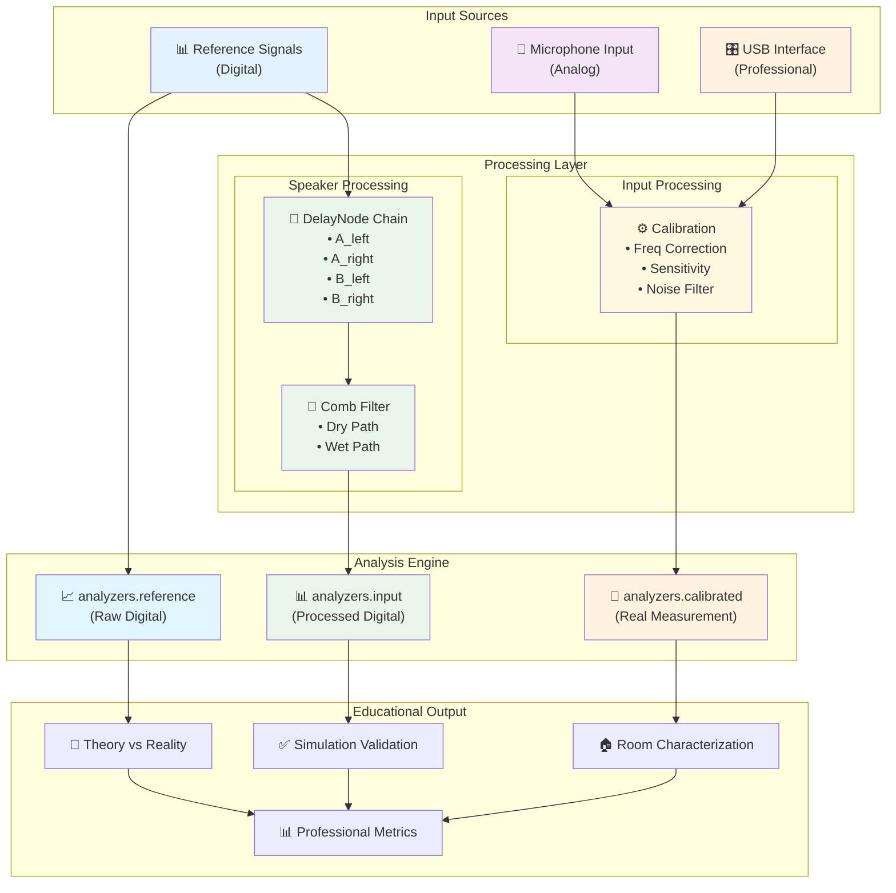
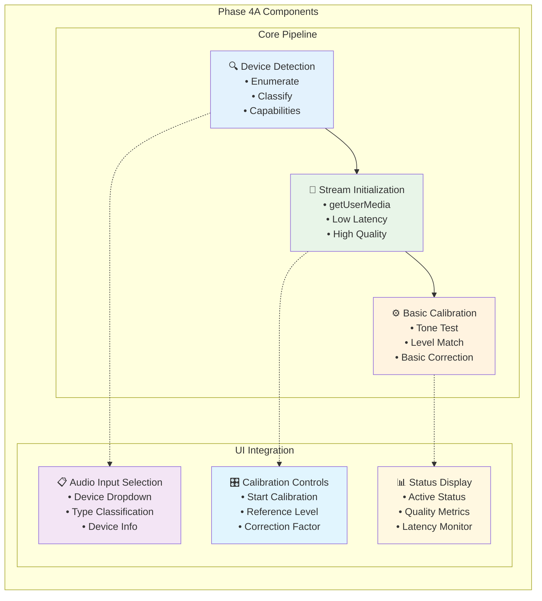

# Phase 4: Real-World Audio Input Analysis Architecture

**Version:** 1.0  
**Date:** 2025-09-01  
**Status:** Implementation Architecture Documentation  

---

## System Architecture Overview

The Phase 4 implementation extends the Perfect Logic Framework with comprehensive real-world audio input analysis capabilities, creating a complete acoustic measurement and education platform.

### Phase 4 Architecture Overview



---

## Component Architecture

### Core Implementation Structure



---

## Signal Flow Diagram

### Triple-Path Analysis System



---

## Implementation Modules

### Phase 4A: Basic Audio Input (2-3 weeks)



### Phase 4B: Professional Features (3-4 weeks)

```
┌─────────────────────────────────────────────────────────────────────┐
│                        PHASE 4B COMPONENTS                         │
├─────────────────────────────────────────────────────────────────────┤
│                                                                     │
│  ┌─────────────────┐    ┌─────────────────┐    ┌─────────────────┐  │
│  │ USB Audio       │    │ Advanced        │    │ Multi-Channel   │  │
│  │ Interface       │───▶│ Calibration     │───▶│ Analysis        │  │
│  │                 │    │                 │    │                 │  │
│  │ • WebUSB API    │    │ • Freq Response │    │ • Stereo Field  │  │
│  │ • Device Info   │    │ • Phase Correct │    │ • Channel Corr  │  │
│  │ • Pro Features  │    │ • Noise Profiling│   │ • Spatial Coh   │  │
│  └─────────────────┘    └─────────────────┘    └─────────────────┘  │
│                                                                     │
│  ┌─────────────────────────────────────────────────────────────────┐  │
│  │                Professional Interface                           │  │
│  │                                                                 │  │
│  │  Hardware Control   │  Precision Calibration │  Pro Metrics   │  │
│  │  • Phantom Power    │  • Sweep Test          │  • THD+N        │  │
│  │  • Gain Control     │  • Phase Alignment     │  • Dynamic Range│  │
│  │  • Direct Monitor   │  • Impedance Match     │  • Freq Response│  │
│  └─────────────────────────────────────────────────────────────────┘  │
└─────────────────────────────────────────────────────────────────────┘
```

### Phase 4C: Advanced Experiments (2-3 weeks)

```
┌─────────────────────────────────────────────────────────────────────┐
│                        PHASE 4C EXPERIMENTS                        │
├─────────────────────────────────────────────────────────────────────┤
│                                                                     │
│  ┌──────────────────────────────────────────────────────────────┐   │
│  │                    Experiment 4                             │   │
│  │              Digital vs Acoustic Validation                 │   │
│  │                                                             │   │
│  │  Reference → Digital Processing → Predicted Output         │   │
│  │       ↓                                                     │   │
│  │  Reference → Speakers → Room → Microphone → Measured       │   │
│  │                                                             │   │
│  │  Compare: Predicted vs Measured → Validation Metrics       │   │
│  └──────────────────────────────────────────────────────────────┘   │
│                                                                     │
│  ┌──────────────────────────────────────────────────────────────┐   │
│  │                    Experiment 5                             │   │
│  │                Room Characterization                        │   │
│  │                                                             │   │
│  │  Test Signals:    Analysis:           Results:             │   │
│  │  • Impulse     → • Impulse Response → • RT60              │   │
│  │  • Swept Sine  → • Transfer Function→ • Room Modes        │   │
│  │  • White Noise → • Reverberation   → • Absorption        │   │
│  └──────────────────────────────────────────────────────────────┘   │
│                                                                     │
│  ┌──────────────────────────────────────────────────────────────┐   │
│  │                    Experiment 6                             │   │
│  │               Multi-Position Analysis                       │   │
│  │                                                             │   │
│  │  Fixed Speakers + Moving Microphone → Spatial Map          │   │
│  │  • Sweet Spot Identification                               │   │
│  │  • Comb Pattern Variation                                  │   │
│  │  • Room Mode Mapping                                       │   │
│  └──────────────────────────────────────────────────────────────┘   │
└─────────────────────────────────────────────────────────────────────┘
```

---

## Success Metrics

### Technical Performance Targets

```
Performance Metrics Dashboard
┌────────────────────┬────────────────────┬────────────────────┐
│   Audio Quality    │    System Perf     │    Accuracy        │
├────────────────────┼────────────────────┼────────────────────┤
│ • Latency <50ms    │ • CPU <10%         │ • Calibration ±2dB │
│ • SNR >60dB        │ • RAM <500MB       │ • Frequency ±1Hz   │
│ • THD+N <0.1%      │ • Real-time 48kHz  │ • Time ±0.1ms      │
│ • Dynamic Range    │ • Stable Operation │ • Phase ±5°        │
│   >90dB            │   >1 hour          │                    │
└────────────────────┴────────────────────┴────────────────────┘
```

### Educational Impact Metrics

```
Learning Assessment Framework
┌─────────────────────────────────────────────────────────────────┐
│                    Educational Effectiveness                    │
├─────────────────────────────────────────────────────────────────┤
│                                                                 │
│  Theory Understanding    │    Practical Skills   │   Research   │
│  • Concept Mastery      │    • Measurement      │   • Data      │
│  • Mathematical         │    • Calibration      │     Collection│
│    Relationships        │    • Equipment Use    │   • Analysis  │
│  • Acoustic Principles  │    • Troubleshooting  │   • Reporting │
│                                                                 │
│  ┌─────────────────────────────────────────────────────────────┐ │
│  │                Progress Tracking                            │ │
│  │                                                             │ │
│  │  Beginner → Intermediate → Advanced → Professional         │ │
│  │     │           │             │            │                │ │
│  │   Basic      Computational  Real-World   Research          │ │
│  │   Concepts   Analysis       Validation   Applications      │ │
│  └─────────────────────────────────────────────────────────────┘ │
└─────────────────────────────────────────────────────────────────┘
```

This documentation provides a comprehensive visual overview of the Phase 4 architecture using the same diagram-style approach as shown in your reference image.