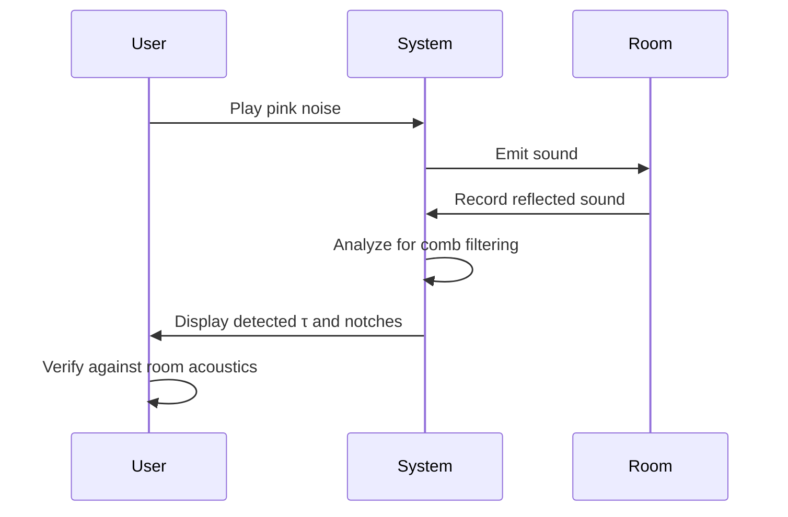

# Comb‑Filtering Detection — Design Notes

Last updated: 2025-08-24

## What you see in a spectrogram
- **Sine wave**: one narrow horizontal line; comb isn’t visible (no broadband content).
- **Triangle wave**: odd harmonics with 1/n² roll‑off; some notches may appear on those harmonics only.
- **Best probes**: pink/white noise, speech, music. Comb shows as evenly spaced notches/peaks across a wide frequency span.

## Definition and relationships
- Comb‑filtering arises when a signal sums with a delayed copy (reflection/parallel path).
- **Notch spacing**: Δf = 1 / τ, where τ is delay in seconds.
- **Delay estimate**: τ = 1 / Δf.
- Typical audible τ for rooms/paths: ~0.2 ms to 20 ms (Δf ≈ 50 Hz to 5 kHz).

## Detection approach (runtime, per spectrogram column)

### Mermaid Diagram: Cepstrum Detection Flowchart

```mermaid
graph TD
    A[Get FFT Data] --> B[Preprocess (Detrend, etc.)];
    B --> C{Compute Real Cepstrum};
    C --> D[Search for Dominant Peak];
    D --> E{Peak Found?};
    E -->|Yes| F[Estimate Delay & Confidence];
    E -->|No| G[No Comb Filtering];
    F --> H[Stabilize & Alert];
```

1. **Magnitude spectrum**: use existing FFT data (`AnalyserNode.getFloatFrequencyData`) → dB.
2. **Preprocess**: select 200 Hz–8 kHz, convert to linear frequency grid, detrend log‑magnitude (remove slope via high‑pass or polynomial fit).
3. **Cepstrum method (recommended)**
   - Compute real cepstrum of the log‑magnitude: C(τ) = IFFT{ log(|X(f)| + ε) }.
   - Search τ ∈ [0.2 ms, 20 ms] for the dominant peak.
   - Peak location → τ̂ (delay); peak height vs noise floor → confidence.
4. **Alternative (autocorrelation in frequency)**
   - Autocorrelate detrended magnitude vs frequency; peak lag Δf̂ → τ̂ = 1/Δf̂.
5. **Stability**
   - Require broadband energy (RMS above threshold) and at least 5–7 notches spanning 200 Hz–8 kHz.
   - Smooth τ̂ over ~0.5 s (median/EMA) and only alert when confidence persists over N frames.

## UI/overlay behavior

### Mermaid Diagram: UI Overlay

```mermaid
graph TD
    subgraph Spectrogram UI
        A[Banner: "Comb filtering detected: τ ≈ 2.8 ms"] --> B[Confidence Bar]
        A --> C[Vertical Notch Rulers]
    end
```

- **Banner**: “Comb filtering detected: τ ≈ 2.8 ms (Δf ≈ 357 Hz)” with confidence bar.
- **Guides**: draw faint vertical notch rulers at f = k·Δf across the view, limited to 200 Hz–8 kHz.
- **Gating**: bypass detection when source is tonal/narrowband (e.g., sine); auto‑hide banner when confidence drops.

## Parameters (defaults)
- Analysis band: 200 Hz–8 kHz.
- Delay search window: 0.2–20 ms.
- Confidence threshold: cepstral peak SNR > 8 dB, sustained ≥ 300–500 ms.
- FFT: 4096–8192, Hann window, 50–75% overlap.

## False‑positive controls
- Ensure broadband content present (pink noise ideal for tests).
- Ignore τ < 0.2 ms (ADC/interleave artifacts) and extremely large τ where Δf is below resolution.
- Debounce alerts and rate‑limit UI updates.

## Integration points (`spectogram/script.js`)
- After acquiring `freqData`, build a linear‑frequency magnitude array over 200 Hz–8 kHz.
- Implement `estimateCombDelay(magLinHz)` that returns `{tau, deltaF, confidence}` or `null`.
- Maintain rolling buffer of estimates to stabilize output.
- Add a UI toggle “Comb Detect” to enable/disable detection and overlay.

## Validation workflow

### Mermaid Diagram: Validation Sequence



- Play pink noise via speakers in a reflective room; observe detected τ and notch overlay.
- Cross‑check Δf spacing against visible stripe distance; verify τ ≈ path length / speed of sound.
- Run swept sine; ensure detector gates off for narrowband content.
