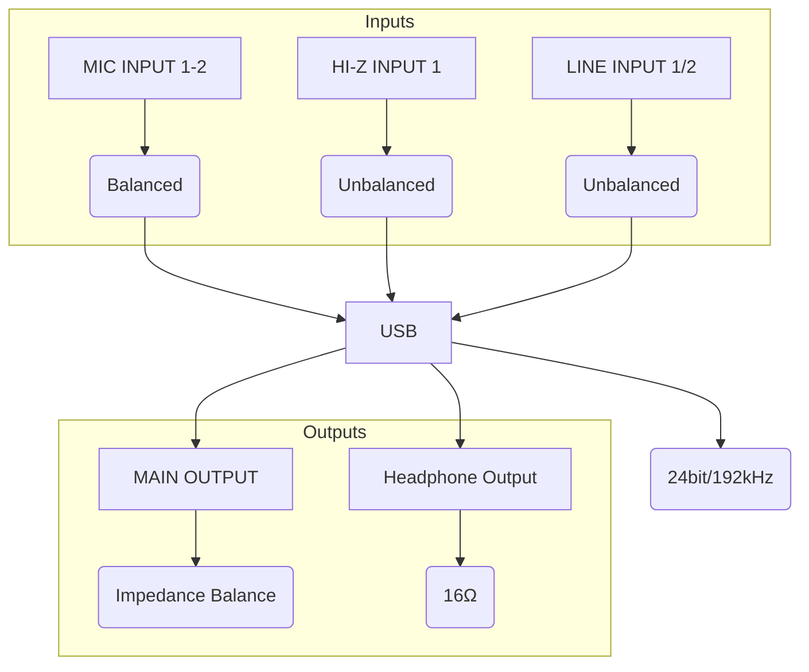

Teyun Q-24 Product Details
http://www.teyun-cn.com/en/Q-24-PG10135731

FEATURES

### Mermaid Diagram: Teyun Q-24 I/O

Q-24 sound card is with more powerful technology and compatibility, with high-speed USB2.0 interface, built-in high-speed digital processor, with extremely low distortion and high-precision digital signal processing.

Q-24 with AD and DA converters,sample rates up to 24 bits/192KHZ, which can provide excellent recording quality, dynamic response and rich low frequency. High-quality conversion is the key to achieving high-quality audio signal conversion. The power supply can be connected to PC/DC 5V, providing connection with MAC and PC computers.

 

TECHNICAL PARAMETERS

■ MIC INPUT 1-2(balanced）

■ Frequency response: -1/-1dB, 20Hz – 20kHz

■ Dynamic Range: 82 dB, A weighting

■ THD+N 0.03%, 1kHz

■ Maximum input level: +6dBu Input resistance 10KΩ

■ Gain range: +3dB- +60dB

■ HI-Z INPUT 1(Unbalanced)

■ Maximum input level: +3.0dBV

■ Input resistance: 10KΩ

■ Gain range: 0dB – +40dB

■ LINE INPUT  ½(unbalanced)

■ Maximum input level: +10dBu

■ Input resistance: 10KΩ

■ Gain range: -10dB – +40dB

■ MAIN OUTPUT(Impedance balance）Mono stereo switchable

■ Frequency response: -1/-1dB, 20Hz–20kHz

■ Dynamic Range: 82 dB, A weighting

■ Headphone output impedance 16Ω

■ Output impedance 1KΩ

■ Input resistance 100kΩ

■ Maximum input level: 15mW +15mW, 40Ω

■ USB Technical specifications: 24bit/192KHZ

■ Power requirements: ＞ 5W

This interface can be used with Impedance RIG (REW speaker's impedance detection method)
https://www.roomeqwizard.com/help/help_en-GB/html/impedancemeasurement.html

