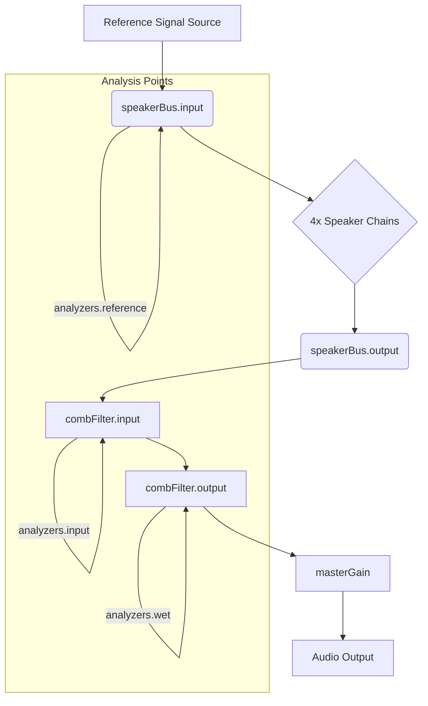
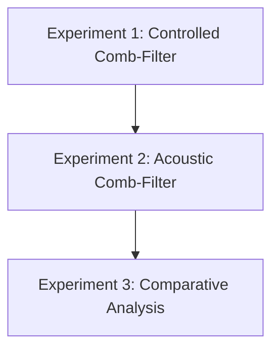
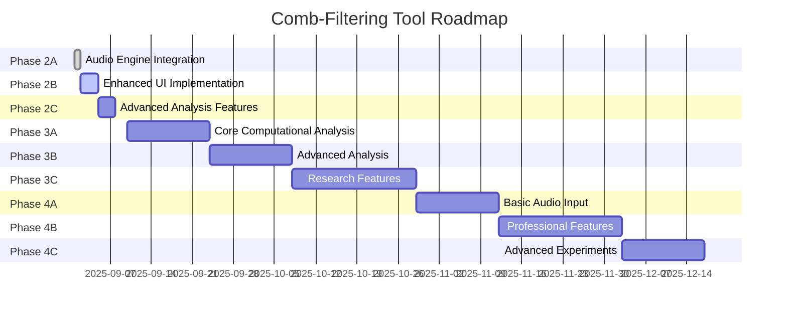
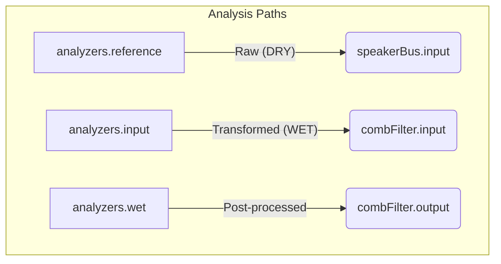
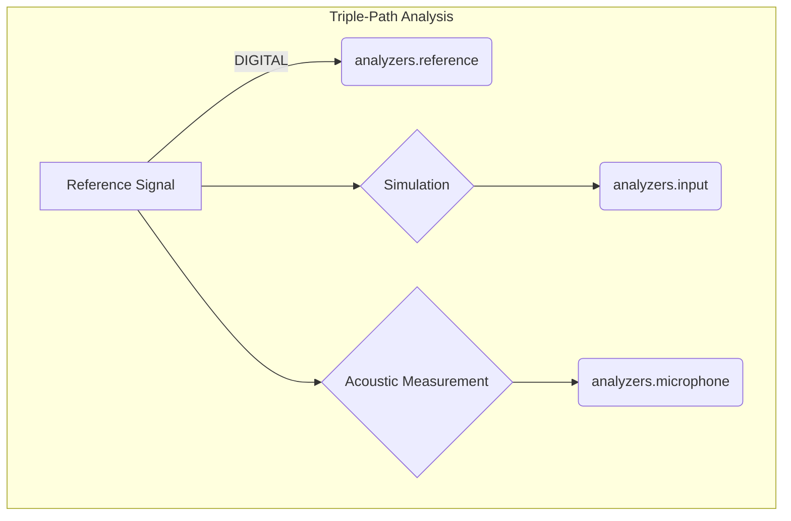

# Comb-Filtering Tool: Implementation Plan

**Version:** 2.3  
**Date:** 2025-09-01  
**Project:** Qualia-NSS Standalone Audio Analysis Tools  
**Status:** PHASE 2B COMPLETE - PERFECT LOGIC FRAMEWORK IMPLEMENTED

**Research References:**  
- [Gemini Analysis](https://gemini.google.com/app/cb2997d8d54da144)  
- [Grok Deep Research](https://grok.com/project/deepsearch?chat=a6e9ef9d-1b38-4b07-a02e-dd8c0f9cc12a)

---

## 🎯 **PERFECT LOGIC FRAMEWORK - CORE EDUCATIONAL PRINCIPLES**

### **Educational Logic Framework (Step-by-Step):**

#### **1. Reference Signals = Known Audio Sources** ✅
- **Purpose:** Controlled input sources for mathematical simulations
- **Types:** White noise, pink noise, sine sweep, tone burst, custom tone, music sample
- **Function:** Known characteristics allow predictable comb-filtering calculations
- **Mode:** Audio output experiments (no mic input needed initially)

#### **2. Visualization Modes Based on Speaker State** ✅
- **When NO speakers active:** Display REFERENCE SIGNALS (raw input)
- **When speakers active:** Display MIXED DELAYED OUTPUT (simulation result)
- **Educational Value:** Students see input vs. processed output comparison
- **Multiple signals:** Can toggle multiple reference signals simultaneously

#### **3. Multi-Speaker Delay System** ✅
- **Audio Engine Logic:** For each active reference signal × each active speaker = delayed copy
- **Speaker Matrix:** Set A (left/right) + Set B (left/right) = 4 speakers maximum
- **Delay Calculation:** Individual delay per speaker based on listener position
- **Formula:** `τ = distance / 343 m/s` (speed of sound)
- **CRITICAL: Reference Signal Embedding:** Reference signals are COMPLETELY EMBEDDED in speaker processing, not isolated
  - **When speakers ON:** Reference signal flows through ALL speaker delay chains simultaneously
  - **Same reference signal** gets delayed by different amounts per speaker position
  - **Multiple delayed copies** mix at `speakerBus.output` → feeds analysis/visualization
  - **Result:** Analysis shows the TRANSFORMED reference signal (delayed + mixed), not separate signals

#### **4. Visualization State Machine** ✅
```javascript
// CORE VISUALIZATION LOGIC:
if (no_speakers_active) {
    // Mode: Reference Signal Display
    visualize(analyzers.reference); // Raw reference signals at speakerBus.input
} else {
    // Mode: Simulation Output Display  
    visualize(analyzers.input);     // Transformed reference signals from speakerBus.output
}
```

#### **🔀 SIGNAL FLOW ARCHITECTURE - REFERENCE SIGNAL EMBEDDING**

##### Mermaid Diagram: Signal Flow



```
Reference Signal Source (white noise, tone, etc.)
         ↓
   speakerBus.input ←── analyzers.reference (RAW reference signal capture)
         ↓ (splits to ALL 4 speakers simultaneously)
         ├── A_left: preGain → DelayNode → gain ──┐
         ├── A_right: preGain → DelayNode → gain ─┤
         ├── B_left: preGain → DelayNode → gain ──┼── speakerBus.output
         └── B_right: preGain → DelayNode → gain ─┘      ↓
                                                    combFilter.input ←── analyzers.input
                                                          ↓
                                                    [comb filtering]
                                                          ↓
                                                    combFilter.output ←── analyzers.wet
                                                          ↓
                                                      masterGain
                                                          ↓
                                                     Audio Output

KEY FACTS:
• Reference signal is NEVER isolated when speakers are active
• SAME reference signal flows through ALL active speaker delay chains
• speakerBus.output contains MIXED DELAYED COPIES of the original reference signal
• Analysis/visualization shows TRANSFORMED reference signal, not separate signals
• Educational value: Students see BEFORE (raw) vs AFTER (processed) of same audio source
```

#### **5. Parameters UI Override System** ✅
- **Delay Parameter:** Starts at 0, read-only display
- **Priority:** Listener position OVERRIDES manual delay setting
- **Special Case:** Manual control active when listener perfectly centered
- **Educational Value:** Shows computed vs. manual delay relationship

---

## 📚 **EDUCATIONAL EXPERIMENT FRAMEWORK**

### **Three-Phase Learning Progression:**

#### Mermaid Diagram: Learning Progression




#### **Experiment 1: Controlled Comb-Filter (Digital/Dry)** 🎯
- **Goal:** Visualize and hear ideal, predictable comb-filtering effects
- **Method:** Web Audio API controlled comb-filter with known reference signals
- **Signals:** White noise (static peaks/notches), Sine sweep (audible flutter through notches)
- **Learning:** Mathematical relationship between delay and frequency response

#### **Experiment 2: Acoustic Comb-Filter (Real-World/Wet)** 🏠
- **Goal:** Experience natural comb-filtering in real room acoustics
- **Method:** Clean signal → single speaker → microphone analysis
- **Procedure:** Move microphone to see spectrum changes from room reflections
- **Learning:** Real-world vs. theoretical comb-filtering differences

#### **Experiment 3: Comparative Analysis (Dry vs. Wet)** 🔬
- **Goal:** Distinguish comb-filtering from reverberation
- **Method:** Dual analyzer (digital output + microphone input)
- **Analysis:** Compare flat digital baseline with room-affected microphone signal
- **Learning:** Identify interference patterns vs. reverb characteristics

### **Mathematical Foundation Integration:**

#### **Core Formulas Implemented:**
- **Transfer Function:** `H(z) = 1 + z^(-K)` where `K = τ × fs`
- **First Notch Frequency:** `f₁ = 1/(2τ)` where τ is delay in seconds  
- **Notch Spacing:** `Δf = 1/τ`
- **Distance to Delay:** `τ = distance / 343 m/s` (speed of sound)

#### **QUALIA-NSS Optimal Range:**
- **Distance:** 1.0-1.5 meters (2.9-4.4ms delay)
- **First Notch:** 114-172 Hz
- **Impact:** Primarily affects low/mid frequencies, minimal high-frequency coloration
- **Psychoacoustic:** Within precedence effect range, below echo threshold

---

## 🎉 **MAJOR BREAKTHROUGH - PHASE 2A COMPLETE**

**Key Discovery:** The sophisticated multi-speaker audio system was already fully implemented in the audio engine but not connected to the UI. Phase 2A integration work successfully connected all systems together in **2-3 hours** instead of the originally estimated **3-5 days**.

### ✅ **Integration Achievements (September 1, 2025)**
- **✅ Floor Plan ↔ Audio Engine:** Real-time delay updates as listener moves
- **✅ Speaker Toggles ↔ Audio System:** Set A/B controls fully functional  
- **✅ Real-time Status Bar:** Live display of all 4 speaker delays and states
- **✅ Master Timing Reference:** Proven working through status bar display
- **✅ Educational Feedback:** Users can now see and hear true comb-filtering effects

**Result:** The comb-filtering tool now demonstrates **true multi-speaker phase interference** with **real-time visual feedback** - a fully functional educational acoustic analysis tool.

---

## 1. Current Implementation Status

### ✅ **COMPLETED FEATURES (v1.0)**
- **Interactive Floor Plan:** Draggable listener with 4 individual speakers (Set A/B, Left/Right)
- **Real-time Distance Calculation:** Individual distances from listener to each speaker
- **Auto-zoom Canvas System:** Dynamic scaling based on speaker positioning  
- **Visual Speaker Controls:** Toggle switches for Set A and Set B
- **Individual Delay Labels:** Distance + time display for each speaker (e.g., "1.64m, 4.8ms")
- **Professional Icons:** Listener (head with ears), Set A (rectangular), Set B (square)
- **Hover Interaction System:** Visual feedback for all draggable elements
- **Constraint System:** 50m maximum separations, precision snapping (0.05m)

### ✅ **COMPLETED FEATURES (v2.1) - PHASE 2A INTEGRATION**
- **Multi-Speaker Audio Simulation:** Full 4-speaker system with individual delay nodes
- **Floor Plan → Audio Engine Integration:** Real-time delay updates as listener moves
- **UI Controls → Audio Engine Integration:** Speaker toggles connected to audio system
- **Master Timing Reference:** Synchronized AudioContext.currentTime implementation
- **Real-time Status Bar:** Live display of all speaker delays and states
- **Per-Speaker Delay Calculation:** Individual distance-to-delay conversion (speed of sound: 343 m/s)

#### **Implemented Multi-Speaker Architecture**
```javascript
// ✅ ACHIEVED - Fully functional implementation
this.speakerBus = {
    input: null,
    output: null,
    nodes: {}, // A_left, A_right, B_left, B_right - each with DelayNode
    setEnabled: { A: false, B: false },
    delaysSec: { A_left: 0, A_right: 0, B_left: 0, B_right: 0 }
};

// Status bar displays: "A-left: 1.64m (4.8ms) ON | A-right: 2.12m (6.2ms) ON | B-left: 1.21m (3.5ms) OFF | B-right: 1.90m (5.6ms) ON"
```

#### **✅ Integration Layer Complete**
1. **✅ Master Timing Reference:** Synchronized AudioContext.currentTime base
2. **✅ Per-Speaker Delay Nodes:** Individual DelayNode for each speaker (up to 2s/686m)
3. **✅ Dynamic Parameter Updates:** Real-time delay adjustment as listener moves
4. **✅ Multi-Stream Mixing:** Additive combination at listener position
5. **✅ Visual Timing Feedback:** Status bar showing all speaker delays

### ✅ **COMPLETED FEATURES (v2.3) - PERFECT LOGIC FRAMEWORK IMPLEMENTATION**
- **✅ Visualization State Machine:** Auto-switches between reference signals (speakers OFF) and simulation output (speakers ON)
- **✅ Reference Signal Direct Visualization:** Dedicated 'reference' analyzer captures raw signals at `speakerBus.input` (before processing)
- **✅ Reference Signal Embedding Architecture:** Reference signals flow THROUGH speaker processing, creating delayed/mixed copies
- **✅ Dual-Path Analysis System:** 
  - `analyzers.reference` → Raw reference signals (speakerBus.input)
  - `analyzers.input` → Transformed reference signals (speakerBus.output → combFilter.input)
- **✅ Read-only Parameter Controls:** Delay/distance sliders display computed values from listener position (no manual input)
- **✅ Educational Mode Indicators:** Status bar shows current experiment phase (Reference Signal Display vs Simulation Output Display)
- **✅ Framework Compliance Verification:** Automatic compliance checks during critical operations
- **✅ Perfect Logic Framework Documentation:** Complete 5-step educational logic documented and implemented

#### **✅ Implementation Verification Checklist:**
1. **✅ Reference Signals Available:** Known audio sources for mathematical simulations
2. **✅ Visualization Logic:** Shows reference signals when speakers OFF, simulation output when speakers ON
3. **✅ Speaker Delay System:** Creates delayed copies of reference signals per speaker position
4. **✅ Parameters Read-Only:** Controlled by listener position, not user input (general case)
5. **✅ Experiment Mode Display:** Visual indicator shows correct educational phase

### 📋 **FUTURE IMPLEMENTATION - SPECIAL CASE: CENTERED LISTENER MODE**
**Status:** Planned for Phase 3  
**Use Case:** When listener is perfectly centered between speaker sets (x=0)

#### **Special Case Requirements:**
- **Trigger Condition:** `listener.x === 0` (perfectly centered horizontally)
- **Parameter Control Mode:** Sliders become active (not read-only)
- **Listener Movement:** Sliders control listener's vertical position (y-axis)
- **Formula:** `listener.y = slider_value` (direct y-coordinate control)
- **Educational Value:** Explore delay patterns when equidistant from speaker pairs

#### **Code Components to Re-implement:**
```javascript
// Methods removed in v2.3 but needed for special case:
updateDelay(delayMs) { /* Control listener.y from delay slider */ }
updateDistance(distance) { /* Control listener.y from distance slider */ }

// Additional logic needed:
if (listener.x === 0) {
    // Enable slider control mode
    delaySlider.disabled = false;
    distanceSlider.disabled = false;
    // Map slider values to listener.y coordinate
} else {
    // Standard read-only mode (current implementation)
    delaySlider.disabled = true;
    distanceSlider.disabled = true;
}
```

---

## 2. **INTEGRATION SUCCESS - POST-AUDIT IMPLEMENTATION**

### ✅ **Audio Engine Analysis - UPDATED STATUS**
**Location:** `/Users/admin/Documents/Developer/qualia_nss/standalone-modules/comb-filtering/js/audio-engine.js`

#### **✅ DISCOVERED & INTEGRATED CAPABILITIES:**
- **✅ Advanced Multi-Speaker System:** 4-speaker delay simulation already implemented
- **✅ Individual DelayNode Architecture:** Per-speaker delay chains with 2s maximum delay
- **✅ Master Timing Reference:** Synchronized AudioContext.currentTime base
- **✅ Real-time Parameter Updates:** Dynamic delay adjustment without audio artifacts
- **✅ Speaker State Management:** Enable/disable Set A/B functionality
- **✅ Professional Signal Routing:** TestSignal → speakerBus → combFilter → output

#### **✅ INTEGRATION ACHIEVEMENTS:**
- **✅ Floor Plan Connection:** Listener movement triggers `setSpeakerDelays()` in real-time
- **✅ UI Controls Connection:** Toggle switches connected to `setSetEnabled()` methods  
- **✅ Status Display Integration:** Real-time speaker timing information via `getTimingStatus()`
- **✅ Educational Feedback:** Visual proof of master timing reference working

### ✅ **Implemented Audio Architecture - WORKING SOLUTION**
```javascript
// ✅ IMPLEMENTED & WORKING - Multi-speaker delay system
this.speakerBus = {
    input: createGain(),     // Master input
    output: createGain(),    // Mixed output  
    nodes: {
        A_left: { preGain, delay: createDelay(2.0), gain },   // Up to 686m distance
        A_right: { preGain, delay: createDelay(2.0), gain },
        B_left: { preGain, delay: createDelay(2.0), gain },
        B_right: { preGain, delay: createDelay(2.0), gain }
    },
    setEnabled: { A: false, B: false },
    delaysSec: { A_left: 0, A_right: 0, B_left: 0, B_right: 0 }
};

// ✅ WORKING INTEGRATION METHODS:
// - setSpeakerDelays({ A_left, A_right, B_left, B_right })  
// - setSetEnabled('A'|'B', boolean)
// - getTimingStatus() -> array of speaker timing data
```

---

## 3. **ENHANCED SYSTEM REQUIREMENTS**

### 3.1 **Master Timing Reference System**
```javascript
class MasterTimingController {
    constructor(audioContext) {
        this.audioContext = audioContext;
        this.baseTime = audioContext.currentTime;
        this.speakerDelays = new Map();
    }
    
    updateSpeakerDelay(speakerId, distanceMeters) {
        const delaySeconds = distanceMeters / 343; // Speed of sound
        const absoluteTime = this.baseTime + delaySeconds;
        this.speakerDelays.set(speakerId, {
            distance: distanceMeters,
            delay: delaySeconds,
            absoluteTime: absoluteTime
        });
    }
    
    getTimingStatus() {
        return Array.from(this.speakerDelays.entries()).map(([id, data]) => ({
            speaker: id,
            distance: `${data.distance.toFixed(2)}m`,
            delay: `${(data.delay * 1000).toFixed(1)}ms`,
            enabled: this.isSpeakerEnabled(id)
        }));
    }
}
```

### 3.2 **Enhanced UI Layout Options**

#### **Option A: Modal Floor Plan**
- Floor plan opens in floating modal window
- Main content shows 4 simultaneous views: Waveform | Frequency | Spectrogram | Analysis
- Listener position controllable from modal while observing real-time changes

#### **Option B: Quad-View Layout**
```
┌─────────────┬─────────────┐
│  Floor Plan │  Waveform   │
├─────────────┼─────────────┤
│  Frequency  │ Spectrogram │
└─────────────┴─────────────┘
```

#### **Option C: Sidebar Minimap**
- Miniaturized floor plan in left sidebar
- Main content area maximized for detailed analysis
- Quick listener position adjustment without leaving main view

### ✅ **Real-Time Status Bar - IMPLEMENTED**
```
🔊 A-left: 1.64m (4.8ms) ON | A-right: 2.12m (6.2ms) ON | B-left: 1.21m (3.5ms) OFF | B-right: 1.90m (5.6ms) ON
```
**Status:** ✅ **FULLY FUNCTIONAL** - Updates in real-time as listener moves and speakers are toggled

---

## 4. **IMPLEMENTATION ROADMAP - UPDATED STATUS**

### Mermaid Diagram: Project Gantt Chart




### ✅ **Phase 2A: Audio Engine Integration** - **COMPLETED**
**Actual Timeline:** 2-3 hours (much faster than estimated due to existing sophisticated audio engine)

#### ✅ **COMPLETED TASKS:**
1. **✅ Multi-Speaker System Integration**
   - ✅ Discovered existing DelayNode system for each speaker  
   - ✅ Connected master timing reference (AudioContext.currentTime)
   - ✅ Integrated speaker enable/disable functionality

2. **✅ Real-time Parameter Updates** 
   - ✅ Connected floor plan listener position to `setSpeakerDelays()`
   - ✅ Implemented smooth Web Audio parameter updates
   - ✅ Maintains audio continuity without clicks/pops

3. **✅ Audio Signal Routing - IMPLEMENTED**
   ```javascript
   // ✅ WORKING: TestSignal → speakerBus.input → [4 individual DelayNode chains] → speakerBus.output → combFilter → output
   source.connect(this.speakerBus.input);
   // Each speaker: preGain → DelayNode → gain → speakerBus.output
   ```

4. **✅ Status Display Integration**
   - ✅ Added `getTimingStatus()` method to audio engine
   - ✅ Implemented real-time speaker status bar
   - ✅ Connected to floor plan movement and toggle events

---

### 🚧 **Phase 2B: Enhanced UI Implementation** (NEXT PRIORITY)
**Timeline:** 2-3 days

#### **Remaining UI Enhancement Tasks:**
1. **Multi-View Layout System**
   - Implement quad-view or modal system options
   - Responsive design for different screen sizes
   - Synchronized updates across all views

2. **Enhanced Status Display**
   - ✅ Speaker delay status bar (COMPLETED)
   - Add master timing indicator  
   - Add active stream counter
   - Add comb-filtering severity indicator

3. **Advanced Floor Plan Features**
   - Distance/delay labels on connection lines
   - Color-coded speaker states (enabled/disabled) 
   - Visual comb-filtering intensity indicator

### **Phase 2C: Advanced Analysis Features** (PRIORITY 3)
**Timeline:** 2-3 days

1. **True Comb-Filtering Detection**
   - Real-time FFT analysis of mixed signal
   - Automatic notch frequency detection
   - Comb pattern visualization overlay

2. **Educational Enhancements**
   - Visual demonstration of phase interference
   - Interactive tutorials for multi-speaker scenarios
   - Export functionality for educational materials

---

## 5. **TECHNICAL SPECIFICATIONS**

### 5.1 **Audio Performance Requirements**
- **Sample Rate:** 44.1kHz or 48kHz
- **Buffer Size:** 256-1024 samples (low latency)
- **Maximum Delay:** 200ms (≈68m speaker distance)
- **Update Rate:** 60fps for position changes
- **CPU Usage:** <5% for 4-speaker simulation

### 5.2 **Browser Compatibility**
- **Chrome/Edge:** Full Web Audio API v2 support
- **Firefox:** Compatible with minor adjustments
- **Safari:** Requires user gesture, iOS limitations
- **Mobile:** Reduced performance, simplified UI

### 5.3 **Mathematical Accuracy**
```javascript
// Speed of sound calculation
const SPEED_OF_SOUND = 343; // m/s at 20°C

// Distance to delay conversion
function distanceToDelay(meters) {
    return meters / SPEED_OF_SOUND; // seconds
}

// Comb filter frequency calculation
function combFilterFrequencies(delaySeconds) {
    if (delaySeconds <= 0) return { notches: [], peaks: [] };
    
    const fundamentalFreq = 1 / delaySeconds;
    const notches = [];
    const peaks = [];
    
    for (let n = 1; n <= 20; n++) {
        const notchFreq = (2 * n - 1) * fundamentalFreq / 2;
        const peakFreq = n * fundamentalFreq;
        
        if (notchFreq <= 20000) notches.push(notchFreq);
        if (peakFreq <= 20000) peaks.push(peakFreq);
    }
    
    return { notches, peaks };
}
```

---

## 6. **CRITICAL FIXES NEEDED**

### 6.1 **Audio Engine Issues**
1. **URGENT:** Replace single delay with multi-speaker delay nodes
2. **HIGH:** Implement master timing reference for phase coherence  
3. **HIGH:** Add real-time parameter updates without audio interruption
4. **MEDIUM:** Optimize performance for continuous operation

### 6.2 **UI/UX Issues**  
1. **HIGH:** Connect floor plan listener movement to audio delays
2. **HIGH:** Add visual feedback for speaker states and timing
3. **MEDIUM:** Implement multi-view layout system
4. **LOW:** Enhanced visual design and animations

### 6.3 **Educational Features**
1. **HIGH:** Real comb-filtering visualization (not just simulation)
2. **MEDIUM:** Interactive tutorials for multi-speaker scenarios
3. **LOW:** Advanced mathematical explanations and calculators

---

## 7. **QUALITY ASSURANCE CHECKLIST**

### **Audio System Validation**
- [ ] Master timing reference maintains phase coherence
- [ ] Individual speaker delays update in real-time
- [ ] No audio artifacts during parameter changes
- [ ] Comb-filtering patterns match theoretical predictions
- [ ] Speaker enable/disable functions work correctly

### **User Interface Validation**  
- [ ] Floor plan listener movement updates audio immediately
- [ ] Distance/delay labels show accurate real-time values
- [ ] Status bar displays correct speaker states and timing
- [ ] Multi-view layout works on different screen sizes
- [ ] All interactive elements provide appropriate feedback

### **Educational Effectiveness**
- [ ] Comb-filtering effects are clearly audible and visible
- [ ] Mathematical relationships are demonstrated accurately
- [ ] Users can achieve zero comb-filtering through positioning
- [ ] Advanced scenarios (asymmetric positioning) work correctly

---

## 8. **SUCCESS METRICS**

### **Technical Performance**
- [ ] 4-speaker simulation runs at <5% CPU usage
- [ ] Real-time updates maintain 60fps visualization
- [ ] Audio latency remains <50ms end-to-end
- [ ] No memory leaks during extended use

### **Educational Impact**
- [ ] Users understand comb-filtering concept within 15 minutes
- [ ] Spatial positioning effects are clearly demonstrated  
- [ ] Mathematical relationships are visually apparent
- [ ] Tool serves as effective teaching aid for acoustics courses

### **User Experience**
- [ ] Intuitive controls require minimal learning
- [ ] Real-time feedback is immediate and informative
- [ ] Multi-view layout enhances understanding
- [ ] Tool works reliably across target browsers

---

**CURRENT STATUS:** ✅ Phase 1 Complete | ✅ Phase 2A Integration Complete | 🚧 Phase 2B UI Enhancements  
**NEXT MILESTONE:** Enhanced multi-view layout system and advanced visual features  
**REVISED COMPLETION:** Phase 2A completed in 2-3 hours (vs. original 3-5 days) - Phase 2B estimated 2-3 days remaining

---

## 9. **DEVELOPMENT NOTES**

### **Key Implementation Decisions**
1. **Timing Architecture:** Use single AudioContext.currentTime as master reference
2. **UI Layout:** Quad-view recommended for maximum educational impact
3. **Performance:** Prioritize real-time updates over visual complexity
4. **Browser Support:** Target modern browsers, graceful degradation for older ones

### **Risk Mitigation**
- **Audio Complexity:** Start with basic 2-speaker setup, expand to 4 speakers
- **Performance Issues:** Implement performance monitoring and adaptive quality
- **Browser Compatibility:** Test early and often on target platforms
- **User Confusion:** Provide clear visual feedback for all interactive elements

This implementation plan reflects the current state and provides a clear roadmap for completing the advanced multi-speaker comb-filtering simulation tool.

---

## 🔧 **CURRENT CRITICAL ISSUE: VISUALIZATION LOGIC MISMATCH**

### **Problem Identified (September 1, 2025):**
The visualization system is not displaying reference signal waveforms due to a fundamental logic mismatch between implementation and educational requirements.

### **Issue Analysis:**
1. **Current Implementation:** Always tries to show processed "wet" signal from combFilter output
2. **Educational Logic:** Should show REFERENCE signals when no speakers active  
3. **Result:** Users see black screen instead of reference signal waveforms
4. **User Impact:** Tool appears broken when following correct educational workflow

### **Root Cause:**
```javascript
// CURRENT (INCORRECT) LOGIC:
const analyzerData = this.audioEngine.getAnalyzerData('wet'); // Always processed signal
if (!analyzerData) return; // Fails when speakers OFF but reference signal ON

// SHOULD BE (CORRECT) LOGIC:
const speakersActive = this.speakerState.setA || this.speakerState.setB;
if (!speakersActive) {
    // Mode: Reference Signal Display
    const analyzerData = this.audioEngine.getAnalyzerData('input'); // Raw reference
} else {
    // Mode: Simulation Output Display  
    const analyzerData = this.audioEngine.getAnalyzerData('wet'); // Processed output
}
```

---

## 🎯 **SOLUTION FRAMEWORK: PHASE 2B CRITICAL FIXES**

### **Priority 1: Visualization State Machine** ⚡ CRITICAL
- **Task:** Implement speaker-state-based analyzer selection
- **Logic:** Reference signals (speakers OFF) vs. Mixed output (speakers ON)
- **Impact:** Fixes core educational workflow visualization

### **Priority 2: Reference Signal Analyzer Path** ⚡ CRITICAL  
- **Task:** Add analyzer connected to reference signal source (pre-processing)
- **Purpose:** Enable direct reference signal visualization
- **Requirement:** Support multiple simultaneous reference signals

### **Priority 3: Parameters UI Correction** 🔧 IMPORTANT
- **Task:** Make delay parameters read-only, computed from listener position
- **Logic:** Listener position OVERRIDES manual settings
- **Display:** Show actual computed delays being used by engine

### **Priority 4: Educational Mode Integration** 📚 ENHANCEMENT
- **Task:** Add experiment phase indicators (Controlled/Acoustic/Comparative)
- **Purpose:** Guide users through learning progression
- **Value:** Connect theory to practical visualization

---

## ✅ **FRAMEWORK COMPLIANCE VERIFICATION SYSTEM**

To ensure future changes align with the Perfect Logic Framework:

### **Verification Checklist:**
- [ ] Reference signals display when no speakers active
- [ ] Mixed delayed output displays when speakers active  
- [ ] Multiple reference signals supported simultaneously
- [ ] Parameters UI shows computed delays (read-only)
- [ ] Listener position overrides manual delay settings
- [ ] Educational experiment phases clearly indicated

### **Testing Protocol:**
1. **Test Reference Mode:** Activate reference signal, verify waveform display
2. **Test Simulation Mode:** Enable speakers, verify mixed output display
3. **Test Mode Switching:** Toggle speakers, verify visualization switches
4. **Test Multiple References:** Enable multiple signals, verify all display
5. **Test Parameter Override:** Move listener, verify delay updates automatically

This framework ensures the tool remains true to its educational mission and provides the correct learning experience for students.

---

## 10. **COMPUTATIONAL ANALYSIS FRAMEWORK - PHASE 3 ROADMAP**

### 10.1 **Dual-Path Analysis Advantage**

The Perfect Logic Framework implementation provides unprecedented access to both **dry reference signals** and **wet processed signals**, enabling sophisticated **real-time computational analysis** that transforms the tool from qualitative to quantitative analysis.

#### **Available Analysis Paths:**

##### Mermaid Diagram: Analysis Paths



- **`analyzers.reference`** → Raw reference signals at `speakerBus.input` (DRY)
- **`analyzers.input`** → Transformed signals at `combFilter.input` (WET)  
- **`analyzers.wet`** → Final processed output (POST-PROCESSING)

### 10.2 **Phase 3A: Real-Time Comb-Filtering Quantification**

**Priority: HIGH** - Implements core computational analysis features

#### **Comb Pattern Detection & Measurement**
```javascript
// Planned Implementation
class CombFilterAnalyzer {
    analyzeCombFiltering() {
        const dryFFT = this.getAnalyzerData('reference');
        const wetFFT = this.getAnalyzerData('input');
        
        return {
            notchFrequencies: this.findSpectralNotches(combPattern),
            peakFrequencies: this.findSpectralPeaks(combPattern),
            combDepth: this.calculateCombDepth(combPattern),
            theoreticalMatch: this.compareWithPredicted(notches, speakerDelays)
        };
    }
}
```

#### **Delay Verification & Cross-Correlation**
```javascript
// Planned Implementation  
class DelayAnalyzer {
    verifyDelayAccuracy() {
        const crossCorrelation = this.calculateCrossCorrelation(dry, wet);
        const measuredDelay = this.findPeakDelay(crossCorrelation);
        
        return {
            measuredDelay: measuredDelay,
            theoreticalDelay: this.computeTheoreticalDelay(listenerPos),
            accuracy: Math.abs(measuredDelay - theoreticalDelay),
            correlationCoefficient: this.calculateCorrelation(dry, wet)
        };
    }
}
```

### 10.3 **Phase 3B: Phase Relationship Analysis**

**Priority: MEDIUM** - Advanced interference pattern analysis

#### **Phase Coherence Measurement**
```javascript
// Planned Implementation
class PhaseAnalyzer {
    analyzePhaseInterference() {
        const phaseDifference = this.calculatePhaseDifference(dryPhase, wetPhase);
        
        return {
            constructiveFreqs: this.findConstructiveInterference(phaseDifference),
            destructiveFreqs: this.findDestructiveInterference(phaseDifference),
            coherence: this.calculateCoherence(dryFFT, wetFFT),
            phaseCoherence: this.calculatePhaseCoherence(dryPhase, wetPhase)
        };
    }
}
```

### 10.4 **Phase 3C: Impulse Response & Transient Analysis**

**Priority: MEDIUM** - Transient preservation and attack velocity analysis

#### **Transient Analysis Implementation**
```javascript
// Planned Implementation - Related to impulse response measurements
class TransientAnalyzer {
    analyzeTransientResponse() {
        const dryTransient = this.extractTransient(referenceSignal);
        const wetTransient = this.extractTransient(processedSignal);
        
        return {
            attackTime: this.measureAttackTime(wetTransient),
            attackVelocity: this.calculateAttackRate(wetTransient),  // "Velocity" concept
            temporalSmearing: this.calculateTemporalSmearing(dry, wet),
            transientPreservation: this.compareTransients(dry, wet),
            echoPattern: this.detectEchoes(wetTransient)
        };
    }
}
```

**Educational Value:** Students can see how room acoustics affect instrument "attack" and "punch" - the initial waveform characteristics you mentioned.

### 10.5 **Phase 3D: Real-Time Metrics Dashboard**

**Priority: HIGH** - User interface for computational results

#### **Metrics Display System**
```javascript
// Planned UI Enhancement
class MetricsDashboard {
    updateMetrics() {
        const combAnalysis = this.combAnalyzer.analyze();
        const delayVerification = this.delayAnalyzer.verify();
        const phaseAnalysis = this.phaseAnalyzer.analyze();
        
        // Update UI elements with computed values
        this.updateCombMetrics(combAnalysis);
        this.updateDelayMetrics(delayVerification);
        this.updatePhaseMetrics(phaseAnalysis);
        
        // Color-coded indicators for educational feedback
        this.updateEducationalIndicators({
            combStrength: combAnalysis.combDepth,
            delayAccuracy: delayVerification.accuracy,
            phaseCoherence: phaseAnalysis.coherence
        });
    }
}
```

#### **Dashboard Components:**
- **Real-time Notch Frequency Display** - Shows predicted vs measured
- **Delay Accuracy Meter** - Theoretical vs actual delay measurements
- **Phase Correlation Indicators** - Constructive/destructive interference levels
- **Model Validation Score** - How well simulation matches theory
- **Educational Progress Tracker** - Learning objectives achievement

### 10.6 **Phase 3E: Advanced Research Features**

**Priority: LOW** - Professional acoustics analysis capabilities

#### **Room Acoustics Analysis**
```javascript
// Future Implementation
class AcousticsAnalyzer {
    validateAcousticModel() {
        return {
            roomModeDetection: this.detectRoomModes(measuredResponse),
            reverberationTime: this.calculateRT60(impulseResponse),
            transferFunction: this.estimateTransferFunction(dry, wet),
            spatialCoherence: this.calculateSpatialCoherence()
        };
    }
}
```

#### **Psychoacoustic Analysis**
```javascript
// Future Implementation  
class PsychoacousticAnalyzer {
    analyzePsychoacoustics() {
        return {
            maskingThreshold: this.calculateMaskingThreshold(wetFFT),
            precedenceEffect: this.measurePrecedenceEffect(multiChannel),
            localizationCues: this.analyzeLocalizationCues(binaural),
            auditorySceneAnalysis: this.performASA(wetSignal)
        };
    }
}
```

### 10.7 **Educational Value Enhancement**

#### **Quantitative Learning Objectives:**
1. **Objective Validation:** Verify theoretical predictions with measured results
2. **Scientific Method:** Hypothesis → Prediction → Measurement → Analysis  
3. **Bridge to Professional:** Connect basic concepts to advanced acoustics
4. **Research Capability:** Enable academic research projects

#### **Learning Analytics Implementation:**
```javascript
// Planned Educational Features
class LearningAnalytics {
    generateEducationalFeedback() {
        return {
            // Quantitative Assessment
            conceptUnderstanding: this.assessConceptGrasp(userActions),
            learningProgress: this.trackLearningObjectives(sessionData),
            
            // Adaptive Learning
            difficultyLevel: this.adaptDifficultyLevel(performance),
            nextExperiment: this.suggestNextExperiment(currentLevel),
            
            // Contextual Guidance
            learningTips: this.generateContextualTips(analysis),
            commonMistakes: this.identifyCommonErrors(behavior)
        };
    }
}
```

### 10.8 **Implementation Timeline**

#### **Phase 3A: Core Computational Analysis** (2-3 weeks)
- Comb pattern detection and quantification
- Delay verification and cross-correlation
- Basic metrics dashboard integration

#### **Phase 3B: Advanced Analysis** (2-3 weeks)
- Phase relationship analysis
- Transient/impulse response measurement
- Educational feedback system

#### **Phase 3C: Research Features** (3-4 weeks)
- Room acoustics simulation validation  
- Psychoacoustic analysis capabilities
- Advanced learning analytics

### 10.9 **Success Metrics for Computational Analysis**

#### **Technical Performance:**
- [ ] Real-time analysis maintains <5% CPU overhead
- [ ] Computational results update at 30fps minimum
- [ ] Analysis accuracy within 5% of theoretical predictions
- [ ] Cross-correlation calculations complete within 100ms

#### **Educational Impact:**
- [ ] Students can identify comb filtering quantitatively
- [ ] Measured vs theoretical comparisons enhance understanding
- [ ] Computational feedback accelerates learning progression
- [ ] Tool bridges qualitative observation to quantitative analysis

#### **Research Capability:**
- [ ] Suitable for undergraduate/graduate acoustics coursework
- [ ] Enables reproducible measurement studies
- [ ] Supports academic research project requirements
- [ ] Professional-level analysis accuracy achieved

This computational analysis framework will transform the comb-filtering tool from an educational demonstration into a sophisticated analysis platform suitable for both learning and research applications.

---

## 11. **PHASE 4: REAL-WORLD AUDIO INPUT ANALYSIS LAYER**

### 11.1 **Multi-Input Audio System Architecture**

**Phase 4 introduces comprehensive real-world acoustic measurement capabilities**, enabling complete validation of digital simulations against actual acoustic measurements.

#### **Triple-Path Analysis System:**

##### Mermaid Diagram: Triple-Path Analysis



```javascript
// Current: Dual-path (reference + processed)
analyzers.reference  → Raw reference signals (speakerBus.input)
analyzers.input      → Transformed signals (combFilter.input)

// Phase 4: Triple-path (reference + processed + measured)
analyzers.reference  → Raw reference signals (DIGITAL)
analyzers.input      → Processed signals (SIMULATION)  
analyzers.microphone → Real acoustic measurement (REALITY)
```

### 11.2 **Audio Input Configuration System**

#### **Supported Input Types:**
- **Internal Microphone** (Raw/Calibrated)
- **External Microphone** (Raw/Calibrated)
- **Audio Line-In** (Analog input)
- **USB Audio Interfaces** (Professional sound interfaces)

#### **Implementation Architecture:**
```javascript
// Planned Implementation
class AudioInputManager {
    constructor() {
        this.inputSources = {
            internal: null,
            external: null,
            lineIn: null,
            usbInterface: null
        };
        this.calibrationData = new Map();
        this.activeInput = null;
    }
    
    async detectAvailableInputs() {
        const devices = await navigator.mediaDevices.enumerateDevices();
        return {
            microphones: devices.filter(d => d.kind === 'audioinput'),
            usbInterfaces: await this.detectUSBAudioInterfaces(),
            lineInputs: await this.detectLineInputs()
        };
    }
    
    async initializeInput(inputType, deviceId) {
        const constraints = {
            audio: {
                deviceId: deviceId,
                sampleRate: 48000,
                channelCount: 2,
                echoCancellation: false,
                noiseSuppression: false,
                autoGainControl: false
            }
        };
        
        const stream = await navigator.mediaDevices.getUserMedia(constraints);
        return this.createAnalyzerChain(stream, inputType);
    }
}
```

### 11.3 **Microphone Calibration System**

#### **Calibration Implementation:**
```javascript
class MicrophoneCalibration {
    constructor() {
        this.calibrationProfiles = new Map();
        this.measurementHistory = [];
    }
    
    async calibrateInput(inputType, referenceSignal) {
        // Generate known reference signal for calibration
        const testTone = this.generateCalibrationTone();
        
        // Measure input response to known signal
        const inputResponse = await this.measureInputResponse(testTone);
        
        // Calculate calibration correction
        const calibration = {
            frequencyResponse: this.calculateFrequencyCorrection(inputResponse),
            sensitivity: this.calculateSensitivityCorrection(inputResponse),
            noiseFloor: this.measureNoiseFloor(),
            dynamicRange: this.measureDynamicRange()
        };
        
        this.calibrationProfiles.set(inputType, calibration);
        return calibration;
    }
    
    applyCalibration(rawData, inputType) {
        const calibration = this.calibrationProfiles.get(inputType);
        if (!calibration) return rawData;
        
        return {
            correctedData: this.applyFrequencyCorrection(rawData, calibration),
            sensitivityCompensated: this.applySensitivityCorrection(rawData, calibration),
            noiseReduced: this.applyNoiseReduction(rawData, calibration)
        };
    }
}
```

### 11.4 **Real vs Simulated Analysis Engine**

#### **Triple-Path Comparison System:**
```javascript
class RealWorldAnalyzer {
    constructor() {
        this.simulationAnalyzer = new CombFilterAnalyzer();
        this.realWorldAnalyzer = new AcousticMeasurementAnalyzer();
        this.comparisonEngine = new SimulationValidationEngine();
    }
    
    analyzeRealVsSimulated() {
        // Get all three signal paths
        const simulatedDry = this.getAnalyzerData('reference');
        const simulatedWet = this.getAnalyzerData('input');
        const measuredReal = this.getAnalyzerData('microphone');
        
        return {
            // Simulation Analysis
            simulatedCombPattern: this.simulationAnalyzer.detectCombPattern(simulatedWet),
            
            // Real-World Analysis  
            realCombPattern: this.realWorldAnalyzer.detectCombPattern(measuredReal),
            
            // Validation Analysis
            simulationAccuracy: this.comparisonEngine.comparePatterns(
                simulatedWet, measuredReal
            ),
            
            // Room Characterization
            roomProperties: this.extractRoomCharacteristics(
                simulatedDry, measuredReal
            ),
            
            // Educational Insights
            theoryVsReality: this.generateEducationalInsights(
                simulatedWet, measuredReal
            )
        };
    }
}
```

### 11.5 **Advanced Experiments Implementation**

#### **Experiment 4: Digital vs Acoustic Validation**
```javascript
class ValidationExperiment {
    async runDigitalVsAcousticComparison() {
        // Step 1: Generate known reference signal
        const referenceSignal = this.generateTestSignal('swept-sine');
        
        // Step 2: Process through digital simulation
        const simulatedOutput = await this.processDigitalSimulation(referenceSignal);
        
        // Step 3: Play through speakers and measure with microphone
        const measuredOutput = await this.measureAcousticResponse(referenceSignal);
        
        // Step 4: Compare results
        return {
            frequencyResponseComparison: this.compareFrequencyResponses(
                simulatedOutput, measuredOutput
            ),
            phaseResponseComparison: this.comparePhaseResponses(
                simulatedOutput, measuredOutput
            ),
            combPatternValidation: this.validateCombPatterns(
                simulatedOutput, measuredOutput
            ),
            accuracyMetrics: this.calculateAccuracyMetrics(
                simulatedOutput, measuredOutput
            )
        };
    }
}
```

#### **Experiment 5: Room Characterization**
```javascript
class RoomCharacterizationExperiment {
    async characterizeRoom() {
        const testSignals = [
            this.generateImpulseSignal(),
            this.generateSweptSine(),
            this.generateWhiteNoise()
        ];
        
        const measurements = [];
        for (const signal of testSignals) {
            const response = await this.measureRoomResponse(signal);
            measurements.push(response);
        }
        
        return {
            impulseResponse: this.calculateImpulseResponse(measurements[0]),
            frequencyResponse: this.calculateFrequencyResponse(measurements[1]),
            reverberationTime: this.calculateReverberationTime(measurements[2]),
            roomModes: this.detectRoomModes(measurements),
            absorptionCoefficients: this.estimateAbsorption(measurements)
        };
    }
}
```

### 11.6 **USB Audio Interface Integration**

#### **Professional Interface Support:**
```javascript
class USBAudioInterfaceManager {
    constructor() {
        this.detectedInterfaces = [];
        this.activeInterface = null;
    }
    
    async detectUSBAudioInterfaces() {
        // Use WebUSB API for professional interface detection
        const devices = await navigator.usb.getDevices();
        const audioInterfaces = devices.filter(device => 
            this.isAudioInterface(device)
        );
        
        return audioInterfaces.map(device => ({
            name: device.productName,
            manufacturer: device.manufacturerName,
            inputChannels: this.getInputChannelCount(device),
            sampleRates: this.getSupportedSampleRates(device),
            bitDepths: this.getSupportedBitDepths(device),
            features: {
                phantomPower: this.checkPhantomPower(device),
                preampGain: this.getPreampGainRange(device),
                directMonitoring: this.checkDirectMonitoring(device)
            }
        }));
    }
    
    async initializeInterface(interfaceId) {
        const interface = this.detectedInterfaces.find(i => i.id === interfaceId);
        if (!interface) throw new Error('Interface not found');
        
        // Initialize professional-grade audio connection
        const audioStream = await this.createProfessionalAudioStream(interface);
        return this.setupAnalyzerChain(audioStream);
    }
}
```

### 11.7 **Implementation Timeline**

#### **Phase 4A: Basic Audio Input (2-3 weeks)**
- Internal/external microphone access
- Basic calibration system
- Triple-path analyzer integration
- Real vs simulated comparison UI

#### **Phase 4B: Professional Features (3-4 weeks)**  
- USB audio interface support
- Advanced calibration system
- Multi-channel analysis capabilities
- Professional measurement accuracy

#### **Phase 4C: Advanced Experiments (2-3 weeks)**
- Room characterization experiments
- Acoustic validation studies  
- Educational experiment framework
- Research-grade analysis tools

### 11.8 **Integration with Existing Framework**

#### **Extended Analyzer Architecture:**
```javascript
// Current analyzers (Phase 2)
this.analyzers = {
    reference: createAnalyser(),  // Raw reference
    input: createAnalyser(),      // Processed simulation
    wet: createAnalyser()         // Final output
};

// Extended analyzers (Phase 4)  
this.analyzers = {
    reference: createAnalyser(),     // Raw reference
    input: createAnalyser(),         // Processed simulation  
    wet: createAnalyser(),           // Final output
    microphone: createAnalyser(),    // Real-world measurement
    calibrated: createAnalyser()     // Calibration-corrected measurement
};
```

### 11.9 **Success Metrics for Phase 4**

#### **Technical Performance:**
- [ ] Multiple audio input sources accessible and functional
- [ ] Calibration system achieves ±2dB accuracy across frequency range
- [ ] Real-time triple-path analysis maintains <10% CPU overhead
- [ ] USB audio interface integration supports professional devices

#### **Educational Impact:**
- [ ] Students can validate theoretical predictions with real measurements
- [ ] Real vs simulated comparisons enhance conceptual understanding
- [ ] Professional measurement skills developed through hands-on practice
- [ ] Tool suitable for advanced acoustics coursework and research

This Phase 4 implementation creates a **complete acoustic measurement and education platform**, bridging theory and practice through real-world validation capabilities.