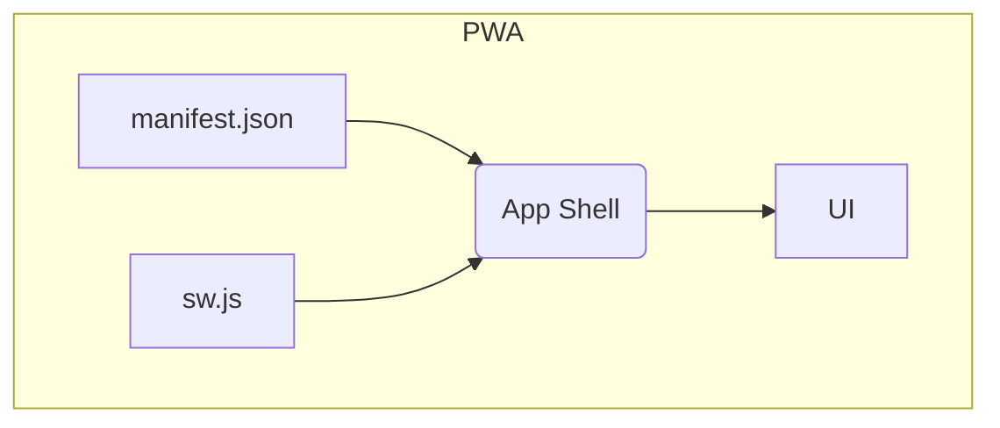
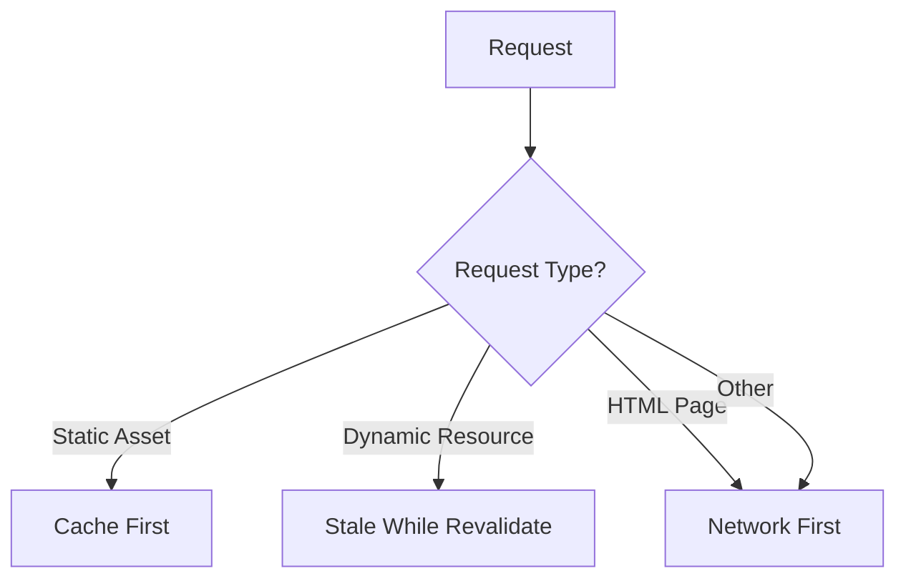

# QUALIA•NSS Mobile Optimization & PWA Conversion Guide
https://claude.ai/chat/98b2b43d-a207-482d-91d1-1a5082b1c500


## Part 1: Automatic Device Detection & Responsive CSS

### 1.1 JavaScript Device Detection

#### Mermaid Diagram: Device Detection Logic

```mermaid
graph TD
    A[Start] --> B{isMobileDevice()};
    B -->|Yes| C[Add 'mobile' class];
    B -->|No| D{isTabletDevice()};
    D -->|Yes| E[Add 'tablet' class];
    D -->|No| F[Add 'desktop' class];
    C --> G{isiOS()};
    E --> G;
    G -->|Yes| H[Add 'ios' class];
    G -->|No| I{isAndroid()};
    I -->|Yes| J[Add 'android' class];
    H --> K[Load Responsive Styles];
    J --> K;
    F --> K;
```

Create a comprehensive device detection system that loads appropriate styles:

```javascript
// device-detection.js
class DeviceDetector {
    constructor() {
        this.init();
    }

    init() {
        this.detectDevice();
        this.loadResponsiveStyles();
        this.setupOrientationHandling();
    }

    detectDevice() {
        const userAgent = navigator.userAgent.toLowerCase();
        const isTouch = 'ontouchstart' in window || navigator.maxTouchPoints > 0;
        
        // Modern approach using multiple detection methods
        this.device = {
            // Primary detection using media queries and touch capability
            isMobile: this.isMobileDevice(),
            isTablet: this.isTabletDevice(),
            isDesktop: !this.isMobileDevice() && !this.isTabletDevice(),
            
            // Specific OS detection
            iOS: this.isiOS(),
            android: this.isAndroid(),
            
            // Additional info
            isTouch: isTouch,
            orientation: this.getOrientation(),
            screenSize: this.getScreenInfo()
        };

        // Add device classes to body
        this.addDeviceClasses();
    }

    isMobileDevice() {
        // Combine multiple detection methods for accuracy
        const mediaQuery = window.matchMedia('(max-width: 768px) and (pointer: coarse)').matches;
        const userAgentMobile = /android|webos|iphone|ipad|ipod|blackberry|iemobile|opera mini/i.test(navigator.userAgent);
        const touchAndSmallScreen = 'ontouchstart' in window && window.innerWidth <= 768;
        
        return mediaQuery || (userAgentMobile && touchAndSmallScreen);
    }

    isTabletDevice() {
        const mediaQuery = window.matchMedia('(min-width: 769px) and (max-width: 1024px) and (pointer: coarse)').matches;
        const isIPad = /ipad/i.test(navigator.userAgent) || 
                       (navigator.platform === 'MacIntel' && navigator.maxTouchPoints > 1);
        
        return mediaQuery || isIPad;
    }

    isiOS() {
        return /iphone|ipad|ipod/i.test(navigator.userAgent) ||
               (navigator.platform === 'MacIntel' && navigator.maxTouchPoints > 1);
    }

    isAndroid() {
        return /android/i.test(navigator.userAgent);
    }

    getOrientation() {
        if (window.orientation !== undefined) {
            return Math.abs(window.orientation) === 90 ? 'landscape' : 'portrait';
        }
        return window.innerWidth > window.innerHeight ? 'landscape' : 'portrait';
    }

    getScreenInfo() {
        return {
            width: window.innerWidth,
            height: window.innerHeight,
            devicePixelRatio: window.devicePixelRatio || 1
        };
    }

    addDeviceClasses() {
        const body = document.body;
        
        // Remove existing device classes
        body.classList.remove('mobile', 'tablet', 'desktop', 'ios', 'android', 'touch', 'no-touch');
        
        // Add device type classes
        if (this.device.isMobile) body.classList.add('mobile');
        if (this.device.isTablet) body.classList.add('tablet');
        if (this.device.isDesktop) body.classList.add('desktop');
        
        // Add OS classes
        if (this.device.iOS) body.classList.add('ios');
        if (this.device.android) body.classList.add('android');
        
        // Add touch capability
        body.classList.add(this.device.isTouch ? 'touch' : 'no-touch');
        
        // Add orientation
        body.classList.add(this.device.orientation);
    }

    loadResponsiveStyles() {
        // Dynamic CSS loading based on device
        if (this.device.isMobile) {
            this.loadCSS('styles/mobile.css');
            if (this.device.iOS) this.loadCSS('styles/ios-mobile.css');
            if (this.device.android) this.loadCSS('styles/android-mobile.css');
        } else if (this.device.isTablet) {
            this.loadCSS('styles/tablet.css');
            if (this.device.iOS) this.loadCSS('styles/ios-tablet.css');
            if (this.device.android) this.loadCSS('styles/android-tablet.css');
        }
    }

    loadCSS(href) {
        // Check if CSS is already loaded
        if (document.querySelector(`link[href="${href}"]`)) return;
        
        const link = document.createElement('link');
        link.rel = 'stylesheet';
        link.href = href;
        link.media = 'all';
        document.head.appendChild(link);
    }

    setupOrientationHandling() {
        // Handle orientation changes
        const handleOrientationChange = () => {
            setTimeout(() => {
                this.device.orientation = this.getOrientation();
                this.device.screenSize = this.getScreenInfo();
                
                // Update body classes
                document.body.classList.remove('portrait', 'landscape');
                document.body.classList.add(this.device.orientation);
                
                // Dispatch custom event
                window.dispatchEvent(new CustomEvent('deviceOrientationUpdate', {
                    detail: this.device
                }));
            }, 100); // Delay to ensure dimensions are updated
        };

        window.addEventListener('orientationchange', handleOrientationChange);
        window.addEventListener('resize', handleOrientationChange);
    }
}

// Initialize on DOM ready
document.addEventListener('DOMContentLoaded', () => {
    window.deviceDetector = new DeviceDetector();
});
```

### 1.2 CSS Structure for Device-Specific Styles

Create a modular CSS architecture:

#### Base CSS (styles/base.css)
```css
/* Base styles that work across all devices */
:root {
    --primary-color: #007bff;
    --secondary-color: #6c757d;
    --success-color: #28a745;
    --danger-color: #dc3545;
    --warning-color: #ffc107;
    --info-color: #17a2b8;
    --light-color: #f8f9fa;
    --dark-color: #343a40;
    
    /* Responsive typography */
    --base-font-size: 16px;
    --heading-scale: 1.25;
    
    /* Layout variables */
    --container-max-width: 1200px;
    --sidebar-width: 280px;
    --header-height: 60px;
    
    /* Touch targets */
    --touch-target-size: 44px;
    --button-min-size: 48px;
}

* {
    box-sizing: border-box;
}

body {
    font-family: -apple-system, BlinkMacSystemFont, 'Segoe UI', Roboto, sans-serif;
    font-size: var(--base-font-size);
    line-height: 1.5;
    margin: 0;
    padding: 0;
}

.container {
    max-width: var(--container-max-width);
    margin: 0 auto;
    padding: 0 1rem;
}
```

#### Mobile-Specific CSS (styles/mobile.css)
```css
/* Mobile-first responsive design */
:root {
    --base-font-size: 14px;
    --header-height: 56px;
    --touch-target-size: 48px;
    --button-min-size: 52px;
}

.mobile {
    /* Enhanced touch targets */
    button, .button, .btn {
        min-height: var(--button-min-size);
        padding: 12px 16px;
        font-size: 16px; /* Prevents zoom on iOS */
        border-radius: 8px;
        touch-action: manipulation;
    }
    
    /* Input fields */
    input, select, textarea {
        font-size: 16px; /* Prevents zoom on iOS */
        padding: 12px;
        border-radius: 6px;
        min-height: var(--touch-target-size);
    }
    
    /* Navigation */
    .nav-menu {
        position: fixed;
        top: 0;
        left: -100%;
        width: 80%;
        max-width: 320px;
        height: 100vh;
        background: white;
        transition: left 0.3s ease;
        z-index: 1000;
        overflow-y: auto;
    }
    
    .nav-menu.active {
        left: 0;
    }
    
    .nav-overlay {
        position: fixed;
        top: 0;
        left: 0;
        width: 100%;
        height: 100%;
        background: rgba(0, 0, 0, 0.5);
        z-index: 999;
        opacity: 0;
        pointer-events: none;
        transition: opacity 0.3s ease;
    }
    
    .nav-overlay.active {
        opacity: 1;
        pointer-events: all;
    }
    
    /* Mobile header */
    .header {
        height: var(--header-height);
        display: flex;
        align-items: center;
        justify-content: space-between;
        padding: 0 1rem;
        background: white;
        box-shadow: 0 2px 4px rgba(0, 0, 0, 0.1);
        position: fixed;
        top: 0;
        left: 0;
        right: 0;
        z-index: 100;
    }
    
    .main-content {
        margin-top: var(--header-height);
        padding: 1rem;
    }
    
    /* Audio controls for mobile */
    .audio-controls {
        display: flex;
        flex-direction: column;
        gap: 1rem;
    }
    
    .audio-control-group {
        background: #f8f9fa;
        border-radius: 8px;
        padding: 1rem;
    }
    
    /* Charts and visualizations */
    .chart-container {
        width: 100%;
        overflow-x: auto;
        margin: 1rem 0;
    }
    
    .chart-container canvas {
        max-width: none !important;
        width: auto !important;
    }
    
    /* Modal dialogs */
    .modal {
        position: fixed;
        top: 0;
        left: 0;
        width: 100%;
        height: 100%;
        background: white;
        z-index: 2000;
        transform: translateY(100%);
        transition: transform 0.3s ease;
    }
    
    .modal.active {
        transform: translateY(0);
    }
    
    .modal-header {
        display: flex;
        justify-content: space-between;
        align-items: center;
        padding: 1rem;
        border-bottom: 1px solid #dee2e6;
        position: sticky;
        top: 0;
        background: white;
    }
    
    .modal-content {
        padding: 1rem;
        overflow-y: auto;
        height: calc(100% - 70px);
    }
}

/* Mobile landscape adjustments */
.mobile.landscape {
    --header-height: 48px;
    
    .modal {
        width: 90%;
        height: 80%;
        top: 10%;
        left: 5%;
        border-radius: 12px;
        transform: scale(0.9) translateY(100%);
    }
    
    .modal.active {
        transform: scale(1) translateY(0);
    }
}
```

#### iOS-Specific CSS (styles/ios-mobile.css)
```css
/* iOS-specific optimizations */
.mobile.ios {
    /* Safe area handling for newer iPhones */
    --safe-area-top: env(safe-area-inset-top);
    --safe-area-bottom: env(safe-area-inset-bottom);
    --safe-area-left: env(safe-area-inset-left);
    --safe-area-right: env(safe-area-inset-right);
    
    /* iOS-specific scrolling */
    -webkit-overflow-scrolling: touch;
    
    /* Disable text size adjustment */
    -webkit-text-size-adjust: none;
    
    /* iOS button styling */
    button, .button {
        -webkit-appearance: none;
        background: var(--primary-color);
        color: white;
        border: none;
        border-radius: 10px;
        font-weight: 600;
    }
    
    /* Input styling */
    input, select, textarea {
        -webkit-appearance: none;
        border: 1px solid #d1d1d6;
        border-radius: 10px;
        background: white;
    }
    
    input:focus, select:focus, textarea:focus {
        border-color: var(--primary-color);
        outline: none;
        box-shadow: 0 0 0 3px rgba(0, 123, 255, 0.1);
    }
    
    /* iOS-style navigation */
    .header {
        padding-top: var(--safe-area-top);
        height: calc(var(--header-height) + var(--safe-area-top));
        background: rgba(248, 248, 248, 0.9);
        backdrop-filter: blur(20px);
        -webkit-backdrop-filter: blur(20px);
    }
    
    .main-content {
        margin-top: calc(var(--header-height) + var(--safe-area-top));
        padding-left: calc(1rem + var(--safe-area-left));
        padding-right: calc(1rem + var(--safe-area-right));
        padding-bottom: calc(1rem + var(--safe-area-bottom));
    }
    
    /* iOS scroll behavior */
    .scrollable {
        -webkit-overflow-scrolling: touch;
        overflow: auto;
    }
    
    /* Disable iOS zoom on double tap */
    * {
        touch-action: pan-x pan-y;
    }
    
    button, .button {
        touch-action: manipulation;
    }
}
```

#### Android-Specific CSS (styles/android-mobile.css)
```css
/* Android-specific optimizations */
.mobile.android {
    /* Material Design principles */
    --elevation-1: 0 1px 3px rgba(0, 0, 0, 0.12), 0 1px 2px rgba(0, 0, 0, 0.24);
    --elevation-2: 0 3px 6px rgba(0, 0, 0, 0.16), 0 3px 6px rgba(0, 0, 0, 0.23);
    --elevation-3: 0 10px 20px rgba(0, 0, 0, 0.19), 0 6px 6px rgba(0, 0, 0, 0.23);
    
    /* Material Design buttons */
    button, .button {
        border-radius: 4px;
        text-transform: uppercase;
        letter-spacing: 0.5px;
        font-weight: 500;
        box-shadow: var(--elevation-1);
        transition: box-shadow 0.2s ease;
    }
    
    button:active, .button:active {
        box-shadow: var(--elevation-2);
    }
    
    /* Material Design inputs */
    input, select, textarea {
        border: none;
        border-bottom: 2px solid #e0e0e0;
        border-radius: 4px 4px 0 0;
        background: #f5f5f5;
        padding: 16px 12px 8px;
        transition: border-bottom-color 0.2s ease;
    }
    
    input:focus, select:focus, textarea:focus {
        border-bottom-color: var(--primary-color);
        outline: none;
        background: white;
        box-shadow: var(--elevation-1);
    }
    
    /* Android navigation with material design */
    .header {
        background: var(--primary-color);
        color: white;
        box-shadow: var(--elevation-2);
    }
    
    .nav-menu {
        box-shadow: var(--elevation-3);
    }
    
    /* Android-style cards */
    .card {
        border-radius: 8px;
        box-shadow: var(--elevation-1);
        transition: box-shadow 0.2s ease;
    }
    
    .card:hover {
        box-shadow: var(--elevation-2);
    }
    
    /* Android ripple effect */
    .ripple {
        position: relative;
        overflow: hidden;
        cursor: pointer;
    }
    
    .ripple::before {
        content: '';
        position: absolute;
        top: 50%;
        left: 50%;
        width: 0;
        height: 0;
        border-radius: 50%;
        background: rgba(255, 255, 255, 0.3);
        transform: translate(-50%, -50%);
        transition: width 0.3s, height 0.3s;
    }
    
    .ripple:active::before {
        width: 300px;
        height: 300px;
    }
}
```

### 1.3 Implementation Script

```html
<!DOCTYPE html>
<html lang="en">
<head>
    <meta charset="UTF-8">
    <meta name="viewport" content="width=device-width, initial-scale=1.0, user-scalable=no">
    <title>QUALIA•NSS - Professional Audio Analysis</title>
    
    <!-- Base styles loaded first -->
    <link rel="stylesheet" href="styles/base.css">
    
    <!-- Device detection and dynamic loading script -->
    <script src="js/device-detection.js"></script>
    
    <!-- Prevent FOUC (Flash of Unstyled Content) -->
    <style>
        body { opacity: 0; transition: opacity 0.3s ease; }
        body.device-detected { opacity: 1; }
    </style>
</head>
<body>
    <!-- Your existing QUALIA•NSS content -->
    
    <script>
        // Show content after device detection
        document.addEventListener('DOMContentLoaded', () => {
            setTimeout(() => {
                document.body.classList.add('device-detected');
            }, 100);
        });
    </script>
</body>
</html>
```

## Part 2: Converting QUALIA•NSS to a Mobile App (PWA)

### Mermaid Diagram: PWA Architecture




### 2.1 Web App Manifest (manifest.json)

```json
{
    "name": "QUALIA•NSS Professional Audio Analysis Toolkit",
    "short_name": "QUALIA•NSS",
    "description": "Precision audio engineering and acoustic measurement applications, powered by modern web technologies",
    "start_url": "/",
    "display": "standalone",
    "orientation": "any",
    "theme_color": "#007bff",
    "background_color": "#ffffff",
    "lang": "en-US",
    "scope": "/",
    "categories": ["music", "utilities", "productivity"],
    "icons": [
        {
            "src": "icons/icon-72x72.png",
            "sizes": "72x72",
            "type": "image/png",
            "purpose": "maskable any"
        },
        {
            "src": "icons/icon-96x96.png",
            "sizes": "96x96",
            "type": "image/png",
            "purpose": "maskable any"
        },
        {
            "src": "icons/icon-128x128.png",
            "sizes": "128x128",
            "type": "image/png",
            "purpose": "maskable any"
        },
        {
            "src": "icons/icon-144x144.png",
            "sizes": "144x144",
            "type": "image/png",
            "purpose": "maskable any"
        },
        {
            "src": "icons/icon-152x152.png",
            "sizes": "152x152",
            "type": "image/png",
            "purpose": "maskable any"
        },
        {
            "src": "icons/icon-192x192.png",
            "sizes": "192x192",
            "type": "image/png",
            "purpose": "maskable any"
        },
        {
            "src": "icons/icon-384x384.png",
            "sizes": "384x384",
            "type": "image/png",
            "purpose": "maskable any"
        },
        {
            "src": "icons/icon-512x512.png",
            "sizes": "512x512",
            "type": "image/png",
            "purpose": "maskable any"
        }
    ],
    "shortcuts": [
        {
            "name": "Spectrum Analyzer",
            "short_name": "Spectrum",
            "description": "Quick access to spectrum analysis tools",
            "url": "/spectrum-analyzer",
            "icons": [
                {
                    "src": "icons/spectrum-96x96.png",
                    "sizes": "96x96",
                    "type": "image/png"
                }
            ]
        },
        {
            "name": "Signal Generator",
            "short_name": "Generator",
            "description": "Quick access to signal generation tools",
            "url": "/signal-generator",
            "icons": [
                {
                    "src": "icons/generator-96x96.png",
                    "sizes": "96x96",
                    "type": "image/png"
                }
            ]
        },
        {
            "name": "Audio Recorder",
            "short_name": "Recorder",
            "description": "Quick access to audio recording",
            "url": "/recorder",
            "icons": [
                {
                    "src": "icons/recorder-96x96.png",
                    "sizes": "96x96",
                    "type": "image/png"
                }
            ]
        }
    ],
    "screenshots": [
        {
            "src": "screenshots/desktop-1.png",
            "sizes": "1280x720",
            "type": "image/png",
            "form_factor": "wide",
            "label": "Main interface with spectrum analyzer"
        },
        {
            "src": "screenshots/mobile-1.png",
            "sizes": "390x844",
            "type": "image/png",
            "form_factor": "narrow",
            "label": "Mobile spectrum analyzer view"
        }
    ]
}
```

### 2.2 Service Worker (sw.js)

```javascript
const CACHE_NAME = 'qualia-nss-v1.0.0';
const STATIC_CACHE_NAME = 'qualia-nss-static-v1.0.0';
const DYNAMIC_CACHE_NAME = 'qualia-nss-dynamic-v1.0.0';

// Resources to cache immediately
const STATIC_ASSETS = [
    '/',
    '/index.html',
    '/manifest.json',
    
    // CSS files
    '/styles/base.css',
    '/styles/mobile.css',
    '/styles/tablet.css',
    '/styles/ios-mobile.css',
    '/styles/android-mobile.css',
    
    // JavaScript files
    '/js/device-detection.js',
    '/js/main.js',
    '/js/audio-engine.js',
    '/js/spectrum-analyzer.js',
    '/js/signal-generator.js',
    
    // Icons
    '/icons/icon-192x192.png',
    '/icons/icon-512x512.png',
    
    // Fonts (if any)
    '/fonts/roboto-regular.woff2',
    
    // Essential audio processing libraries
    '/lib/web-audio-modules.js',
    '/lib/fft-processor.js'
];

// Resources that can be cached dynamically
const DYNAMIC_CACHE_PATTERNS = [
    /^https:\/\/cdnjs\.cloudflare\.com/,
    /^https:\/\/fonts\.googleapis\.com/,
    /^https:\/\/fonts\.gstatic\.com/
];

self.addEventListener('install', event => {
    console.log('[ServiceWorker] Install');
    
    event.waitUntil(
        caches.open(STATIC_CACHE_NAME)
            .then(cache => {
                console.log('[ServiceWorker] Pre-caching static assets');
                return cache.addAll(STATIC_ASSETS);
            })
            .then(() => self.skipWaiting())
    );
});

self.addEventListener('activate', event => {
    console.log('[ServiceWorker] Activate');
    
    event.waitUntil(
        caches.keys().then(cacheNames => {
            return Promise.all(
                cacheNames.map(cacheName => {
                    if (cacheName !== STATIC_CACHE_NAME && 
                        cacheName !== DYNAMIC_CACHE_NAME) {
                        console.log('[ServiceWorker] Removing old cache:', cacheName);
                        return caches.delete(cacheName);
                    }
                })
            );
        }).then(() => self.clients.claim())
    );
});

self.addEventListener('fetch', event => {
    const { request } = event;
    const url = new URL(request.url);
    
    // Handle different types of requests
    if (request.method === 'GET') {
        if (STATIC_ASSETS.includes(url.pathname) || url.pathname === '/') {
            // Static assets - cache first strategy
            event.respondWith(cacheFirstStrategy(request));
        } else if (DYNAMIC_CACHE_PATTERNS.some(pattern => pattern.test(request.url))) {
            // Dynamic resources - stale while revalidate
            event.respondWith(staleWhileRevalidateStrategy(request));
        } else if (request.headers.get('accept')?.includes('text/html')) {
            // HTML pages - network first with cache fallback
            event.respondWith(networkFirstStrategy(request));
        } else {
            // Other resources - network first
            event.respondWith(networkFirstStrategy(request));
        }
    }
});

// Cache strategies

#### Mermaid Diagram: Service Worker Caching Strategies



async function cacheFirstStrategy(request) {
    const cached = await caches.match(request);
    return cached || fetchAndCache(request, STATIC_CACHE_NAME);
}

async function networkFirstStrategy(request) {
    try {
        const response = await fetch(request);
        if (response.status === 200) {
            await cacheResponse(request, response.clone(), DYNAMIC_CACHE_NAME);
        }
        return response;
    } catch (error) {
        const cached = await caches.match(request);
        return cached || new Response('Offline - Resource not available', {
            status: 503,
            statusText: 'Service Unavailable'
        });
    }
}

async function staleWhileRevalidateStrategy(request) {
    const cached = await caches.match(request);
    const fetchPromise = fetchAndCache(request, DYNAMIC_CACHE_NAME);
    
    return cached || fetchPromise;
}

async function fetchAndCache(request, cacheName) {
    try {
        const response = await fetch(request);
        if (response.status === 200) {
            await cacheResponse(request, response.clone(), cacheName);
        }
        return response;
    } catch (error) {
        throw error;
    }
}

async function cacheResponse(request, response, cacheName) {
    const cache = await caches.open(cacheName);
    return cache.put(request, response);
}

// Handle background sync for audio file uploads
self.addEventListener('sync', event => {
    if (event.tag === 'audio-upload-sync') {
        event.waitUntil(syncAudioUploads());
    }
});

async function syncAudioUploads() {
    // Handle queued audio uploads when back online
    const uploads = await getQueuedUploads();
    for (const upload of uploads) {
        try {
            await fetch('/api/upload', {
                method: 'POST',
                body: upload.data
            });
            await removeQueuedUpload(upload.id);
        } catch (error) {
            console.error('Failed to sync upload:', error);
        }
    }
}

// Push notification handling
self.addEventListener('push', event => {
    const options = {
        body: event.data ? event.data.text() : 'New audio analysis complete',
        icon: '/icons/icon-192x192.png',
        badge: '/icons/badge-72x72.png',
        vibrate: [100, 50, 100],
        data: {
            dateOfArrival: Date.now(),
            primaryKey: 1
        },
        actions: [
            {
                action: 'view',
                title: 'View Results',
                icon: '/icons/view-action.png'
            },
            {
                action: 'close',
                title: 'Close',
                icon: '/icons/close-action.png'
            }
        ]
    };

    event.waitUntil(
        self.registration.showNotification('QUALIA•NSS', options)
    );
});

self.addEventListener('notificationclick', event => {
    event.notification.close();

    if (event.action === 'view') {
        event.waitUntil(
            clients.openWindow('/analysis-results')
        );
    }
});
```

### 2.3 PWA Installation Handler

```javascript
// pwa-installer.js
class PWAInstaller {
    constructor() {
        this.deferredPrompt = null;
        this.isInstalled = false;
        this.init();
    }

    init() {
        this.checkInstallStatus();
        this.setupEventListeners();
        this.createInstallUI();
    }

    checkInstallStatus() {
        // Check if app is already installed
        if (window.matchMedia('(display-mode: standalone)').matches || 
            window.navigator.standalone === true) {
            this.isInstalled = true;
            this.hideInstallPrompt();
        }
    }

    setupEventListeners() {
        // Listen for install prompt
        window.addEventListener('beforeinstallprompt', (e) => {
            console.log('PWA install prompt available');
            e.preventDefault();
            this.deferredPrompt = e;
            this.showInstallPrompt();
        });

        // Listen for successful installation
        window.addEventListener('appinstalled', () => {
            console.log('PWA installed successfully');
            this.isInstalled = true;
            this.hideInstallPrompt();
            this.showInstalledMessage();
        });

        // Handle iOS installation instructions
        if (this.isiOS() && !this.isInstalled) {
            this.showIOSInstructions();
        }
    }

    createInstallUI() {
        // Create install button and prompt
        const installContainer = document.createElement('div');
        installContainer.id = 'pwa-install-container';
        installContainer.className = 'pwa-install-container hidden';
        
        installContainer.innerHTML = `
            <div class="pwa-install-prompt">
                <div class="pwa-install-content">
                    
                    <div class="pwa-install-text">
                        <h3>Install QUALIA•NSS</h3>
                        <p>Get the full app experience with offline access and native performance</p>
                    </div>
                    <div class="pwa-install-actions">
                        <button id="pwa-install-btn" class="btn btn-primary">Install App</button>
                        <button id="pwa-install-dismiss" class="btn btn-secondary">Not Now</button>
                    </div>
                </div>
            </div>
        `;

        document.body.appendChild(installContainer);

        // Add event listeners
        document.getElementById('pwa-install-btn').addEventListener('click', () => {
            this.installApp();
        });

        document.getElementById('pwa-install-dismiss').addEventListener('click', () => {
            this.dismissInstallPrompt();
        });
    }

    showInstallPrompt() {
        if (this.isInstalled) return;
        
        const container = document.getElementById('pwa-install-container');
        if (container) {
            container.classList.remove('hidden');
            setTimeout(() => {
                container.classList.add('visible');
            }, 100);
        }
    }

    hideInstallPrompt() {
        const container = document.getElementById('pwa-install-container');
        if (container) {
            container.classList.remove('visible');
            setTimeout(() => {
                container.classList.add('hidden');
            }, 300);
        }
    }

    async installApp() {
        if (!this.deferredPrompt) {
            console.log('Install prompt not available');
            return;
        }

        try {
            this.deferredPrompt.prompt();
            const { outcome } = await this.deferredPrompt.userChoice;
            
            if (outcome === 'accepted') {
                console.log('User accepted install prompt');
            } else {
                console.log('User dismissed install prompt');
            }
            
            this.deferredPrompt = null;
        } catch (error) {
            console.error('Install failed:', error);
        }
    }

    dismissInstallPrompt() {
        this.hideInstallPrompt();
        // Remember user dismissed prompt
        localStorage.setItem('pwa-install-dismissed', Date.now().toString());
    }

    showIOSInstructions() {
        // Show iOS-specific installation instructions
        if (localStorage.getItem('ios-install-shown')) return;

        const iosPrompt = document.createElement('div');
        iosPrompt.className = 'ios-install-prompt';
        iosPrompt.innerHTML = `
            <div class="ios-install-content">
                <div class="ios-install-header">
                    
                    <h3>Add to Home Screen</h3>
                    <button class="ios-install-close">&times;</button>
                </div>
                <div class="ios-install-steps">
                    <p>To install QUALIA•NSS:</p>
                    <ol>
                        <li>
                            <span class="ios-step-icon">📤</span>
                            Tap the Share button in Safari
                        </li>
                        <li>
                            <span class="ios-step-icon">📱</span>
                            Select "Add to Home Screen"
                        </li>
                        <li>
                            <span class="ios-step-icon">✅</span>
                            Tap "Add" to install
                        </li>
                    </ol>
                </div>
            </div>
        `;

        document.body.appendChild(iosPrompt);

        // Handle close button
        iosPrompt.querySelector('.ios-install-close').addEventListener('click', () => {
            iosPrompt.remove();
            localStorage.setItem('ios-install-shown', 'true');
        });

        // Auto-hide after 10 seconds
        setTimeout(() => {
            if (iosPrompt.parentNode) {
                iosPrompt.remove();
                localStorage.setItem('ios-install-shown', 'true');
            }
        }, 10000);
    }

    showInstalledMessage() {
        const message = document.createElement('div');
        message.className = 'pwa-installed-message';
        message.innerHTML = `
            <div class="pwa-message-content">
                <span class="pwa-success-icon">✅</span>
                <span>QUALIA•NSS installed successfully!</span>
            </div>
        `;

        document.body.appendChild(message);
        
        setTimeout(() => {
            message.classList.add('visible');
        }, 100);

        setTimeout(() => {
            message.remove();
        }, 3000);
    }

    isiOS() {
        return /iPad|iPhone|iPod/.test(navigator.userAgent) ||
               (navigator.platform === 'MacIntel' && navigator.maxTouchPoints > 1);
    }
}

// Initialize PWA installer
document.addEventListener('DOMContentLoaded', () => {
    window.pwaInstaller = new PWAInstaller();
});
```

### 2.4 PWA Styles (styles/pwa.css)

```css
/* PWA Installation UI Styles */
.pwa-install-container {
    position: fixed;
    bottom: 0;
    left: 0;
    right: 0;
    z-index: 10000;
    transform: translateY(100%);
    transition: transform 0.3s ease;
    background: rgba(0, 0, 0, 0.8);
    backdrop-filter: blur(10px);
    -webkit-backdrop-filter: blur(10px);
}

.pwa-install-container.visible {
    transform: translateY(0);
}

.pwa-install-container.hidden {
    display: none;
}

.pwa-install-prompt {
    background: white;
    border-radius: 12px 12px 0 0;
    box-shadow: 0 -4px 20px rgba(0, 0, 0, 0.15);
    margin: 0 8px 0 8px;
}

.pwa-install-content {
    display: flex;
    align-items: center;
    gap: 1rem;
    padding: 1.5rem;
}

.pwa-install-icon {
    width: 48px;
    height: 48px;
    border-radius: 12px;
    flex-shrink: 0;
}

.pwa-install-text {
    flex-grow: 1;
}

.pwa-install-text h3 {
    margin: 0 0 0.25rem 0;
    font-size: 1.1rem;
    font-weight: 600;
    color: #333;
}

.pwa-install-text p {
    margin: 0;
    font-size: 0.9rem;
    color: #666;
}

.pwa-install-actions {
    display: flex;
    flex-direction: column;
    gap: 0.5rem;
}

.pwa-install-actions .btn {
    padding: 8px 16px;
    border-radius: 8px;
    font-size: 0.9rem;
    font-weight: 500;
    white-space: nowrap;
    min-width: 100px;
}

.btn-primary {
    background: var(--primary-color);
    color: white;
    border: none;
}

.btn-secondary {
    background: transparent;
    color: var(--primary-color);
    border: 1px solid var(--primary-color);
}

/* iOS Installation Prompt */
.ios-install-prompt {
    position: fixed;
    top: 0;
    left: 0;
    right: 0;
    bottom: 0;
    background: rgba(0, 0, 0, 0.8);
    display: flex;
    align-items: flex-end;
    z-index: 10001;
    animation: slideUp 0.3s ease;
}

.ios-install-content {
    background: white;
    border-radius: 12px 12px 0 0;
    margin: 0 12px 0 12px;
    padding: 0;
    width: 100%;
    max-width: 500px;
    margin: 0 auto;
}

.ios-install-header {
    display: flex;
    align-items: center;
    gap: 1rem;
    padding: 1.5rem 1.5rem 1rem 1.5rem;
    border-bottom: 1px solid #f0f0f0;
    position: relative;
}

.ios-install-header img {
    width: 40px;
    height: 40px;
    border-radius: 8px;
}

.ios-install-header h3 {
    flex-grow: 1;
    margin: 0;
    font-size: 1.1rem;
    font-weight: 600;
}

.ios-install-close {
    background: none;
    border: none;
    font-size: 1.5rem;
    color: #999;
    cursor: pointer;
    padding: 4px;
    line-height: 1;
}

.ios-install-steps {
    padding: 1.5rem;
}

.ios-install-steps p {
    margin: 0 0 1rem 0;
    color: #666;
    font-size: 0.95rem;
}

.ios-install-steps ol {
    margin: 0;
    padding: 0;
    list-style: none;
}

.ios-install-steps li {
    display: flex;
    align-items: center;
    gap: 1rem;
    padding: 0.75rem 0;
    font-size: 0.95rem;
}

.ios-step-icon {
    font-size: 1.2rem;
    width: 24px;
    text-align: center;
}

/* PWA Success Message */
.pwa-installed-message {
    position: fixed;
    top: 20px;
    left: 50%;
    transform: translateX(-50%) translateY(-100%);
    background: var(--success-color);
    color: white;
    padding: 12px 20px;
    border-radius: 8px;
    box-shadow: 0 4px 12px rgba(0, 0, 0, 0.15);
    z-index: 10002;
    transition: transform 0.3s ease;
}

.pwa-installed-message.visible {
    transform: translateX(-50%) translateY(0);
}

.pwa-message-content {
    display: flex;
    align-items: center;
    gap: 0.5rem;
    font-weight: 500;
}

.pwa-success-icon {
    font-size: 1.1rem;
}

/* Responsive adjustments */
@media (max-width: 480px) {
    .pwa-install-content {
        flex-direction: column;
        text-align: center;
        gap: 1rem;
    }
    
    .pwa-install-actions {
        flex-direction: row;
        width: 100%;
    }
    
    .pwa-install-actions .btn {
        flex: 1;
    }
}

/* Animation keyframes */
@keyframes slideUp {
    from {
        transform: translateY(100%);
    }
    to {
        transform: translateY(0);
    }
}
```

### 2.5 Main HTML Implementation

```html
<!DOCTYPE html>
<html lang="en">
<head>
    <meta charset="UTF-8">
    <meta name="viewport" content="width=device-width, initial-scale=1.0, user-scalable=no, viewport-fit=cover">
    <title>QUALIA•NSS - Professional Audio Analysis Toolkit</title>
    
    <!-- PWA Meta Tags -->
    <meta name="description" content="Precision audio engineering and acoustic measurement applications, powered by modern web technologies">
    <meta name="theme-color" content="#007bff">
    <meta name="apple-mobile-web-app-capable" content="yes">
    <meta name="apple-mobile-web-app-status-bar-style" content="default">
    <meta name="apple-mobile-web-app-title" content="QUALIA•NSS">
    <meta name="msapplication-TileColor" content="#007bff">
    
    <!-- PWA Icons -->
    <link rel="icon" type="image/png" sizes="32x32" href="/icons/icon-32x32.png">
    <link rel="icon" type="image/png" sizes="16x16" href="/icons/icon-16x16.png">
    <link rel="apple-touch-icon" sizes="180x180" href="/icons/apple-touch-icon.png">
    <link rel="mask-icon" href="/icons/safari-pinned-tab.svg" color="#007bff">
    
    <!-- PWA Manifest -->
    <link rel="manifest" href="/manifest.json">
    
    <!-- Stylesheets -->
    <link rel="stylesheet" href="/styles/base.css">
    <link rel="stylesheet" href="/styles/pwa.css">
    
    <!-- Prevent FOUC -->
    <style>
        body { 
            opacity: 0; 
            transition: opacity 0.3s ease; 
        }
        body.loaded { 
            opacity: 1; 
        }
        
        /* Loading spinner */
        .loading-spinner {
            position: fixed;
            top: 50%;
            left: 50%;
            transform: translate(-50%, -50%);
            width: 40px;
            height: 40px;
            border: 4px solid #f3f3f3;
            border-top: 4px solid #007bff;
            border-radius: 50%;
            animation: spin 1s linear infinite;
            z-index: 9999;
        }
        
        @keyframes spin {
            0% { transform: translate(-50%, -50%) rotate(0deg); }
            100% { transform: translate(-50%, -50%) rotate(360deg); }
        }
    </style>
</head>
<body>
    <!-- Loading Spinner -->
    <div class="loading-spinner" id="loading-spinner"></div>
    
    <!-- Main App Container -->
    <div id="app" class="app-container">
        <!-- Header -->
        <header class="header">
            <div class="header-content">
                <button class="menu-toggle" id="menu-toggle" aria-label="Toggle menu">
                    <span></span>
                    <span></span>
                    <span></span>
                </button>
                <h1 class="app-title">QUALIA•NSS</h1>
                <button class="install-btn" id="header-install-btn" aria-label="Install app">📱</button>
            </div>
        </header>
        
        <!-- Navigation Menu -->
        <nav class="nav-menu" id="nav-menu">
            <div class="nav-header">
                
                <h2>QUALIA•NSS</h2>
                <button class="nav-close" id="nav-close" aria-label="Close menu">&times;</button>
            </div>
            <ul class="nav-list">
                <li><a href="/" class="nav-link">Dashboard</a></li>
                <li><a href="/spectrum-analyzer" class="nav-link">Spectrum Analyzer</a></li>
                <li><a href="/signal-generator" class="nav-link">Signal Generator</a></li>
                <li><a href="/recorder" class="nav-link">Audio Recorder</a></li>
                <li><a href="/settings" class="nav-link">Settings</a></li>
                <li><a href="/about" class="nav-link">About</a></li>
            </ul>
        </nav>
        
        <!-- Navigation Overlay -->
        <div class="nav-overlay" id="nav-overlay"></div>
        
        <!-- Main Content -->
        <main class="main-content" id="main-content">
            <!-- Your existing QUALIA•NSS content goes here -->
            <div class="welcome-section">
                <h2>Welcome to QUALIA•NSS</h2>
                <p>Professional Audio Analysis Toolkit</p>
                
                <!-- Feature Cards -->
                <div class="feature-grid">
                    <div class="feature-card">
                        <div class="feature-icon">📊</div>
                        <h3>Spectrum Analyzer</h3>
                        <p>Real-time frequency analysis</p>
                    </div>
                    <div class="feature-card">
                        <div class="feature-icon">🎵</div>
                        <h3>Signal Generator</h3>
                        <p>Generate test signals</p>
                    </div>
                    <div class="feature-card">
                        <div class="feature-icon">🎙️</div>
                        <h3>Audio Recorder</h3>
                        <p>High-quality recording</p>
                    </div>
                    <div class="feature-card">
                        <div class="feature-icon">⚙️</div>
                        <h3>Settings</h3>
                        <p>Customize your experience</p>
                    </div>
                </div>
            </div>
        </main>
    </div>
    
    <!-- Scripts -->
    <script src="/js/device-detection.js"></script>
    <script src="/js/pwa-installer.js"></script>
    <script src="/js/main.js"></script>
    
    <!-- Service Worker Registration -->
    <script>
        if ('serviceWorker' in navigator) {
            window.addEventListener('load', () => {
                navigator.serviceWorker.register('/sw.js')
                    .then(registration => {
                        console.log('SW registered: ', registration);
                    })
                    .catch(registrationError => {
                        console.log('SW registration failed: ', registrationError);
                    });
            });
        }
        
        // Initialize app
        document.addEventListener('DOMContentLoaded', () => {
            // Hide loading spinner
            setTimeout(() => {
                document.getElementById('loading-spinner').style.display = 'none';
                document.body.classList.add('loaded');
            }, 500);
            
            // Setup navigation
            setupNavigation();
        });
        
        function setupNavigation() {
            const menuToggle = document.getElementById('menu-toggle');
            const navMenu = document.getElementById('nav-menu');
            const navOverlay = document.getElementById('nav-overlay');
            const navClose = document.getElementById('nav-close');
            
            function openMenu() {
                navMenu.classList.add('active');
                navOverlay.classList.add('active');
                document.body.style.overflow = 'hidden';
            }
            
            function closeMenu() {
                navMenu.classList.remove('active');
                navOverlay.classList.remove('active');
                document.body.style.overflow = '';
            }
            
            menuToggle.addEventListener('click', openMenu);
            navClose.addEventListener('click', closeMenu);
            navOverlay.addEventListener('click', closeMenu);
            
            // Close menu when clicking nav links
            document.querySelectorAll('.nav-link').forEach(link => {
                link.addEventListener('click', closeMenu);
            });
        }
    </script>
</body>
</html>
```

## Part 3: Deployment and Testing Checklist

### 3.1 Pre-Deployment Checklist

- [ ] **Manifest File**: Create and test manifest.json with all required fields
- [ ] **Service Worker**: Implement caching strategies for offline functionality  
- [ ] **Icons**: Generate all required icon sizes (72px to 512px)
- [ ] **HTTPS**: Ensure site is served over HTTPS
- [ ] **Mobile Optimization**: Test responsive design on actual devices
- [ ] **Performance**: Optimize for mobile performance (< 3s load time)

### 3.2 Testing Strategy

#### Device Testing Matrix
```markdown
| Device Type | OS Version | Browser | Screen Size | Test Priority |
|-------------|------------|---------|-------------|---------------|
| iPhone 12+ | iOS 16+ | Safari | 390x844 | High |
| iPhone SE | iOS 15+ | Safari | 375x667 | High |
| Samsung Galaxy S21+ | Android 11+ | Chrome | 384x854 | High |
| iPad Air | iOS 15+ | Safari | 820x1180 | Medium |
| Samsung Tab | Android 10+ | Chrome | 800x1280 | Medium |
```

#### Performance Testing
- **Lighthouse Audit**: Target PWA score > 90
- **Core Web Vitals**: LCP < 2.5s, FID < 100ms, CLS < 0.1
- **Audio Latency**: < 20ms for real-time processing

### 3.3 App Store Distribution (Optional)

#### Google Play Store (via PWABuilder)
1. Use [PWABuilder.com](https://pwabuilder.com) to generate Android package
2. Configure signing keys and app details
3. Submit to Google Play Console

#### iOS App Store (via PWABuilder)  
1. Generate iOS wrapper using PWABuilder
2. Configure Xcode project settings
3. Submit through App Store Connect

### 3.4 Analytics and Monitoring

```javascript
// Add to your main.js for tracking PWA usage
function trackPWAInstallation() {
    // Track install events
    window.addEventListener('appinstalled', () => {
        gtag('event', 'pwa_installed', {
            'event_category': 'PWA',
            'event_label': 'App Installed'
        });
    });
    
    // Track display mode
    const displayMode = window.matchMedia('(display-mode: standalone)').matches ? 'standalone' : 'browser';
    gtag('event', 'pwa_display_mode', {
        'event_category': 'PWA',
        'event_label': displayMode
    });
}
```

This comprehensive solution provides QUALIA•NSS with:

1. **Automatic device detection** with optimized CSS for iOS/Android
2. **Progressive Web App** capabilities for app-like experience
3. **Offline functionality** through service workers
4. **Installation prompts** for mobile devices
5. **Performance optimizations** for mobile audio processing
6. **Future app store distribution** options

The implementation is modular, maintainable, and follows modern web standards for maximum compatibility across devices.
    