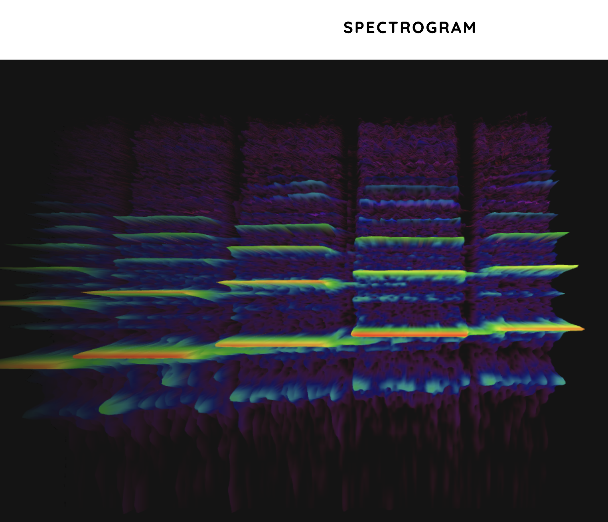

https://musiclab.chromeexperiments.com/Spectrogram/

https://github.com/googlecreativelab/chrome-music-lab/tree/master/spectrogram

Calibration documentation:
https://grok.com/chat/fa315979-96d1-472a-9e7b-7c5d1103737c

Yes, there are audio calibration files designed to produce predictable spectrogram images, often used for testing, analyzing, and calibrating audio processing systems, software, or equipment. These typically include test signals like chirp tones (e.g., linear frequency sweeps) that generate clear, diagonal patterns in spectrograms, making them ideal for verifying frequency response, aliasing, or visualization accuracy. While not always explicitly labeled as "spectrogram calibration files," they serve that purpose in fields like signal processing, audio engineering, and machine learning.

### Examples of Such Files
- **Linear Chirp Signals**: These sweep from low to high frequencies over time, resulting in a straight diagonal line on a spectrogram. They are commonly used to test spectrogram generation and analyze effects like sampling issues.
  - Download or generate them from sites like AudioCheck.net, which offers customizable sweep generators for linear or logarithmic chirps (0 Hz to 24 kHz).
- **Other Test Tones**: Sine waves, logarithmic sweeps, or impulse responses can produce known spectrogram patterns for calibration, such as horizontal lines for constant frequencies or bursts for impulse testing.
  - High-definition test files (up to 192 kHz sample rates) are available on AudioCheck.net for free download.

### Tools for Generation and Viewing
- Software like MATLAB can synthesize chirps and plot their spectrograms directly.
- Free tools such as Audacity or LabChirp allow creating custom chirps and exporting audio files.
- For bioacoustics or specialized calibration (e.g., sound level calibration in software like Raven Pro), chirp modes are used for system testing.

These files are widely available online for free and are substantiated in educational, lab, and engineering contexts for spectrogram-related calibration. If you meant something more specific (e.g., pre-generated spectrogram images or files for a particular application), provide more details for a refined search.

# Spectrogram — Implementation Plan (thinking only)

## Goals
- Build a real‑time microphone spectrogram in the browser.
- High readability and accuracy; consistent with our 7‑band tools.
- Exportable snapshot; user settings persisted.

## Data encoding (what each visual dimension means)
- X axis: Time (left→right, newest at right).
- Y axis: Frequency (bottom→top; log scale preferred).
- Color/Luminance: Magnitude (dBFS), not frequency.

## Colormap strategy
- Default magnitude LUT: Inferno or Viridis (perceptually uniform, good contrast, CB‑friendly).
- Frequency is already the vertical axis; color must encode intensity to avoid ambiguity.
- Consistency with 7‑band palette via overlays and UI affordances:
  - Horizontal band guides tinted with our 7‑band colors.
  - Cursor readout shows band‑color swatch for the hovered frequency.
  - Optional side band meters (RMS/peak per band) using the same palette.
  - Optional toggle: "7‑band themed magnitude" LUT with strictly monotonic luminance.

## Architecture
- Audio input: `getUserMedia()` → `AudioContext` → `MediaStreamSource`.
- Analysis path (two tiers):
  1) Start: `AnalyserNode` with `getFloatFrequencyData()` for rapid prototype.
  2) Upgrade: custom STFT in `AudioWorkletProcessor` for precise windowing/overlap and improved dynamic range.
- Windowing: Hann; overlap 50–75%.
- FFT sizes: 4096–8192 (trade time vs frequency resolution). Sample-rate aware.
- Magnitude scaling: compute dBFS; clamp floor at ~−100 dB to 0 dB.
- Frequency scale: logarithmic mapping for the canvas Y coordinate.

## Rendering
- Canvas 2D; draw one column per analysis frame.
- Use a precomputed LUT texture for the colormap for speed.
- OffscreenCanvas when available; fallback to main thread draw.
- Maintain a scrolling backing bitmap; avoid full-canvas shifts when possible.

## Parameters (defaults)
- FFT size: 4096 (optionally 2048/8192).
- Overlap: 4x (75%).
- Floor: −100 dB; Ceiling: 0 dB.
- Colormap: Inferno (default), Viridis (alt), 7‑band themed (optional).
- Y scale: Log; min/max frequency derived from sample rate, with UI min/max clamps.

## UX
- Start/Stop/Pause.
- Device selector with permissions/error handling.
- Snapshot export (PNG of canvas).
- Cursor probe: time, freq, level (dBFS), band color swatch.
- Settings persisted to `localStorage` (FFT size, overlap, colormap, y‑scale, min/max f).

## Performance & quality
- Decouple analysis rate from `requestAnimationFrame`.
- Backpressure: drop frames if UI lags; never block audio thread.
- Validate with white noise and swept sine; align magnitude with our meters (cal offset available).

## Files to create in `spectogram/`
- `index.html` — UI shell (canvas, controls, legend, links).
- `style.css` — dark theme; band guide styling; responsive layout.
- `script.js` — audio graph, STFT/AnalyserNode pipeline, rendering, settings, device handling.

## Open questions
- Input sources: Mic only, or add file upload/URL analysis?
- Default colormap: Inferno or Viridis?
- Keep folder spelling `spectogram/` or rename to `spectrogram/`?

Reference: Chrome Music Lab Spectrogram — see the URL above for UX inspiration. 
