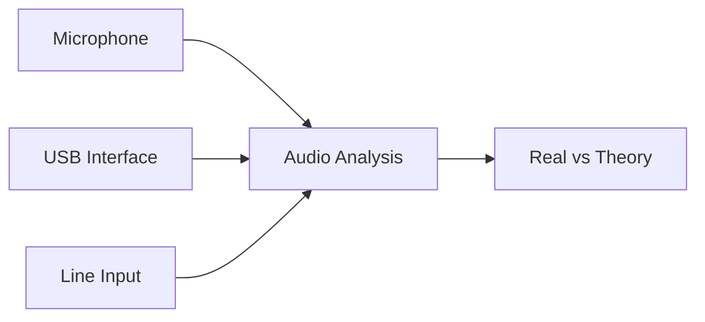

# Phase 4: Real-World Audio Analysis

**Status**: In Development  
**Version**: 2.0  
**Target Release**: Q4 2025  

## Overview

Phase 4 extends the Qualia-NSS Comb Filtering Tool with real-world audio input capabilities, enabling users to compare theoretical simulations with actual acoustic measurements.

## Key Features

### Multi-Input Audio System

### Triple-Path Analysis
- **Reference Path**: Digital signal processing
- **Simulation Path**: Predicted acoustic behavior  
- **Reality Path**: Measured acoustic response

### Educational Benefits
- Compare theory with real-world measurements
- Understand room acoustics impact
- Learn professional audio measurement techniques
- Validate computational models with physical reality

## System Requirements

### Hardware
- Computer with audio input capability
- External microphone (recommended)
- USB audio interface (optional, for professional use)
- Speakers for acoustic playback

### Software
- Modern web browser with Web Audio API support
- Microphone access permissions
- Stable internet connection

## Getting Started

### Basic Setup
1. Connect your microphone or audio interface
2. Grant microphone permissions when prompted
3. Run the audio calibration process
4. Begin real-world measurements

### Professional Setup
- Use USB audio interface for enhanced quality
- Position microphone at optimal measurement locations
- Calibrate system with known reference signals
- Document room characteristics and setup

## Educational Applications

### Academic Use
- **Signal Processing Courses**: Validate theoretical concepts
- **Acoustics Studies**: Measure real room responses  
- **Audio Engineering**: Learn professional measurement techniques

### Research Applications
- Room acoustics characterization
- Speaker and microphone testing
- Filter algorithm validation
- Psychoacoustic studies

## Technical Specifications

### Audio Quality
- Sample Rate: 48 kHz
- Bit Depth: 24-bit (when supported)
- Latency: < 50ms
- Dynamic Range: > 90 dB

### Analysis Capabilities
- Real-time spectrum analysis
- Impulse response measurement
- Transfer function calculation
- Room mode detection

## Future Development

Phase 4 represents the foundation for advanced acoustic measurement capabilities in Qualia-NSS, with planned expansions including:

- Multi-channel analysis
- Advanced calibration systems
- Professional measurement protocols
- Integration with academic curricula

---

*For technical implementation details and development progress, see the internal development documentation.*