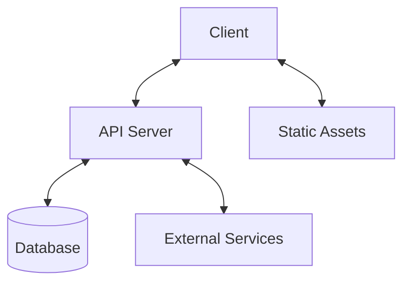

# System Architecture Overview

This document provides a high-level overview of the Qualia NSS system architecture.

## Architecture Diagram

## Core Components

### 1. Client Application
- **Frontend Framework**: [Specify if using React, Vue, etc.]
- **State Management**: [e.g., Redux, Context API]
- **UI Components**: Custom component library
- **Routing**: Client-side routing

### 2. API Server
- **Framework**: [e.g., Express, Fastify]
- **Authentication**: JWT-based auth
- **API Versioning**: v1, v2, etc.
- **Rate Limiting**: For API protection

### 3. Database
- **Primary Database**: [e.g., PostgreSQL, MongoDB]
- **Caching Layer**: [e.g., Redis]
- **Migrations**: Database schema management

### 4. External Services
- [List any third-party services]
- [Authentication providers]
- [Payment processors]
- [Email services]

## Data Flow

1. **Client Request**:
   - User interacts with the UI
   - API requests are made to the backend

2. **Server Processing**:
   - Request validation
   - Authentication/Authorization
   - Business logic execution
   - Database operations

3. **Response**:
   - Data transformation
   - Error handling
   - Response formatting

## Security Considerations

- HTTPS for all communications
- Input validation and sanitization
- Rate limiting
- CORS configuration
- Secure headers
- Regular security audits

## Performance

- Client-side:
  - Code splitting
  - Lazy loading
  - Image optimization
  - Caching strategies

- Server-side:
  - Database indexing
  - Query optimization
  - Response caching
  - Load balancing

## Monitoring and Logging

- Error tracking
- Performance monitoring
- User analytics
- Server health checks

## Deployment

- CI/CD pipeline
- Environment configurations
- Rollback strategies
- Zero-downtime deployments

## Future Considerations

- Microservices architecture
- Serverless components
- GraphQL API
- Real-time features

## Related Documents

- [Design Decisions](decisions.md)
- [Data Flow](data-flow.md)
- [API Documentation](/api/)
