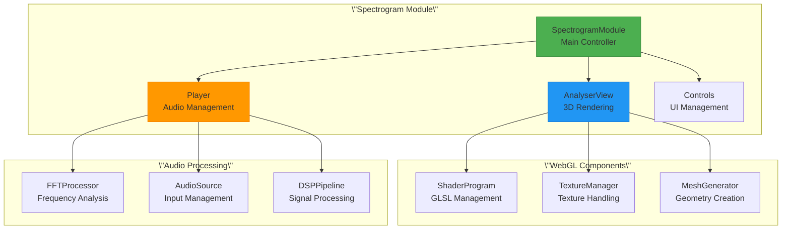

# Spectrogram Module

## Overview

The **Spectrogram Module** is Qualia-NSS's flagship feature, providing real-time 3D visualization of audio frequency content using WebGL acceleration. This module transforms audio input into stunning 3D spectrograms that reveal the temporal evolution of frequency content with professional-grade precision.

## Technical Specifications

### Core Technologies
- **WebGL 2.0** with WebGL 1.0 fallback
- **Web Audio API** for real-time audio processing
- **Custom 3D Engine** optimized for spectral visualization
- **Vertex Texture Sampling** for high-resolution frequency data

### Performance Characteristics
- **256×256 mesh resolution** for detailed visualization
- **60 FPS rendering** with WebGL acceleration
- **Real-time FFT processing** up to 8192 samples
- **Low-latency audio pipeline** (<10ms typical)

## Architecture

### Module Structure
```
src/spectrogram/
├── index.html          # HTML template
├── spectrogram.js      # Main WebGL implementation
└── styles.css         # Module-specific styling
```

### Class Hierarchy



## Core Components

### SpectrogramModule Class

**Purpose**: Main module controller and lifecycle management

```javascript
class SpectrogramModule {
    constructor() {
        this.name = 'spectrogram';
        this.isInitialized = false;
        this.player = null;
        this.analyserView = null;
        this.controls = null;
    }
    
    async init() {
        try {
            // Initialize audio processing
            this.player = new Player();
            await this.player.init();
            
            // Initialize 3D visualization
            this.analyserView = new AnalyserView(this.player);
            await this.analyserView.init();
            
            // Initialize UI controls
            this.controls = new SpectrogramControls(this.player, this.analyserView);
            this.controls.init();
            
            this.isInitialized = true;
            console.log('Spectrogram module initialized successfully');
        } catch (error) {
            console.error('Failed to initialize spectrogram module:', error);
            throw error;
        }
    }
    
    async destroy() {
        if (this.analyserView) {
            this.analyserView.destroy();
        }
        
        if (this.player) {
            await this.player.destroy();
        }
        
        if (this.controls) {
            this.controls.destroy();
        }
        
        this.isInitialized = false;
    }
}
```

### Player Class (Audio Management)

**Purpose**: Audio source management and Web Audio API integration

**Key Features**:
- Multiple audio source support (microphone, file, system audio)
- Real-time FFT processing with configurable parameters
- DSP controls (echo cancellation, noise suppression, auto gain)
- Professional audio routing and monitoring

```javascript
class Player {
    constructor() {
        this.audioContext = null;
        this.analyser = null;
        this.sourceNode = null;
        this.mediaStream = null;
        this.fftSize = 2048;
        this.smoothingTimeConstant = 0.8;
    }
    
    async init() {
        // Create Web Audio context
        this.audioContext = new (window.AudioContext || window.webkitAudioContext)();
        
        // Create analyser node
        this.analyser = this.audioContext.createAnalyser();
        this.analyser.fftSize = this.fftSize;
        this.analyser.smoothingTimeConstant = this.smoothingTimeConstant;
        
        // Set up default audio source
        await this.setAudioSource('microphone');
    }
    
    async setAudioSource(sourceType, options = {}) {
        switch (sourceType) {
            case 'microphone':
                return this.setupMicrophoneInput(options);
            case 'file':
                return this.setupFileInput(options.file);
            case 'system':
                return this.setupSystemAudioInput(options);
            default:
                throw new Error(`Unknown audio source: ${sourceType}`);
        }
    }
}
```

### AnalyserView Class (3D Rendering)

**Purpose**: WebGL-based 3D spectrogram visualization

**Key Features**:
- High-performance WebGL 2.0 rendering
- 256×256 mesh with vertex texture sampling
- Real-time frequency data visualization
- Interactive camera controls (rotation, zoom, panning)
- Multiple visualization modes and color schemes

```javascript
class AnalyserView {
    constructor(player) {
        this.player = player;
        this.canvas = null;
        this.gl = null;
        this.shaderProgram = null;
        this.meshData = null;
        this.textureData = null;
        this.animationFrameId = null;
    }
    
    async init() {
        // Get WebGL context
        this.canvas = document.getElementById('spectrogram-canvas');
        this.gl = this.getWebGLContext();
        
        // Initialize shaders
        await this.initShaders();
        
        // Create 3D mesh
        this.createMesh();
        
        // Start rendering loop
        this.startRenderLoop();
    }
    
    startRenderLoop() {
        const render = () => {
            this.updateFrequencyData();
            this.renderFrame();
            this.animationFrameId = requestAnimationFrame(render);
        };
        render();
    }
}
```

## Audio Processing Pipeline

### FFT Configuration

```javascript
// Configurable FFT parameters
const FFT_SIZES = [512, 1024, 2048, 4096, 8192];
const WINDOW_FUNCTIONS = ['hanning', 'hamming', 'blackman', 'rectangular'];
const SMOOTHING_RANGE = [0.0, 0.95];

// FFT processing example
class FFTProcessor {
    constructor(analyser) {
        this.analyser = analyser;
        this.frequencyData = new Uint8Array(analyser.frequencyBinCount);
        this.timeData = new Uint8Array(analyser.fftSize);
    }
    
    getFrequencyData() {
        this.analyser.getByteFrequencyData(this.frequencyData);
        return this.frequencyData;
    }
    
    getTimeData() {
        this.analyser.getByteTimeDomainData(this.timeData);
        return this.timeData;
    }
}
```

### DSP Controls

```javascript
// Digital signal processing controls
class DSPControls {
    constructor(audioContext) {
        this.audioContext = audioContext;
        this.enableEchoCancellation = true;
        this.enableNoiseSuppression = true;
        this.enableAutoGainControl = false;
    }
    
    async setupMicrophoneConstraints() {
        return {
            audio: {
                echoCancellation: this.enableEchoCancellation,
                noiseSuppression: this.enableNoiseSuppression,
                autoGainControl: this.enableAutoGainControl,
                sampleRate: this.audioContext.sampleRate,
                channelCount: 1
            }
        };
    }
}
```

## WebGL Rendering

### Vertex Shader

```glsl
// Vertex shader for 3D spectrogram
attribute vec3 a_position;
attribute vec2 a_texCoord;

uniform mat4 u_modelViewMatrix;
uniform mat4 u_projectionMatrix;
uniform sampler2D u_frequencyTexture;
uniform float u_amplitudeScale;
uniform float u_timeOffset;

varying vec2 v_texCoord;
varying float v_amplitude;

void main() {
    vec2 texCoord = a_texCoord;
    texCoord.x = mod(texCoord.x + u_timeOffset, 1.0);
    
    // Sample frequency data from texture
    float amplitude = texture2D(u_frequencyTexture, texCoord).r;
    amplitude *= u_amplitudeScale;
    
    // Calculate 3D position
    vec3 position = a_position;
    position.y = amplitude;
    
    gl_Position = u_projectionMatrix * u_modelViewMatrix * vec4(position, 1.0);
    
    v_texCoord = texCoord;
    v_amplitude = amplitude;
}
```

### Fragment Shader

```glsl
// Fragment shader with colormap
precision mediump float;

varying vec2 v_texCoord;
varying float v_amplitude;

uniform vec3 u_colorLow;
uniform vec3 u_colorHigh;
uniform float u_brightness;

vec3 getColor(float value) {
    // Apply gamma correction
    value = pow(value, 0.5);
    
    // Interpolate between low and high colors
    return mix(u_colorLow, u_colorHigh, value) * u_brightness;
}

void main() {
    vec3 color = getColor(v_amplitude);
    gl_FragColor = vec4(color, 1.0);
}
```

## User Interface Controls

### Control Panels

```javascript
// Spectrogram control interface
class SpectrogramControls {
    constructor(player, analyserView) {
        this.player = player;
        this.analyserView = analyserView;
        this.setupControlPanels();
    }
    
    setupControlPanels() {
        // Audio source controls
        this.setupAudioSourceControls();
        
        // FFT parameter controls
        this.setupFFTControls();
        
        // Visualization controls
        this.setupVisualizationControls();
        
        // Camera controls
        this.setupCameraControls();
    }
    
    setupFFTControls() {
        const fftSizeSelect = document.getElementById('fft-size-select');
        fftSizeSelect.addEventListener('change', (e) => {
            const fftSize = parseInt(e.target.value);
            this.player.setFFTSize(fftSize);
        });
        
        const smoothingSlider = document.getElementById('smoothing-slider');
        smoothingSlider.addEventListener('input', (e) => {
            const smoothing = parseFloat(e.target.value);
            this.player.setSmoothingTimeConstant(smoothing);
        });
    }
}
```

### Sidebar Template

```html
<!-- Spectrogram sidebar controls -->
<div class=\"spectrogram-controls\">
    <div class=\"accordion\" id=\"spectrogramAccordion\">
        <!-- Audio Source Panel -->
        <div class=\"accordion-item\">
            <h2 class=\"accordion-header\">
                <button class=\"accordion-button\" type=\"button\" data-bs-toggle=\"collapse\" data-bs-target=\"#audioSourcePanel\">
                    🎤 Audio Source
                </button>
            </h2>
            <div id=\"audioSourcePanel\" class=\"accordion-collapse collapse show\">
                <div class=\"accordion-body\">
                    <div class=\"mb-3\">
                        <label for=\"audio-source-select\" class=\"form-label\">Input Source</label>
                        <select id=\"audio-source-select\" class=\"form-select\">
                            <option value=\"microphone\">Microphone</option>
                            <option value=\"file\">Audio File</option>
                            <option value=\"system\">System Audio</option>
                        </select>
                    </div>
                    <div class=\"form-check\">
                        <input class=\"form-check-input\" type=\"checkbox\" id=\"echo-cancellation\" checked>
                        <label class=\"form-check-label\" for=\"echo-cancellation\">
                            Echo Cancellation
                        </label>
                    </div>
                </div>
            </div>
        </div>
        
        <!-- FFT Parameters Panel -->
        <div class=\"accordion-item\">
            <h2 class=\"accordion-header\">
                <button class=\"accordion-button collapsed\" type=\"button\" data-bs-toggle=\"collapse\" data-bs-target=\"#fftPanel\">
                    📊 FFT Parameters
                </button>
            </h2>
            <div id=\"fftPanel\" class=\"accordion-collapse collapse\">
                <div class=\"accordion-body\">
                    <div class=\"mb-3\">
                        <label for=\"fft-size-select\" class=\"form-label\">FFT Size</label>
                        <select id=\"fft-size-select\" class=\"form-select\">
                            <option value=\"512\">512</option>
                            <option value=\"1024\">1024</option>
                            <option value=\"2048\" selected>2048</option>
                            <option value=\"4096\">4096</option>
                            <option value=\"8192\">8192</option>
                        </select>
                    </div>
                    <div class=\"mb-3\">
                        <label for=\"smoothing-slider\" class=\"form-label\">Smoothing</label>
                        <input type=\"range\" id=\"smoothing-slider\" class=\"form-range\" min=\"0\" max=\"0.95\" step=\"0.05\" value=\"0.8\">
                    </div>
                </div>
            </div>
        </div>
    </div>
</div>
```

## Integration Examples

### Module Loading

```javascript
// Load and initialize spectrogram module
async function loadSpectrogramModule() {
    try {
        const module = new SpectrogramModule();
        await module.init();
        
        // Register with module system
        window.moduleRegistry.register('spectrogram', module);
        
        return module;
    } catch (error) {
        console.error('Failed to load spectrogram module:', error);
        throw error;
    }
}

// Usage in router
router.registerRoute('/spectrogram', async () => {
    const module = await loadSpectrogramModule();
    return module;
});
```

### Event Integration

```javascript
// Event handling between modules
class SpectrogramEventHandler {
    constructor(module) {
        this.module = module;
        this.setupEventListeners();
    }
    
    setupEventListeners() {
        // Listen for global events
        window.eventBus.on('audioSourceChanged', (event) => {
            this.module.player.setAudioSource(event.detail.source);
        });
        
        window.eventBus.on('themeChanged', (event) => {
            this.module.analyserView.updateTheme(event.detail.theme);
        });
        
        // Emit module-specific events
        this.module.player.on('fftSizeChanged', (size) => {
            window.eventBus.emit('spectrogramFFTSizeChanged', { size });
        });
    }
}
```

## Performance Optimization

### WebGL Optimization

```javascript
// Optimized rendering techniques
class OptimizedRenderer {
    constructor() {
        this.vertexBufferPool = [];
        this.texturePool = [];
        this.lastFrameTime = 0;
        this.targetFPS = 60;
    }
    
    render(currentTime) {
        const deltaTime = currentTime - this.lastFrameTime;
        const minFrameTime = 1000 / this.targetFPS;
        
        if (deltaTime >= minFrameTime) {
            this.renderFrame();
            this.lastFrameTime = currentTime;
        }
    }
    
    // Buffer pool management
    getVertexBuffer() {
        return this.vertexBufferPool.pop() || this.gl.createBuffer();
    }
    
    releaseVertexBuffer(buffer) {
        this.vertexBufferPool.push(buffer);
    }
}
```

### Memory Management

```javascript
// Memory-efficient audio processing
class MemoryEfficientProcessor {
    constructor() {
        this.bufferPool = new Float32Array(8192);
        this.recycledArrays = [];
    }
    
    processAudioFrame(inputData) {
        // Reuse typed arrays to avoid garbage collection
        const workingBuffer = this.getWorkingBuffer(inputData.length);
        
        // Process data in-place
        this.performFFT(inputData, workingBuffer);
        
        // Return buffer to pool
        this.releaseWorkingBuffer(workingBuffer);
    }
}
```

## Troubleshooting

### Common Issues

1. **WebGL Not Available**
   - Check browser WebGL support
   - Update graphics drivers
   - Try WebGL 1.0 fallback

2. **Audio Permission Denied**
   - Ensure HTTPS in production
   - Check browser permissions
   - Verify microphone access

3. **Performance Issues**
   - Reduce FFT size
   - Lower mesh resolution
   - Check GPU capabilities

### Debug Mode

```javascript
// Debug utilities
class SpectrogramDebugger {
    constructor(module) {
        this.module = module;
        this.stats = {
            frameRate: 0,
            audioLatency: 0,
            memoryUsage: 0
        };
    }
    
    enableDebugMode() {
        this.showPerformanceStats();
        this.enableWebGLDebug();
        this.logAudioStats();
    }
    
    showPerformanceStats() {
        const statsDisplay = document.getElementById('debug-stats');
        setInterval(() => {
            statsDisplay.innerHTML = `
                FPS: ${this.stats.frameRate.toFixed(1)}<br>
                Latency: ${this.stats.audioLatency.toFixed(1)}ms<br>
                Memory: ${this.stats.memoryUsage.toFixed(1)}MB
            `;
        }, 1000);
    }
}
```

## Related Documentation

- [Audio Processing Pipeline](../audio-processing/web-audio-api.md)
- [WebGL Implementation Details](../api-reference/javascript-api/spectrogram-renderer.md)
- [7-Band Level Meter Module](7band-level-meter.md)
- [UI Components - Tone Control](../ui-components/tone-control.md)
- [Development Guidelines](../development/guidelines.md)

---

*The Spectrogram Module represents the cutting edge of browser-based audio visualization, combining advanced WebGL techniques with professional audio processing to create an unparalleled real-time analysis experience.*