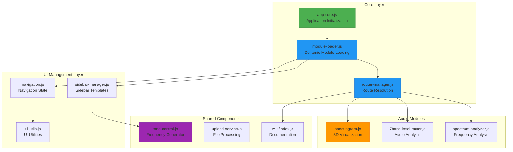

# JavaScript Module Architecture

## Overview

Qualia-NSS implements a sophisticated **modular architecture** using native ES6+ modules without build systems. The architecture follows **separation of concerns** principles, with distinct layers for core functionality, UI management, audio processing, and module integration.

## Core Module System

### Architecture Diagram



## Core Modules

### app-core.js - Application Initialization

**Purpose**: Central initialization and theme management

**Key Responsibilities**:
- Application startup and initialization
- Theme system management (dark/light mode)
- Global state management
- Module registration and lifecycle

```javascript
// Core initialization pattern
class AppCore {
    constructor() {
        this.theme = 'light';
        this.modules = new Map();
        this.eventBus = new EventTarget();
    }
    
    async init() {
        await this.initializeTheme();
        await this.loadModules();
        this.setupEventListeners();
    }
    
    // Theme management
    setTheme(theme) {
        document.documentElement.setAttribute('data-theme', theme);
        this.theme = theme;
        this.eventBus.dispatchEvent(new CustomEvent('themeChange', { detail: theme }));
    }
}
```

**Integration Points**:
- Initializes `ModuleLoader`
- Manages global CSS custom properties
- Provides theme switching functionality
- Coordinates module lifecycle events

### module-loader.js - Dynamic Module Loading

**Purpose**: Dynamic loading and integration of audio analysis modules

**Key Responsibilities**:
- Module discovery and loading
- HTML template management
- Sidebar integration
- Error handling and fallbacks

```javascript
// Module loading pattern
class ModuleLoader {
    constructor() {
        this.loadedModules = new Set();
        this.moduleTemplates = new Map();
        this.sidebarTemplates = new Map();
    }
    
    async loadModule(moduleName) {
        if (this.loadedModules.has(moduleName)) {
            return this.getModule(moduleName);
        }
        
        try {
            // Load module script
            const module = await import(`../src/${moduleName}/index.js`);
            
            // Load HTML template
            const htmlTemplate = await this.loadTemplate(moduleName);
            
            // Register and initialize
            await this.registerModule(moduleName, module, htmlTemplate);
            
            return module;
        } catch (error) {
            console.error(`Failed to load module ${moduleName}:`, error);
            throw error;
        }
    }
}
```

**Features**:
- **Lazy Loading**: Modules loaded on demand
- **Template Management**: HTML fragment loading and caching
- **Error Recovery**: Graceful fallbacks for failed loads
- **Sidebar Integration**: Automatic sidebar template registration

### router-manager.js - Route Resolution

**Purpose**: URL routing and module navigation management

**Key Responsibilities**:
- URL path resolution
- Module routing logic
- History management
- Context switching

```javascript
// Routing pattern
class RouterManager {
    constructor() {
        this.routes = new Map();
        this.currentRoute = null;
        this.basePath = '';
    }
    
    registerRoute(path, handler) {
        this.routes.set(path, handler);
    }
    
    async navigate(path, pushState = true) {
        const route = this.resolveRoute(path);
        
        if (route) {
            await this.executeRoute(route);
            
            if (pushState) {
                history.pushState({ path }, '', `#${path}`);
            }
        }
    }
    
    resolveRoute(path) {
        // Route resolution logic
        for (const [pattern, handler] of this.routes) {
            const match = this.matchRoute(pattern, path);
            if (match) {
                return { handler, params: match.params };
            }
        }
        return null;
    }
}
```

**Routing Features**:
- **Hash-based Routing**: Client-side navigation
- **Parameter Extraction**: URL parameter parsing
- **Module Context**: Automatic module loading for routes
- **History Integration**: Browser back/forward support

## UI Management Layer

### navigation.js - Navigation State Management

**Purpose**: Navigation state and active module tracking

**Key Features**:
- Active module state management
- Navigation event coordination
- Menu state synchronization
- URL state persistence

```javascript
// Navigation state pattern
class NavigationManager {
    constructor() {
        this.activeModule = null;
        this.navigationHistory = [];
        this.eventBus = new EventTarget();
    }
    
    setActiveModule(moduleName) {
        const previousModule = this.activeModule;
        this.activeModule = moduleName;
        
        // Update UI state
        this.updateActiveStates();
        
        // Emit navigation event
        this.eventBus.dispatchEvent(new CustomEvent('moduleChange', {
            detail: { previous: previousModule, current: moduleName }
        }));
    }
}
```

### sidebar-manager.js - Sidebar Template System

**Purpose**: Dynamic sidebar content management

**Key Responsibilities**:
- Sidebar template registration
- Dynamic content injection
- Accordion behavior management
- Responsive sidebar handling

```javascript
// Sidebar template pattern
class SidebarManager {
    constructor() {
        this.templates = new Map();
        this.accordionStates = new Map();
    }
    
    registerTemplate(moduleName, template) {
        this.templates.set(moduleName, template);
    }
    
    renderSidebar(moduleName) {
        const template = this.templates.get(moduleName);
        if (template) {
            const sidebarContainer = document.getElementById('sidebar-content');
            sidebarContainer.innerHTML = template;
            this.setupAccordionBehavior(sidebarContainer);
        }
    }
}
```

### ui-utils.js - UI Utilities

**Purpose**: Common UI functionality and effects

**Features**:
- Scroll effects and animations
- DOM manipulation utilities
- Event handling helpers
- Responsive behavior management

## Module Integration Patterns

### Module Interface Contract

All audio analysis modules implement a standard interface:

```javascript
// Standard module interface
export class AudioModule {
    constructor() {
        this.name = 'module-name';
        this.isInitialized = false;
        this.audioContext = null;
    }
    
    // Required lifecycle methods
    async init() {
        // Module initialization
    }
    
    async destroy() {
        // Cleanup resources
    }
    
    // Required audio methods
    setAudioSource(source) {
        // Audio input configuration
    }
    
    startProcessing() {
        // Begin audio processing
    }
    
    stopProcessing() {
        // Stop audio processing
    }
    
    // Optional UI methods
    renderSidebar() {
        // Return sidebar HTML template
    }
    
    handleResize() {
        // Responsive behavior
    }
}
```

### Module Registration Pattern

```javascript
// Module registration example
export async function initializeModule() {
    const module = new SpectrogramModule();
    
    // Register with module loader
    window.moduleLoader.register('spectrogram', module);
    
    // Register sidebar template
    window.sidebarManager.registerTemplate('spectrogram', module.renderSidebar());
    
    // Register route
    window.router.registerRoute('/spectrogram', () => module.init());
    
    return module;
}
```

## Event-Driven Communication

### Event Bus Pattern

Modules communicate through a centralized event system:

```javascript
// Event bus usage
class EventBus extends EventTarget {
    emit(eventName, data) {
        this.dispatchEvent(new CustomEvent(eventName, { detail: data }));
    }
    
    on(eventName, handler) {
        this.addEventListener(eventName, handler);
    }
    
    off(eventName, handler) {
        this.removeEventListener(eventName, handler);
    }
}

// Global event bus
window.eventBus = new EventBus();

// Module communication example
window.eventBus.emit('audioSourceChanged', { source: 'microphone' });
window.eventBus.on('themeChanged', (event) => {
    this.updateTheme(event.detail);
});
```

### Standard Events

- `moduleLoaded` - Module successfully loaded
- `moduleError` - Module loading error
- `audioSourceChanged` - Audio input source changed
- `themeChanged` - Theme switched
- `navigationChanged` - Active module changed

## Performance Optimizations

### Lazy Loading Strategy

```javascript
// Lazy loading implementation
class LazyModuleLoader {
    constructor() {
        this.moduleCache = new Map();
        this.loadingPromises = new Map();
    }
    
    async loadModule(moduleName) {
        // Return cached module if available
        if (this.moduleCache.has(moduleName)) {
            return this.moduleCache.get(moduleName);
        }
        
        // Return existing loading promise
        if (this.loadingPromises.has(moduleName)) {
            return this.loadingPromises.get(moduleName);
        }
        
        // Start new loading process
        const loadingPromise = this._loadModuleInternal(moduleName);
        this.loadingPromises.set(moduleName, loadingPromise);
        
        try {
            const module = await loadingPromise;
            this.moduleCache.set(moduleName, module);
            return module;
        } finally {
            this.loadingPromises.delete(moduleName);
        }
    }
}
```

### Memory Management

```javascript
// Module cleanup pattern
class ModuleLifecycleManager {
    async switchModule(fromModule, toModule) {
        // Cleanup previous module
        if (fromModule) {
            await fromModule.destroy();
            this.releaseResources(fromModule);
        }
        
        // Initialize new module
        await toModule.init();
        this.trackResources(toModule);
    }
    
    releaseResources(module) {
        // Release audio contexts, cancel animation frames, etc.
        if (module.audioContext) {
            module.audioContext.close();
        }
        
        if (module.animationFrame) {
            cancelAnimationFrame(module.animationFrame);
        }
    }
}
```

## Development Guidelines

### Module Development Best Practices

1. **Implement Standard Interface**: Follow the module contract
2. **Handle Lifecycle Events**: Proper init/destroy implementation
3. **Resource Management**: Clean up audio contexts and event listeners
4. **Error Handling**: Graceful degradation and error reporting
5. **Performance**: Optimize for real-time audio processing

### Code Organization

```
src/js/
├── app-core.js          # Application initialization
├── module-loader.js     # Dynamic module loading
├── router-manager.js    # URL routing
├── navigation.js        # Navigation state
├── sidebar-manager.js   # Sidebar templates
└── ui-utils.js         # UI utilities

src/[module-name]/
├── index.js            # Module entry point
├── [module-name].js    # Main module class
├── index.html          # HTML template
└── styles.css         # Module-specific styles
```

## Testing Strategies

### Module Testing Pattern

```javascript
// Module test example
describe('AudioModule', () => {
    let module;
    
    beforeEach(async () => {
        module = new AudioModule();
        await module.init();
    });
    
    afterEach(async () => {
        await module.destroy();
    });
    
    test('should initialize correctly', () => {
        expect(module.isInitialized).toBe(true);
    });
    
    test('should handle audio source changes', () => {
        const mockSource = createMockAudioSource();
        module.setAudioSource(mockSource);
        expect(module.audioSource).toBe(mockSource);
    });
});
```

## Related Documentation

- [Routing and Navigation System](routing-navigation.md)
- [CSS Module Architecture](css-modules.md)
- [Audio Processing Pipeline](../audio-processing/web-audio-api.md)
- [Development Guidelines](../development/guidelines.md)

---

*The JavaScript module architecture provides a scalable foundation for adding new audio analysis capabilities while maintaining clean separation of concerns and optimal performance.*