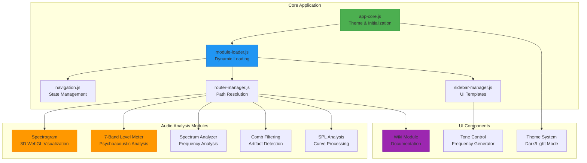

# Project Overview

## Project Background

**Qualia-NSS: Near-field Speaker Simulator** is a professional web-based audio analysis toolkit designed for precision audio engineering and acoustic measurement applications. It enables real-time visualization and analysis of audio signals using modern web technologies.

## Value and Purpose

The project provides a modular, high-performance platform for audio professionals to analyze speaker behavior, detect acoustic artifacts, and visualize sound characteristics in real time—directly in the browser.

## Core User Problems Solved

- **Lack of accessible, real-time audio analysis tools** for speaker and room acoustics
- **Need for professional-grade visualization** (e.g., 3D spectrograms, multi-band level meters)
- **Difficulty in detecting comb filtering** and other acoustic interference issues
- **Limited open, modular tools** for audio measurement and calibration

## System Functionality

### Real-Time Audio Processing
- Real-time audio input processing via microphone or system audio
- Support for multiple audio sources and routing configurations
- Professional-grade DSP controls and processing parameters

### Advanced Visualization
- **3D WebGL spectrogram visualization** with interactive controls
- **7-band psychoacoustic level metering** with calibration capabilities
- **Spectrum analysis** with configurable FFT sizes and windowing

### Acoustic Analysis
- **Comb filtering detection** using cepstrum analysis
- **SPL (Sound Pressure Level) curve analysis** from uploaded measurement data
- Room acoustics and speaker placement optimization tools

### Professional UI
- **Theme-aware, responsive UI** with state persistence
- **Modular architecture** for easy extension and customization
- **Cross-browser compatibility** and optimized performance

## Architecture Overview

## Technical Highlights

### No Build System Architecture
- **Pure ES6+ JavaScript** modules without bundlers
- **Vanilla CSS** with Bootstrap 5 (CSS-only) for maximum compatibility
- **Static hosting optimization** for CDN delivery and GitHub Pages

### Real-Time Performance
- **Web Audio API** integration for low-latency processing
- **WebGL 2.0** with fallback for high-performance 3D visualization
- **Configurable FFT** implementations (512–8192 samples)

### Browser Compatibility
- Support for modern browsers with Web Audio API
- WebGL 2.0 preferred, WebGL 1.0 fallback
- CORS-safe fallbacks for local development

## Use Cases

### Professional Audio Engineering
- Speaker placement optimization in recording studios
- Room acoustics analysis and treatment planning
- Audio equipment testing and calibration

### Educational Applications
- Teaching audio engineering concepts
- Demonstrating psychoacoustic principles
- Visualizing complex audio phenomena

### Research and Development
- Acoustic measurement and analysis
- Audio algorithm development and testing
- Scientific visualization of sound characteristics

## Getting Started

1. **Quick Start**: Open `index.html` in a modern browser
2. **Development Setup**: Use Python or Node.js HTTP server
3. **Explore Modules**: Navigate through integrated analysis tools
4. **Professional Use**: Connect measurement microphones and calibrate

## Related Documentation

- [Technology Stack & Dependencies](../technology-stack/dependencies.md)
- [Modular Architecture](../modular-architecture/javascript-modules.md)
- [Audio Analysis Modules](../audio-analysis-modules/spectrogram.md)
- [Development Guidelines](../development/guidelines.md)

---

*Qualia-NSS represents the intersection of modern web technology and professional audio engineering, bringing sophisticated analysis tools directly to your browser.*